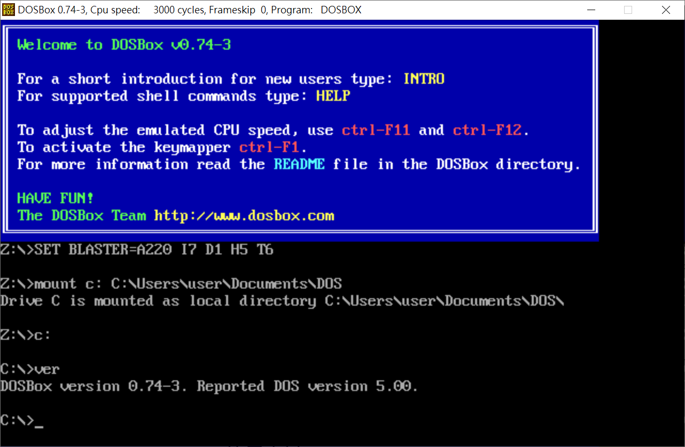
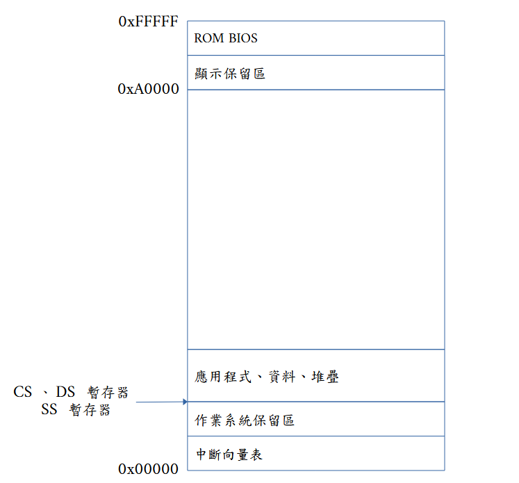
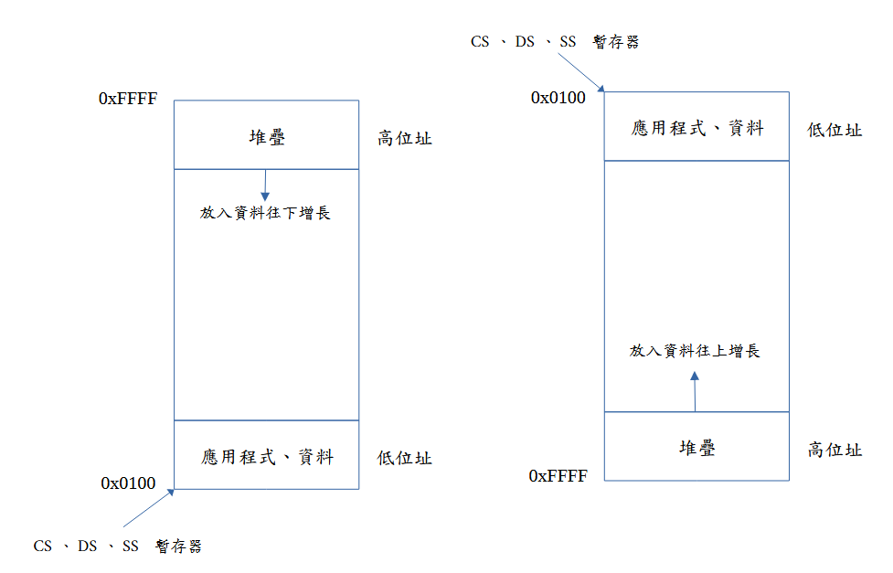

# 8086 組合語言

陳維志(weijyh.chen@gmail.com)

## 前言及學習條件

> 記事：
> 
> 2024/07/19 Microsoft Windows 大當機，造成多家航空公司系統無法運作，所有航班不是取消就是延誤，有一家歐洲的航空公司因為使用古老的 Windows 3.1 而不受影響，這件事說明了什麼? Windows 3.1 比較安全?! 當然不是，只是再次證明沒有任何系統是永遠安全的。只有自己能完全掌握的系統，才能盡快復原，在學習程式設計的路途上，唯有 open source 才能讓你感到安全。 

#### 前言

對於想要研究**編譯器**(例如 GCC)及**作業系統**(例如 Linux)的人來說，不會組合語言是不可能的事情。

現今學習組合語言，不考慮虛擬機及不普及的組合語言，大致可選的有二種，一是 **x86 系統**，包括 16 位元、32 位元及 64 位元，二是 **ARM 系統**，直接學 64 位元即可。

當初 Linux 是從 x86 開始，其它 CPU 的移植，在當時不夠成熟，多數 **Linux** **發行版**本，如 Ubuntu、Debian、RedHat...都以 x86 電腦為主，而後才逐步出現跨平台的程式，所以先學 x86 組合語言，跟隨 Linux 發展的腳步來學習，一步步走到 64 位元組合言言，這一路都有 Linux 及眾多套件的原始程式相伴，你絕對不會寂莫，不會為了找不到該死的資料而洩氣，或者找不到人聊天。等學完 x64 組合語言，立刻可以切換到 ARM 64 bits 組合語言的學習，會順利很多。

> 建議：
> 
> 只寫你懂的指令及程式敍述，任何不能完全了解的指令不要寫出，直到你完全掌握為止。

#### 學習先決條件

本書讀者要先有電腦基本操作的能力，例如拷貝檔案、使用記事本、瀏覽網頁、下載檔案、解壓檔案。以上列出不限定只有這些，只要是上網查得到的基本電腦知識，本書就儘可能減少說明的篇幅。  

電腦中使用的**二進制**、**八進制**及**十六進制系統**，也請讀者自行上網查詢資料，學會它們和十進制之間的轉換。

常見作業系統的命令列操作，例如 **Linux** **shell** 及 Windows 的**命令提示字元**，也請上網自學。本書也只會提及常用的命令及用法，不會涵蓋完整的使用。

電腦程式中敘述或指令執行的流程也要有大致的了解，簡單說，就是由上至下依序執行，除非有改變流程的指令出現。

## 第1章 系統安裝及設定

#### 系統選擇

若有人想要學習古老的 **8086 組合語言**，一定有其原因，這不用去深究，但是現今大都是 64 位元 (128 bits 電腦還不多見)電腦的天下，電腦裡安裝的**開發系統**不是沒法組譯 8086 組合語言，就是組譯出來也沒法現場執行，所以最好還是回到老系統下去玩，比較輕鬆。

老系統的選擇就不多了，你可以選 **DOS**、**MINIX**、**UNIX** ...，最終我選了 DOS，不是我最會用 DOS，而是 MINIX 有人玩過了，其它的連要跑起來都吃力，只有 DOS 跑起來最容易，只要下載個模擬器就可以開始研究了。

接著，要考慮用哪種 DOS 模擬器，有 DOSBox、Bochs、QEMMU、Virtual Box、...，我是選用 **DOSBox**，你可以等到研究透徹了，再改用別的模擬器也可以，事實上，Virtual Box 應該才是最穩固(一直有更新)的選擇。

我會選擇用 DOSBox 是因為檔案操作簡單，它內部 DOS 檔案系統就是模擬器外部作業系統的一個目錄，須要什麼東西，從外部作業系統下載、解壓後，就可以直接 copy 到 DOS 檔案系統中，其它的模擬器要想辦法把檔案放進去內部 DOS 系統，並不是做不到，只是比較麻煩一點而已，相反來說，要把你在 DOS 中寫的程式拿出來備份，也是 DOSBox 最簡單，copy 就可以。

另一個我會選擇 DOSBox 的原因是，它在 Android 平板上也有 **Magic DOSBox** 可以用，內外檔案系統是相連的，在其它地方下載的原始碼直接就在 DOS 中看得到，寫好的程式也直接可以在檔案總管(或檔案管理器)中看得到，附錄 A 有對 Magic DOSBox 加以介紹，你也可以用手機的 DOSBox 來學習，如此就可以隨時用手機或平板寫組合語言程式了。

DOSBox 不是沒有缺點，它內定是 DOS 5.0 ，而且沒法跑自己寫的作業系統，例如 Linux(雖然有 loadlin、ZipSlack 可以在DOS 下用，但不容易使用)，但是這對學習 8086 組合語言來說沒有任何問題，只要在以後有出現 DOSBox 的做不到的事情時，再換別的模擬器就可以了。

#### 工具選擇

常有人會用各式各樣的工具去開發作業系統或編譯器，最終不了了之，他多半會認為是因為自己生不逢時，或者是選錯工具。其實，這二件事是雞生蛋、蛋生雞的問題。

若能完全想明白，就會理解不論你在何時想要開始研究編譯器或作業系統(就算只是想學寫組合語言)，一定要先把上面講的這件事弄清楚。試想你在某個作業系統下(例如 DOS)，用了非開源的 C 編譯器及組譯器(例如  **Microsoft C** 和 **MASM**)的開發工具，你把作業系統寫好了，要怎樣證明你的作業系統將來可以繼續走下去?除非你寫的作業系統是 DOS 相容，否則你原本用來開發你的作業系統的工具，全都無法在你的作業系統中使用，這樣是無法繼續走下去的。想想當初 Linux 的景況吧，非開源的工具是沒法拿到你寫的作業系統下執行的，就算你寫的作業系統跑得起來，在那個系統中也沒有開發工具，該如何繼續呢?

遇到像上面這種情形，和你生不逢時一點關係也沒有，純粹一開始就自斷生路，當然若你只是想玩玩自製作業系統，證明自己有點能力，那就無可厚非了。

因此，要玩得長久，只有一開始就選擇使用**開源**(**open source**)工具，才能繼續玩下去。

接著考慮的是組合語言的開源組譯器那麼多，比如 NASM、JASM、FASM、Open Watcom ASM、...，該選擇哪個呢?多數人會選擇 NASM，因為它即開源又在多數作業系統下都可以安裝使用，我建議不要再犯上面的那種天真想法的錯誤了。Linux 中從來就只有 **Gnu C/C++** 和 **Gnu ASM**，再想不透為何又要白走冤枉路，你只要想到 Linux 中眾多的程式都是用 Gnu 工具開發完成的，將來你拿著另一種組譯器去編譯這些程式，硬要說還真不是做不到，只是現成的 GCC 和 Gas 會簡單很多。雖然可能不一定，但畢竟眾多工具及應用都是用 GCC 寫成，至少在可攜性上，會好一點。

簡單說，要寫作業系統，就要寫出和 Linux 相容的作業系統，要寫編譯器，就要寫能在 Linux 中執行的編譯器。雖然這二件事都不簡單，但比起其它的選擇而言，我認為可能性更高。

對於 8086 組合語言來說，使用 gas 組譯器來寫組合語言程式不是什麼大問題，但有點大材小用，我們把 gas 留著用來寫 80386 的組合語言程式，本書介紹一個叫 **as86** 的組譯器，用它來學習 8086 組合語言也非常容易。

as86 組譯器是什麼來頭，你可以上網查一下就知道，但畢竟事已久遠，不見得一定查得到，總之在此大略介紹一下，它是當初開發 Linux 作業系統時用到的組譯器之一，雖然那時只用它來組譯一個**開機程式**，但它的確是可以用來寫 8086 組合語言程式。會提這個是提醒大家，當初如果可以用 gas 組譯這個開機程式，為何要用 as86? 我們只能自己猜測了。

#### DOSBox 下載及安裝(Windows 10)

本書所有示範的內容是以 Windows 10 下安裝 DOSBox 為主要開發環境，但不限定一定要是這樣的搭配，其它作業系統也有 DOSBox 可以用，例如 Android 系統，在附錄中有介紹如何安裝及設定 Android 中的 DOSBox，這樣的搭配也一樣可以完成本書的所有內容。

你可以到下列網址去下載 DOSBox，理論上沒有病毒，因為不知道有多少人下載過了，Windows 的掃毒程式掃過 N 次了。你若不放心，大可不必冒險，可以試看看附錄中所講的 Android 版：

[DOSBox, an x86 emulator with DOS](https://www.dosbox.com/download.php?main=1)

如下圖所示，點擊 Windows 即可開始下載，過程中會切換到另一個網頁，不用理它(包括不要把它關掉)，幾秒後就會下載完畢，下載完畢後，就可以把所有網頁關掉了：


下載完成後，在你的「下載(Download)」資料夾中會有一個 DOSBox0.74-3-win32-installer.exe 檔案，如下圖，雙擊(double click)該檔案即可開始安裝 DOSBOX：


接著會跳出使用者帳戶控制視窗，請務必要按「是」，啟動安裝程式，

然後出現如下圖安裝視窗，請按「Next>」繼續：


下一個視窗(如下圖)，請繼續按「Next>」：


接著出現安裝路徑視窗，若有必要，請記下此安裝路徑，請按下「Install」開始安裝：


最後，安裝完成後會如下圖，請按「Close」結束安裝。


#### DOSBox 設定

安裝好 DOSBox 後，要先設定它才好使用，包括要模擬的 DOS 機器的記憶體大小，和啟動的程式等等。請從開始功能表找到 **DOSBox 0.74-3 Options** ，點擊它可以用記事本打開 DOSBox 設定檔案：


打開記事本後，找到 **windowresolution**= 的地方，把它改成你要的解析度大小，如果你的螢幕是 1920x1080，則設成 1600x800 就合適，如果是 4K 螢幕，請自行嘗試到自己滿意的解析度為止。下面一行 **output**=surface ，把它改成 output=ddraw ，使用 Windows 的 DirectDraw 函式來繪製 DOS 顯示結果。

接著往下找到 memsize 如下圖，把它改成 64，這樣是指你模擬出的的 DOS 機器有 64MB RAＭ，這對當時來說已是非常大的記憶體容量，雖然現在的電腦最少都有 4GB RAM，但不要改太大，先這樣設定就好，太大對模擬器及一些舊軟體可能會有不利影響，暫時也用不到那麼大的記憶體，反正可以再改。


改完記憶體後，其他就沒什麼好改的了，你可以上網查詢有哪些設定很重要，自己再去改，接著請先決定 DOSBox 啟動後要用哪個資料夾做為內部 DOS 的 C: 磁碟的目錄，請先用檔案總管在「文件」資料夾中建立一個 DOS 目錄，如果你的使用者名稱(Windows 10 登入時的使用者)不是英文的名稱，建議改成別的資料夾，例如 D:\DOS ，這個目錄你必須要有寫入的權限。

然後繼續在記事本中修改 DOSBox 設定檔，移到最後面，如下圖，加入下列指令：

    mount c: C:\Users\使用者名稱\Documents\DOS
    c:


再次提醒上圖中的 user 是我登入 Windows 的使用者名稱，因為是英文的，所以就可以直接拿來用，如果你是要用別的資料夾來當成 DOS 的 C: 磁碟，例如 D:\DOS (本機 Windows 的資料夾)，則最後二行要改為：

    mount c: d:\dos
    c:

把記事本中的內容存檔後，關掉記事本，就可以從「開始」功能表中找到 DOSBox 0.74-3 (noconsole)，點擊即可啟動 DOSBox 了(第一次)。如下圖所示：


要離開 DOSBox 可以在上面命令提示字元中，輸入 exit 指令，並按 enter 按鍵執行退出 DOSBox 的要求，也可以按下右上角 X (關閉視窗)按鈕，把 DOSBox 視窗關掉。

#### 安裝 DOS 4.0 程式

DOSBox 本身已經含有可啟動的 DOS 作業系統，你可以在上述視窗中打入 ver 命令(後面不再強調要按 enter 鍵)查看 DOSBox 本身模擬的 DOS 版本，如下圖：



可以看到它回報的是 DOS version 5.00，目前這個環境下，只能用一些內建的 DOS 指令，其它如 debug、edit 等程式都沒有，所以我們要去下載 DOS 5.0 的其它程式，才能使用完整的 DOS 5.0 全部命令。

因為我不確定目前使用 DOS 5.0 是否合法，所以不用 DOS 5.0，幾年前 Microsoft 就已公布了 **DOS 4.0** 的原始程式碼，只要不做商業用途，原始碼的使用沒有問題，如果要確定合法，請你下載 DOS 4.0 原始碼回來編譯使用。以下則示範從其它來源下載 MSDOS 4.01 版來使用，請自下列網址下載 DOS 4.01。

[WinWorld: Microsoft MS-DOS 4.01 (4-7-1989) (3.5-720k)](https://winworldpc.com/download/818a50a5-4563-11eb-b764-0200008a0da4)

在開始下個動作前，請先自行到 7-zip 網站(https://www.7-zip.org/ ) 下載 7-zip 解壓縮軟體，並安裝，由於過程相當簡單，所以就不在此多說。不過，如果真的安裝失敗，我想網路上教學文件很多，請自行解決這個問題，以下假設你已經安裝好 7-zip 解壓縮軟體。

請在下載的 Microsoft MS-DOS 4.01 (4-7-1989) (3.5-720k).7z 檔案上按右鍵，移到 7-zip 項目，而後選擇「解壓縮至 "Microsoft MS-DOS 4.01 (4-7-1989) (3.5-720k)"，如下圖所示：


接著打開解壓縮之後的資料夾，裡面有三個 .img 的檔案，這是 DOS 4 的三張軟碟映像檔，可以如上圖方式，用 7-zip 在三個檔案上按右鍵解壓出三個資料夾。


三個資料夾解壓之後，如下圖所示：


請先在 C:\Users\user\Documents\DOS (你的 DOS 外部系統可見之資料夾)資料夾中，建立一個 DOS4 的資料夾，而後將上圖中，三個資料夾中的檔案全部拷貝到 DOS4 資料夾中。

而後執行 DOSBox ，進入系統後，利用 cd dos4 命令可以切換到 dos4 資料夾，用 debug 命令欲執行 debug 程式，結果回報版本不對，然後用 **ver set 4.01** 將 DOSBox 回報程式的版本設為 4.01 版，再次使用 debug 就可以了。


你可以將下列命令加在 DOSBox 設定檔的最下面，這樣就不用每次進系統都要打這個命令：

    ver set 4.01

如果覺得 DOS 4.01 功能不是很足，你可以上網找你須要的 DOS 應用程式，自行複製到 DOS 目錄中。

接下來在本機 C:\Users\user\Documents\DOS 資料夾用記事本建立一個 **autoexec.bat** 檔案，打入下列內容，這是為了讓 DOSBox 啟動 DOS 後，自動執行一些工作，其中最重要的是設定 DOS 搜尋執行檔的路徑(path)：

    set path=c:\dos4

> 在本書中常會提及二個資料夾路徑，一個是**本機資料夾** C:\Users\user\Documents\DOS ，這個是在 Windows 10 中的檔案總管可以看到的目錄，另一個目錄是 DOSBox 中的 C:\ **內部資料夾**，這是在執行 DOSBox 時可以操作的 DOS 磁碟根目錄，事實上二個是同一個目錄，在檔案總管中，在 C:\Users\user\Documents\DOS\tmp 中建立一個檔案，就會在下次啟動 DOSBox 時，在 C:\tmp 中看到這個檔案。在 DOSBox 中，刪除 C:\tmp 中的一個檔案，和用檔案總管刪除 C:\Users\user\Documents\DOS\tmp 中的同一個檔案，效果一樣。
> 
> 建議：在使用 DOSBox 時儘可能不要去更動 C:\Users\user\Documents\DOS 中的檔案，最好把 DOSBox 關掉後再更動。更動後，重啟 DOSBox ，更動過的檔案才會在 DOSBox 中顯現新的變動內容。

autoexec.bat 檔案建好後，請將下列命令加入 DOSBox 設定檔案的最後面，如下圖：

    autoexec.bat


#### MSDOS 常用命令介紹

所有的 DOS 命令都不分大小寫，你打入小寫指令也沒問題。

1. **DIR** ： 
   
   查看當前目錄內容，後面如果有接目錄，則查看該目錄內容，例如 DIR Z:\。有時目錄下的檔案太多，可以用 DIR /p 分頁查看，或用 DIR /w 橫式列表查看， DIR /p/w 可一起使用。

2. **CD** 欲切換目錄：
   
   改變當前目錄為欲切換目錄，例如 CD C:\DOS4 可切換到 C:\DOS 下，如果只打 CD DOS4 則是在當前目錄下找 DOS4 目錄，如果有則切換到該目錄，如果沒有，則報錯。

3. **MD** 欲建立目錄：
   
   建立新的目錄，例如 MD C:\temp 會建立新的目錄，如果只打 MD temp ，則是在當前目錄下建立新的 temp 目錄。

4. **RD** 欲刪除目錄：
   
   刪除目錄，該目錄中必須是空的，例如 RD C:\temp 會將該目錄刪除，如果只打 RD DOS4 則是在當前目錄下找 DOS4 目錄，如果有則刪除該目錄，如果沒有，則報錯。

5. **CLS**：
   
   清除螢幕，游標移到最上方。

6. **TYPE** 檔案：
   
   可以顯示檔案內容出來看，有時用編輯器看內容更方便。

7. **VER**：
   
   查看目前的 DOS 版本，或設定 DOS 的版本。

8. **COPY** 來源檔案 目的檔案：
   
   把來源檔案拷貝成目的檔案，例如 COPY C:\tmp\hello.c C:\temp\aaa.c 會將 C:\tmp 中的 hello.c 拷貝到 C:\temp 中成為 aaa.c，如果不打目的檔名，例如 COPY C:\tmp\hello.c C:\temp\ 則是將 C:\tmp 中的 hello.c 拷貝到 C:\temp 中成為 hello.c ，也可以同時拷貝很多檔案，例如 COPY C:\tmp\*.* C:\temp\ 會把所有在 C:\tmp 中的檔案貝到 C:\temp 中

9. **DEL** 檔案：
   
   刪除檔案，例如 DEL C:\temp\hello.c ， 如果只打 DEL hello.c 則是在當前目錄下找 hello.c 檔案，如果有則刪除該檔案，如果沒有，則報錯。

10. **RN** 欲更名檔案 新檔案名稱：
    
    更改檔案名稱，例如 RD hello.c aaa.c 會把當前目錄下的 hello.c 檔案改名為 aaa.c。

有人覺得這樣打指令很麻煩，這也沒辦法，當年只有命令提示字元，就只能這樣打命令。現在，你大可用 Windows 10 的**檔案總管**去拷貝、刪除、更名目錄或檔案，不用這些命令也沒關係(若將來改用其它模擬器時，這招則未必管用)。 

> DOSBox 也可在 Android 手機或平板上使用，出門在外帶個平板就可以開始寫各種各樣的程式了，這不會只是玩玩小玩意而已，要在 DOSBox 中寫一個完整的編譯器或遊戲是一點問題都沒有的，我都用平板 DOSBox 查看 Gnu C 編譯器原始碼並編譯。
> 
> Android 中使用 DOSBox 的方法寫在後面附錄 A

#### 下載及安裝 DJGPP

**DJGPP project** 是將 Gnu 的開發工具移植到 DOS 中的計劃，似乎一直有在進行，網路上官網中的下載資料中，可看到 gcc 似乎有移植到 10.0 版了，對我們來說用太新的版本也不好，太新的 C 編譯器去編譯 **1980** 年代的程式，常常會出問題，那個年代的 C 程式並不遵守什麼 C99 的標準，所以先不要用太新的 gcc 版本，用當年的編譯器就很好，可以一步一步從舊版 gcc 慢慢編譯上來新版的 gcc。

為何要先安裝 DIGPP gcc 編譯器? 因為我們要用的 as86, ld86 組譯器及連結器只有原始檔，要先用 gcc 編譯器去編譯它們的原始檔，才會有 as86 組譯器可以在 DOS 中使用。

當然，用舊版的編譯器或組譯器來編譯現在的程式，也是不行，那時的編譯器也不懂現今新的語法，當然也有問題。

至於那個版本最好，都不要太計較，因為人不是神仙，任何一個版本也都可能還有 **bugs** 存在，我們也不應該擔心這個，不是都有**原始碼**在那裡嗎?山不轉路轉，路不轉人自己要轉，看看程式出錯在哪裡，自己去修改程式符合自己的需求才好。

總而言之，用下列網址下載 DJGPP 軟體來安裝，這個好處是，它是一個光碟映像檔(.ISO檔)，可以直接在 Windows 10 中掛載來用，而且在 DOS 中支持 DOS、Windows 3.1 的安裝，很是方便，更重要的是，裡面連原始程式碼都有，對我們的研究之心來說，都是寶貝。

[DJGPP Development System (August 1998) : Free Download, Borrow, and Streaming : Internet Archive](https://archive.org/details/DJGPP_Development_System_August_1998)

連到網站後，稍微向下移，找到如下圖中的 ISO IMAGE ，點下去就可下載，不用擔心病毒，因為它是在模擬器中使用，就算在模擬器中中毒，因為模擬器中的 DOS 沒有網路，病毒想跑出到 Windows 10 將極不可能，除非...。


下載完成後，在「下載」資料夾(C:\Users\user\Download)中，有一個 DJGPP_Development_System_August_1998.iso 檔案，如下圖，在其上連點二下，即可掛載到你的 Windows 系統上：


至於會成為哪一個磁碟，可以用檔案總管看一下，例如我的系統就掛載到了 H:\，直接進 DOSBox 來操作，執行 DOSBox 後，輸入下列命令來開始安裝 DJGPP 軟體：

    z:\mount d: h:\
    d:
    install

上述命令第一行是用 z:\ 中的 **mount** 程式(z:\ 是 DOSBox 放它提供的程式之處，例如 mount 命令是 DOSBox 提供給我們的命令)將外部 Windows 資料夾 h:\ 掛載到內部 DOS 的 d:，第二行命令將工作目錄切換到 d: 磁碟，d: 磁碟中是我們掛載上來的 DJGPP 光碟片，裡面的 **setup** 程式是 Windows 3.1 中執行的安裝程式，**install** 則是 DOS 命令提示字元中使用的安裝程式。

> 前面有時會看到命令和指令二詞，以我自己的概念來說明：
> 
> **命令(Command)**：在 DOS 下執行的內部或外部程式，我會用命令來描述，因為是在命令提示字元中輸入來開始執行，例如 debug。
> 
> **指令(Instruction)**：在不同語言或軟體中，要求電腦做一件事，我會用指令一詞來描述，例如 C 語言指令 printf ，或組合語言指令 mov 。

install 執行起來後，如下圖所示：


按下 Enter 鍵繼續，待出現如下畫面時：


先不做選擇直接按 Enter 鍵繼續， 此時會開始進行安裝，但 DOSBox 會當掉，不確定是因為什麼原因而起，較有可能是 DOSBox 沒有完整模擬好 386 硬體功能。

安裝不成功，為何還要寫這段，因為將來使用別的模擬器(例如 Bochs)，就可以用這個方法安裝使用。那麼現在該怎麼辦呢?

其實有更簡單的安裝辦法，回到檔案總管，在 DJGPP 掛載的磁碟中，例如我的是 h:\ 磁碟，有一個 **DJGPP 目錄**，把它整個目錄 copy 到 C:\Users\user\Documents\DOS 中即可。拷貝完成後，順道在 DOS 目錄下新增一個 tmp 目錄。如下圖：


接著用記事本編譯 autoexec.bat，修改如下：

    set path=c:\dos4
    set PATH=c:\djgpp\bin;%PATH%
    set DJGPP=c:\djgpp\djgpp.env

第一行是原本的內容，後二行是為了能執行 DJGPP 的軟體所加入。

至此，基本的 DJGPP 應該已經安裝好了，後面會教你把缺的補齊，我們的一向做法是缺什麼補什麼，這樣才能清清楚楚地理解缺的東西是什麼，又有何用處。首先，要試看看安裝進去的東西最少能做什麼，請在 C:\Users\user\Documents\DOS\tmp\ 目錄(即資料夾 directory)中用記事本建立一個 hello.c 的檔案，內容是：

    #include <stdio.h>
    
    void main(void) {
        printf("Hello, world!\n");
    }


打好程式後存檔，如上圖所示，然後打開 DOSBox ，依下圖所示操作：


只要看到如上圖的結果就知道安裝的 DJGPP 沒有問題，即然編譯 hello.c 成為 DOS 下的 hello.exe 沒問題，表示編譯過程中須要的 include 檔及 library 檔案也都找得到，不會建置不成功，這樣就可以進行下一步了。

> 一般來說編譯 C 程式時，我們要告知編譯器去哪裡找到標準函式庫的檔案，大多數編譯器會找尋 **INCLUDE** (或 **INCLUDEPATH**...)及 **LIB** (或 **LIBPATH**...)環境變數的設定，而後就可以找到編譯時須要的標準函式庫檔案。DIGPP 並不須要在 autoexec.bat 中設定這樣的環境變數也能編譯，原因是它是從 **c:\djgpp\djgpp.env** 檔案中取得這些資訊，如果你安裝 DJGPP 的目錄不是在 c:\djgpp 或者要使用自己的標準函式庫，則要記得修改 autoexec.bat 中的 **SET djgpp** 或者修改此檔案的內容。

## 第2章 as86 程式下載及安裝

 Linux 作業系統當初發明時，是用 as86 組合語言寫**開機載入程式**(**Boot Loader**)，為了能打好理解該程式的基礎，所以要先學 as86 組譯器，如果你對 8086 組合語言沒有興趣，則完全可以直接略過本書。 

#### as86 及 ld86 程式下載及安裝

到下列網址中，下載其中的 **bin86-0.1.tar.gz**：

[Index of /slackware/slackware-2.0.0/source/d/binutils](https://mirror-hk.koddos.net/slackware/slackware-2.0.0/source/d/binutils/)

下載完畢後將 bin86-0.1.tar.gz 用 7-zip 解壓，把解壓後的 bin86-0.1 資料夾拷貝到 C:\Users\user\Documents\DOS\tmp 中，

    cd c:\tmp\bin86-0.1
    ren a~1.h aout.h
    cd aout.h
    ren a~1.h aoutgnu.h
    ren bsd-a~1.h bsdaout.h

上述 DOS 命令是因為下載的原始碼檔案都是長檔名，在 DOS 下要改成 8.3 格式的檔名才可以使用，最終如下圖所示：


改過後，可想而知原始碼中有些地方使用到這些長檔名的地方，都要改成這種 **8.3 格式**的檔名，首先

    cd c:\tmp\bin86-0.1\as
    edit makefile

用編輯器(你可以用記事本打開來看及編輯)查看其內容，內容如下，那些編譯的選項都可以不要，只要編譯出來可以執行就好，所以要將 **makefile** 修改一下。

> 用 DOS 中的編輯器修改 makefile 時要小心，不要改動到有 **TAB** 按鍵的地方，有時 TAB 會被編輯器改成幾個空白字元，這樣 make 程式會為沒有 TAB 而出錯。這在早期的 make 程式很常見，如果遇到這種情形，要用別的編輯器去補上 TAB，Windows 中的記事本就很好用了，記得補上 TAB 鍵後，要用另存新檔的方式存檔，並在存檔對話視窗中選擇存成 ANSI 字元格式。


修改完後，如下圖，可以這樣修改有它的原因：

1. 我們用的 gcc 已經是 DOS 下的 gcc，它自然會產生 DOS 的執行檔，不要再指定產生執行檔的格式。

2. 當然也不要指定 gcc 編譯 486 CPU 的指令，gcc 自己會知道它是要編譯 DOS 8086 的執行檔。

3. 不管最後的 as86.exe 在使用時(組譯組合語言程式)，能不能正確生成 a.out 檔，並不重要，我們只是要用它組譯程式以產生目的檔 (OBJ 檔)，所以 aout.h 跟本不重要。


按上面修改後，回到 DOS 命令提示字元，輸入下列命令即可編譯出 as86.exe 檔。

    make

過程中的 warning 都不要理它了，最早一版的 as86 也不用期望它沒有 warning 。編譯完後，可以把它拷貝到 c:\djgpp\bin 中：

    copy as86.exe c:\djgpp\bin

這樣 as86.exe 就搞定了，至少我們有一版可用的 8086 組譯器了，我們後面會用它來學 8086 的組合語言。

接下來要處理 ld86 了，同樣先用下列命今切換到 ld 的原始程式目錄：

    cd c:\tmp\bin86-0.1\ld
    edit makefile

同樣先用編輯器來改 makefile 的內容，大致原理同上所述：


改完的 makefile 如下：


編譯選項保留了 -DBSD_A_OUT 是因為最後編譯出的 ld86.exe ，在使用它來連結目的檔以產生執行檔的時候，產生的執行檔不論是何種格式，應該都不能在我們 DOS 下執行，關於這點先不管它，重要的是先編譯再說，接著用下列命令開始編譯：

    make

可想而知會出現一些問題，我們都沒動到任何原始程式，至少先前那個 bsd-a~1.h 我們把它改名成 bsdaout.h ，這在原始程式某處一定不行過，先編譯看問題在哪裡，結果如下圖，type.h 檔有點問題。


我們用編輯器來打開 type.h ，找到 175 行 umask 的段落，如下圖：


出問題的那段是在 #ifdef MY_STAT_H ，我們用系統的 sys/stat.h 就好，直接把這段註解掉，如下圖。


不刪除它的原因是如果改錯了，還能改回來，另外不要用 /* ... * / 來註解掉這段，因為它裡面已經有 /* ... */ 了，當時的 gcc 不確定可以巢狀註解，不要自找麻煩。

改完後，再重新 make ，結果如下圖，不出所料，writebin.c 找不到 bsd-a.out.h 檔，先自己把第 18 行改成 bsdaout.h


改完後再次 make 出現下圖問題：


再次編輯 type.h ，找到第 204 行 #include <unistd.h> 將其註解掉。重新 make，出現如下圖問題：


上網查一下，是因為 R_OK 定義在 unistd.h 中，而它被我們在前面(type.h中)給註解掉了，沒關係，反正 R_OK 是定義為 4，你可以把它直接改成 4 ，或在 ld.c 的最前面用 

    #define R_OK 4

自己定義它，再次 make 編譯，出現一列問題：


這次是在 bsdaout.h 檔中找不到 a.out.gnu.h 了，這就靠你自己去改了，編輯 bsdaout.h 將 a.out.gnu.h 改為 aoutgnu.h。

最後再用 make 就可以產生 ld86.exe 了，但是用這個 ld86 去連結目的檔產生的執行檔完全不能在 DOS 下使用，因為是 MINIX 系統的執行檔，我們要先修改 writebin.c 檔案，令其寫出執行檔時，不要加入 a.out 格式標頭到輸出的執行檔案中。

as86 及 ld86 原本就不是用來寫大程式，在 DOS 下面寫個小程式(如 .com 檔案)尚且可用，ld86 最後連結出來的執行檔是包含 MINIX 執行檔(excution file)檔頭(header)的部份，尤其下載來的原始程式版本用 gcc 編譯出來的 ld86.exe 程式，在連結 as86.exe 產生的目的檔(object file)時，都會加上 MINIX 作業系統的檔頭部份，這在 DOS 下跟本無法使用，所以我們就直接修改 ld86 的原始碼，讓它**不要輸出檔頭資訊**即可。

除了檔頭外，ld86 還會輸出符號表，這不須要改程式，只要在使用 ld86.exe 時加上 **-s** 即可令其不輸出符號表，經由這樣改造後的 ld86.exe 基本上輸出的就類似 .com 的檔了。(完全只有原始組合語言翻譯出來的機器碼的檔案)

要改造的 ld86 原始程式碼只有一個 writebin.c 檔，用文字編輯器打開 writebin.c，找到如下程式碼段落，把最後那行 **writeout** 程式註解掉即可。

```
#ifdef MINIX

PRIVATE void writeheader()
{
    struct exec header;

    // printf("MINIX\n");
    memset(&header, 0, sizeof header);
    header.a_magic[0] = A_MAGIC0;
    header.a_magic[1] = A_MAGIC1;
#ifdef BSD_A_OUT
    if (!reloc_output)
#endif
    {
    header.a_flags = sepid ? A_SEP : A_EXEC;
    if (uzp)
        header.a_flags |= A_UZP;
    }
#ifdef BSD_A_OUT
    header.a_cpu = (bits32 || reloc_output) ? A_I80386 : A_I8086;
#else
    header.a_cpu = bits32 ? A_I80386 : A_I8086;
#endif
    header.a_hdrlen = FILEHEADERLENGTH;
    offtocn((char *) &header.a_text, etextpadoff - btextoffset,
        sizeof header.a_text);
    offtocn((char *) &header.a_data, edataoffset - bdataoffset,
        sizeof header.a_data);
    offtocn((char *) &header.a_bss, endoffset - edataoffset,
        sizeof header.a_bss);
#ifdef BSD_A_OUT
    if (!reloc_output)
#endif
    {
    if (uzp)
        offtocn((char *) &header.a_entry, page_size(),
            sizeof header.a_entry);
    offtocn((char *) &header.a_total, (offset_t)
            (endoffset < 0x00010000L ? 0x00010000L : endoffset + 0x0008000L),
        sizeof header.a_total);
    }
    //writeout((char *) &header, FILEHEADERLENGTH);
}
```

修改完 writebin.c 程式後，再次 make 即可產生我們要的 ld86.exe，接著把它拷貝到 c:\djgpp\bin 中，

    copy ld86.exe c:\djgpp\bin
    cd c:\tmp

as86.exe 及 ld86.exe 都拷貝到 c:\djgpp\bin 中後，我們要先測試看看它們有沒有大問題，請先切換到 c:\tmp 目錄，而後輸入下列程式，存成 outText.s 組合語言檔案：

```
export _main
.text
_main:
        jmp start
msg:
        .ascii "Hello"
start:
        mov     cx, #5
        mov     dl, #0x00
        mov     dh, #0x05
        mov     ax, #msg
        add     ax, #0x100
        mov     bp, ax
        mov     bx, #0x000c
        mov     ax, #0x1301
        int     0x10
        mov     ax, #0x4c00
        int     0x21
.data
.bss
```

接著用下列命令加以組譯：

```
as86 -0 -o outText.o -l outText.lst outText.s
```

**-0** 是指定組譯成 8086 的機器碼，如果不指定，ax 會被譯成 eax，-3 則指定譯成 80386 的機器碼

**-o** 後面接目的檔名

**-l** 後面接列表檔的檔名，列表檔會將組譯的結果以文字形式列印出來，方便查對程式是否正確(也可能是 as86 自己出錯)

組譯完成後，會產生一個 outText.o 的目的檔，接著就可用下列命令來產生一個 outText.com 的可執行檔了：

```
ld86 -0 -s -o outText.com outText.o
```

**-0** 影響標頭的一個 magic word，代表產生的是 16 bits 執行檔， -3 代表 32 bits ，但因為我們改成不輸出標頭，所以不影響執行檔結果。(在 MINIX 下使用 ld86 產生執行檔就有影響)

**-s** 指定不輸出符號表，只產生原始機器碼檔案，這個選項很重要一定要打

**-o** 後面指定輸出的執行檔名

產生 **outText.com** 執行檔後，因為是完全 16 bits DOS .com 檔案，所以可以放心用 debug 去做除錯，當然也可以直接執行查看結果(先用 DOS 命令 cls 清除螢幕)，執行結果如下：


這個程式只是測試用，只要你照著前面的過程做下來，畫面都跟我的一樣，那就表示 as86 及 ld86 沒有問題了，關於這個程式的每個指令的意義及說明，則要等到後面的章節才來解說。

> 以上產生 as86 及 ld86 的過程也許令你覺得厭煩，但這是成長必經之路，所有程式設計師每天都是在這樣的錯誤或那樣的問題中，掙扎向前，沒有什麼人應該為你準備好一切，除了 M$ (Give me money and I will give you Microsoft)，但你確定微軟給你的東西就沒有問題嗎?你又沒看到它給你的程式的原始碼?你是如何說服自己相信他們的呢?
> 
> 2024/07/19 的事件再次浮現我眼前。
> 
> 我並不是說不要使用微軟的系統或應用程式，而是說**不要隨意相信事情都 100% 盡如人意。**

#### bcc x86 C 語言編譯器下載及安裝

其實這段和本書有點脫節，可是 as86、ld86 和 bcc 常合在一起稱為 bin86 或 dev86 工具，因此在這裡順便把 bcc 編譯器也做出來。雖然從寫組合語言程式的角度來看，編譯器的確不是必需的程式，但用它來觀察 C 編譯器編譯出的組合語言碼，也是一種學習。

前面下載的 bin86 中，因為版本太早了(也可能是其它因素)，並沒有包含完整的 bcc 編譯器程式，所以我們要到下列網址中去下載：

https://github.com/lkundrak/dev86

打開該網頁後，請在「<> Code 」上按一下，會出現如下圖結果，請點擊「Download Zip」將 **dev86** 專案下載。


下載完 dev86 後，在下載資料夾中會有一個 dev86-master.zip 的檔案，請將其解壓縮，而後將整固 dev86-master 解壓目錄貝到 C:\Users\user\Documents\DOS\tmp 中，打開 DOSBox 模擬，執行下列命令：

    cd c:\tmp\dev86-~1\bcc

編輯 makefile 內容成為下列結果：

    #
    # bcc Makefile
    # $Id$
    #
    
    PREFIX=/usr
    
    CFLAGS  =-O -w
    LDFLAGS    =-s
    BINDIR    =$(PREFIX)/bin
    LIBDIR    =$(PREFIX)/lib/bcc
    BCCDEFS =
    
    BCFLAGS=$(ANSI) $(CFLAGS) $(LDFLAGS)
    
    OBJS = bcc-cc1.o codefrag.o dbnode.o declare.o express.o exptree.o floatop.o \
        function.o gencode.o genloads.o glogcode.o hardop.o input.o label.o \
        loadexp.o longop.o output.o preproc.o preserve.o scan.o softop.o \
        state.o table.o type.o assign.o hashcmd.o debug.o dbprintf.o
    
    all:    bcc-cc1 bcc 
    
    install: all
        install -d $(BINDIR)
        install -m 755 bcc $(BINDIR)/bcc
        install -d $(LIBDIR)
        install -m 755 bcc-cc1 $(LIBDIR)/bcc-cc1
    
    bcc: bcc.c
        $(CC) $(BCFLAGS) $(BCCDEFS) bcc.c -o $@
    
    ncc: bcc.c
        $(CC) $(BCFLAGS) -DLOCALPREFIX= -DDEFARCH=0 bcc.c -o $@
    
    bcc09: bcc.c
        $(CC) $(BCFLAGS) -DMC6809 $(BCCDEFS) bcc.c -o $@
    
    ccc: bcc.c
        $(CC) $(BCFLAGS) -DCCC $(BCCDEFS) bcc.c -o $@
    
    bcc-cc1: $(OBJS)
        $(CC) $(BCCARCH) $(LDFLAGS) $(OBJS) -o bcc-cc1
    
    debug.o: debug.c debug.h
        $(CC) $(ANSI) $(BCCARCH) $(CFLAGS) -c debug.c
    
    dbprintf.o: dbprintf.c
        $(CC) $(ANSI) $(BCCARCH) $(CFLAGS) -c dbprintf.c
    
    clean realclean:
        rm -f bcc bcc-cc1 ncc bcc09 ccc bcc.o $(OBJS)
    
    
    $(OBJS):  bcc.h align.h const.h types.h \
              byteord.h condcode.h gencode.h \
          input.h label.h os.h output.h \
          parse.h proto.h reg.h sc.h scan.h \
          sizes.h table.h type.h
    
    .c.o:
        $(CC) $(BCCARCH) $(CFLAGS) -c $<
    然

 然後編輯 bcc.c 檔案，將 #include "version.h" 這行註解掉，總共有二處。註解掉後存檔，回到 DOS 提示字元下，再次用

    make

開始編譯 bcc 程式，編譯完成後，用下列命令將 bcc 程式貝到 c:\djgpp\bin 中，

    copy bcc-cc1.exe c:\djgpp\bin
    copy bcc.exe c:\djgpp\bin

至此，我們就可以測試 bcc 編譯 C 語言程式的能力，先切換到 c:\tmp 目錄下，而後輸入以下程式，存檔為 test.c：

    main() {
            int a;
            a=4+7;
    }

接著用下列命令將 C 語言原始碼編譯成 x86 (16 bits) 組合語言程式碼，

    bcc-cc1 -0 test.c -o test.s

> 不使用 bcc 而是使用 **bcc-cc1** 的原因是，因為 bcc 只是 C 編譯器的驅動器，有關 C 編譯器的驅動器概念，會在另一本我寫的書中介紹，總之 bcc-cc1 才是真正 C 語言的編譯器。
> 
> 事實上，你透過下面的例子，大致也可以感覺到整個編譯的過程了。

編譯出的 8086 組合語言碼如下：

    export    _main
    _main:
    !BCC_EOS
    push    bp
    mov    bp,sp
    push    di
    push    si
    dec    sp
    dec    sp
    mov    ax,*$B
    mov    -6[bp],ax
    !BCC_EOS
    inc    sp
    inc    sp
    pop    si
    pop    di
    pop    bp
    ret
    .data
    .bss
    
    ! 0 errors detected

如果要編譯成 80386 組合語言程式碼，則可將 **-0** 換成 **-3** 即可，如此編譯出的組合語言碼如下：

    export    _main
    _main:
    !BCC_EOS
    push    ebp
    mov    ebp,esp
    push    edi
    push    esi
    push    ebx
    add    esp,*-4
    mov    eax,*$B
    mov    -$10[ebp],eax
    !BCC_EOS
    add    esp,*4
    pop    ebx
    pop    esi
    pop    edi
    pop    ebp
    ret
    .data
    .bss
    
    ! 0 errors detected

要進行組譯(以 8086 test.s為例)，可以使用如下命令：

    as86 -0 -o test.o -l test.lst test.s

產生的 test.lst 列表如下：

    00001                                           export    _main
    00002                       00000000>           _main:
    00003                                           !BCC_EOS
    00004 0000           55                         push    bp
    00005 0001           89E5                       mov    bp,sp
    00006 0003           57                         push    di
    00007 0004           56                         push    si
    00008 0005           4C                         dec    sp
    00009 0006           4C                         dec    sp
    00010 0007           B8                   000B  mov    ax,*$B
    00011 000A           8946         FA            mov    -6[bp],ax
    00012                                           !BCC_EOS
    00013 000D           44                         inc    sp
    00014 000E           44                         inc    sp
    00015 000F           5E                         pop    si
    00016 0010           5F                         pop    di
    00017 0011           5D                         pop    bp
    00018 0012           C3                         ret
    00019 0000                                      .data
    00020 0000                                      .bss
    00021                                           
    00022                                           ! 0 errors detected
    
    Symbols:
                         _main  0 0000 R E 
    
    00000 errors
    00000 warnings

然後用下列命令產生可執行檔：

    ld86 -0 -s -o test.com test.o

這個範例經過編譯、組譯、連結後所產生的執行檔，直接拿來執行無法看到任何結果，因為沒有輸出可看(要看到輸出要有 bcc 的標準庫)，但可以用 **debug test.com** 命令查看它產生的機器碼的結果，如下圖所示：


關鍵的是 **06F2:0107** 及 **06F2:010A** 這二行這就是 **a=4+7;** 那行是 C 語言的編譯結果，可以看出 bcc-cc1 編譯器會先把 4+7 算好，再放入到 a 中，而不是用組合語言指令去做實際的加法：

        mov ax,4
        add ax,7
        mov [bp-6],ax

有關 bcc 的使用及 C 語言的介紹，不是本書範圍，大致先看到這裡，我會專門出一本有關 bcc 的 C 程式設計的書來介紹它。

## 第3章 8086 組合語言程式設計基礎概念

#### 組譯及連結

經過前面的範例，你應該知道組合語言程式經過 as86 組譯器的處理後會變成目的檔，還要經過 ld86 的連結才能變成執行檔，為何不用一個程式就直接產生執行檔不好嗎?

好也不好。

好的原因是自己一個人寫程式，只寫一個組合語言程式，用組譯器程式組譯就直接可以產生執行檔，很方便。

不好的原因是，如果案子很大，一個人做太久，就要幾個人分成幾個程式來寫，這樣每個人就須要分別組譯，看看有沒有組合指令用錯了，或語法上的其它問題，如此可以加快開發速度。

但其實即使是一個人，也總有一天要寫大的程式，也總有一天要會把大程式拆成不同的檔案來各別組譯，這樣組譯器及連結器分開就有意義了，下圖就是一個例子，說明組譯及連結的意義。


事實上，要把組譯器及連結器弄成一個程式也沒有問題，這個程式就叫做驅動器，例如前面提到的 bcc 及 gcc 就是驅動器，它們只是把不同的程式拿來，幫你叫用編譯器、組譯器及連結器，以產生執行檔。

我認為初學者就是要在使用多次 as86 及 ld86 後，自己體驗出不同工具的詳細使用方法，之後使用驅動器就會得心應手了。

#### 電腦的基本架構 ─ 記憶體

在開始寫組合語言之前還是要先把電腦的基本架構交代一下，如果你大致知道電腦的架構，那可以直接跳過這段，寫組合語言不是只用一段架構說明就能講清楚，學習過程中會不斷地出現須要補充的知識，不用急於一時弄清楚。

電腦中的程式經編譯或組譯後，會放在**硬碟**或**軟碟**中，形成一個檔案，當要執行時會由**作業系統**(Operating System, OS)載入到**記憶體**(**RAM**)中，而後由 CPU 一個指令(機器碼)一個指令地從記憶體中取出來執行。故而記憶體中存放有機器碼指令，CPU 指令執行時所須要的資料也是要從記憶體中取得，運算完的結果也會先存在記憶體中，所以記憶體中有**指令碼**(Instruction code)及**資料**(Data)。


記憶體在電腦中可以看成是一格一格的格子，每個格子有一個號碼，從0x0000號開始(電腦中通常從0始編號，不是從1開始)，下一個格子號碼遞增 1，直到最後一個格子。由於每個電腦的記憶體大小不一定，因此最後一個格子的編號通常也不會一樣，這個格子的編號就叫做**位址**(**address**)。

以上圖來說，記憶體的大小是 0x0000 ~ 0xFFFF 共 64K 個位元組。每個記憶體格子中可以放一個位元組(即 8 個位元)的內容，記憶體的內容可能是機器碼指令或資料。

記憶體若是 **RAM**，則其內容可以變更，也就是可以隨著程式的進行而改變其內容。也有不可以改變內容的記憶體，稱為 **ROM**，通常是由電腦硬體隨附而來的程式，例如 **BIOS** 或 **UEFI** 開機程式，電腦在通電開機後，不論有沒有硬碟，主機板上都有 ROM 的程式，CPU 會從其中讀取機器指令來開始運行。

#### 電腦基本架構 ─ Intel 8086 CPU

Intel 8086 CPU 是學習 16 位元 8086 組合語言的 CPU，在它之前 Intel 還有出過 4040、8080   等 CPU，分別是 4、8 位元的 CPU，也就是說即使是硬體廠商，也要從最基本的硬體先設計出來，才會往更複雜的硬體架構前進。

8086 CPU 因為是 16 位元 CPU，所以它存取記憶體時，位址之值可以有 16 個位元，即 0x0000 ~ 0xFFFF，共有 64KB，CPU 硬體可以另外再加上一個 16 位元的**分段暫存器**的值，使存取記憶體時的位址值可以大於 64KB，下圖為 8086 CPU 內部基本架構圖(取至 Intel 8086 datasheet)：


這種硬體功能區塊圖對初學者而言，不是一眼就能看懂及掌握，在此只針對較重要的部份講解。

首先看到右邊的中間有 AD0 - AD15 的**匯流排**(**BUS**)，所謂匯流排可看成是一排的電線，例如 AD0 - AD15 就是指 16 條電線，分別叫做 AD0、AD1、... AD15，這就是連到 CPU 外部記憶體的**位址線**，它有二種作用，另一種作用是當作**資料線**。CPU 利用其它的電線(AD0 - AD15 下面那些電線)，可以讓外部記憶體知道目前在這 16 條電線上是位址或資料，詳細的控制信號在此不用理解，除非本書是介紹數位邏輯或電腦硬體架構的書，在這裡只要知道 CPU 對記憶體的操作基本有二種：

1. **CPU 從記憶體中讀取資料**：CPU 把位址放到 AD0 - AD15 上，而後控制記憶體(下達讀取命令)把該位址內容放到 AD0 - AD15 上，記憶體跟據位址把資料放到 AD0 - AD15 上，而後讀到 CPU 內部暫存器中。

2. **CPU 把資料寫入記憶體中**：CPU 把位址放到 AD0 - AD15上，而後控制記憶體鎖定位址，CPU 再把資料放到 AD0 - AD15 上，然後對記憶體下達寫入命令，記憶體跟據位址把資料放到記憶體正確的位址中。

> 上圖中的 A15 - A19 線可以看成是結合了**分段**(**segmentation**)技術後，可以擴大位址線的數量，從而超越 64KB 的大小。 
> 
> 另外，結合其它控制線，也可以只存取 8 位元的資料，即 AD0 - AD7 或 AD8 - AD15。

在上面的說明中，最重要的是「位址」及「資料」二個詞，其餘都是抽象細節，由於不是具體細節，有點搞不清楚也沒關係，重要的是 CPU 利用「位址」向記憶體讀寫「資料」就對了。

前面提到了 CPU 中的**暫存器**，那麼它到底是什麼呢?你可以把它看成是 CPU 中的記憶體，由於數量不多，所以不是用位址的方式描述它的定位，而是用名稱的方式來定位它們，以上圖來看是位於上方 REGISTER FILE 及 RELOCATION REGISTER FILE 功能區塊中。

我們用下圖來說明， 8086 CPU 中這些暫存器的名稱各是什麼：


CPU 中的最重要部件是稱做 **ALU** (**算術邏輯單元**)的東西，在功能區塊圖的左邊中間有一個 16 BIT ALU，它是執行邏輯及算術運算地方，它會從上圖中的暫存器或外部記憶體取資料來做算術或邏輯運算，運算完的結果會再存回暫存器或外部記憶體中。

上圖中 **AX, BX, CX, DX** 暫存器是 16 位元大小的暫存器，它們各別可以分成上下半部成為 2 個 8 位元的暫存器，例如 AX 可分成 AH 及 AL 暫存器。這 4 個暫存器各有自己的名稱，雖然它們實際上功能各不相同，這可以由它們的全名(例如 ACCUMULATOR REGISTER=AX)看出來，但我們基本上可以把這 4 個暫存器看成一般暫存器，可以用來存放 ALU 計算前後的資料。

**SP, BP, SI, DI** 則通稱指標或索引暫存器，詳細功能等後面講解組合指令時，自然會介紹到它們的作用。CS, DS, SS, ES 是分段暫存器，就是前面說過用來擴大記憶體定址範圍的暫存器，有關記憶體定址在後面會再介紹。

**IP** 是指令指標暫存器，它是 CPU 中記錄目前正在執行的指令之位址的暫存器，例如它的值若是 0x0100，就表示目前將要執行的指令是記憶體位址的 0x0100 中的指令。

ALU 做完算術或邏輯運算後，除了結果外還會有另外的資訊須要記錄下來，例如 0xFFFF + 0x0001 = 0x10000，這在 16 位元電腦中已經超過 16 位元大小了，所以結果會變成 0x0000，並存回指定的一般暫存器中，若只做這樣的動作，就會有資訊遺漏了，所以那個超過的資訊稱為溢位，ALU 也會把它記下來，記錄的地方就是功能區塊圖中 ALU 下方的 FLAGS 區塊，相對暫存器來說，就是上圖中的 STATUS FLAGS 。

後面真正撰寫組合語言程式時，會對這些暫存器的使用及真正意義再加以說明。

#### 電腦基本架構 ─ 簡單架構

電腦的架構中，除了主要的 CPU 及記憶體外，還有其它支持的硬體元件，否則電腦是無法運行的，如果說明太複雜的電腦架構又會偏離本書主題，所以就以下圖(取至 Intel 8086 datasheet)講解和組合語言有關的硬體元件。


8086 CPU 只能做整數的運算，它不包含有浮點數的硬體運算器，故上圖中以簡單的 CPU 和外部硬體元件的連結為主。

1. **8284A**(圖中最左上角)：硬體元件是一個時鐘 IC 晶片，利用石英振盪器及電阻電容構成電壓的方波信號 CLK (時脈)給 CPU 使用，時脈信號可以看成是 010101... 由低電壓(0)和高電壓(1)循環不只的信號，電腦的硬體都要在時脈由 0 變 1 或由 1 變 0 的時間開始動作，在下一個 01 變換到來前，硬體要完成該動作，這就是硬體的同步。

2. **LATCH** (圖中央偏上)：它是用來將 CPU 的 AD0 - AD15 匯流排送出的位址鎖住，由右邊 ADDR 匯流排送出。前面說過，CPU 的 AD0 - AD15 即是資料又是位址，你可以想像在第 T 個時脈時，AD0 - AD15 上面的信號是代表位址，在下一個 T+1 時脈到達前 LATCH 會將其左邊的位址信送到右邊 ADDR 電線上，然後鎖住 ADDR 為 CPU 送出的位址直到下個時脈之後。除了鎖住位址信號外，它還會隔開 AD0 - AD15 線和 ADDR 線，在 T+1 時脈來到時，AD0 - AD15 線上會變成資料，這樣這個資料線的內容就不會跑到 ADDR 線上了。

3. **TRANSCEIVER** (圖中央偏下)：它是用來把 CPU 的資料送到右邊 DATA 匯流排上，或者把 DATA 匯流排上的資料送到左邊 AD0 - AD15 上。它是一個雙向的緩衝器，資料的方向由 DIR 接腳控制，當 CPU 到寫入資料到 RAM 時，會於時脈 T 將位址放到 AD0 - AD15 上，然後由 LATCH 鎖住位址在 ADDR 匯流排上，下一個 T+1 時脈，CPU 將資料放到 AD0 - AD15 上，而後 TRANSCEIVER 將資料送到 DATA 匯流排上，RAM 就會把資料放入到位址所指定的記憶體中了。相反，當 CPU 要從 RAM 讀取資料時，則是 CPU 送出位址，而後 LATCH 鎖定位址，RAM 將該位址的資料取出放到 DATA 匯流排上，而後 TRANSCEIVER 將 DATA 線上的資料放到 AD0 - AD15 上，由 CPU 取走。

> 以上和位址線有關的部份都不提及 A16 - A19，原因是它們純粹是位址線，上面不會出現資料，所以不論哪個時脈，LATCH 只是把它們直接送到 ADDR 線上。
> 
> 時脈說明也是大略的情形，不是完全正確的說明，只是為了在寫組合指令時有個大致的概念。

4. **RAM** (圖右下最左塊)：它是可以讀取(OD線)及寫入(WE線)資料的記憶體區塊，作業系統及一般的應用程式要從硬碟先放到記憶體中才可以由 CPU 執行，執行程式所產生的資料，也要先存放在 RAM 中，才能放回硬碟中。在 RAM 中的資料在電腦關機(沒電)時，會消失不見，要等下次開機再由硬碟中取回。

5. **ROM** (圖右下中間區塊)：它是只可以讀取資料的記憶體區塊，主要是電腦開機時立即要執行的程式所在的記憶體，它裡面的資料不會因為關機(沒電)而消失，通常是放 BIOS 或 UEFI 啟動程式，ROM 中的程式主要在電腦啟動時，對硬體做一個檢測，而後去硬碟中載入作業系統到 RAM 中，而後把電腦執行權交給作業系統。

6. **PERIPHERA**L (圖右下最右邊區塊)：它是周邊設備的連結硬體元件，主要可以把外接周邊設備看成類似記憶體一般，每個設備有它自己的 I/O 位址線，及 I/O 資料線，I/O 位址線和資料線是和 AD0 - AD15 共用，記憶體和周邊利用 CPU 的 M/IO 線的電位高低知道 AD0 - AD15 上的信號是要給記憶體或 I/O 周邊，只要外接設備發現位址線是和自己有關，就會由 DATA 匯流排拿資料，或把資料送到 DATA 匯流排。CPU 送到外接設備的資料可以是指令或真正的資料，每個設備自己會解讀 CPU 送來的指令，而後根據要求行動，完成資料的傳送。

## 第4章 8086 組合語言指令 ─ MOV

#### 第一個範例程式 ─ mov_ex1.s

看過電腦的基本架構後，  先用一個簡單的範例來示範將資料放入到 CPU 中的暫存器之方法：

    export _main
    .text
    _main:
            mov     ax, #50
            mov     bx, #0x20
            mov     cx, #021
            mov     dx, #-1
            mov     ah, #0x4c
            int     0x21     
    .data
    .bss

先用記事本編輯一個如上列表的 mov_ex1.s 檔案，指令碼也可以用大寫，例如 mov ax, #50 可以輸入成 MOV AX, #50，而後在存檔時記得存成 **ANSI** 的字元檔案，不要存成 UTF-8 或 UTF-16 的字元格式，在 DOS 的年代，英文字元都只佔一個 ASCII 位元組，還沒有 unicode 字元，把上列程式複製到記事本中儲存也可能會出問題，因為空白(SPACE)字元也不保證是 8 位元，如果在 DOS 中組譯出錯，先在 DOS 中用編輯器打開查看並修正。

你可以在 c:\tmp 中建立一個 assembly 目錄，用來存放所有範例檔案。

> 在 DOS 中的編輯器有很多，例如 **edit.com** ，使用來很簡單，按 **Alt + F** 即可打開檔案選單，單按 Alt 會把游標移到選單上，可以用上下左右按鍵來移動選單項目。
> 
> DJGPP 中也有附一個編輯器 rhide.exe，可以用來編輯程式碼，功能比 edit.com 強大，如果你想要使用它，請自行上網查詢詳細用法。
> 
> 不論 edit.com 或 rhide.exe ，只要有滑鼠，在 DOSBox 中都可以用滑鼠去點選上方選單，使用起來應該沒有難度。

存檔完成後，假設是存於 c:\tmp\assembly\mov_ex1.s ，則用下列命令進行組譯及連結：

    cd c:\tmp\assembly
    as86 -0 -l mov_ex1.lst -o mov_ex1.o mov_ex1.s
    ld86 -0 -s -o mov_ex1.com mov_ex1.o

組譯連結後會產生 mov_ex1.lst 及 mov_ex1.com 檔，可以查看 mov_ex1.lst 的組譯結果：

    00001                                           export _main
    00002 0000                                      .text
    00003                       00000000>           _main:
    00004 0000           B8                   0032          mov     ax, #50
    00005 0003           BB                   0020          mov     bx, #0x20
    00006 0006           B9                   0011          mov     cx, #021
    00007 0009           BA                   FFFF          mov     dx, #-1
    00008 000C           B4                     4C          mov     ah, #0x4c
    00009 000E           CD                     21          int     0x21     
    00010 0000                                      .data
    00011 0000                                      .bss
    
    Symbols:
                         _main  0 0000 R E 
    
    00000 errors
    00000 warnings

> 不同的組譯器，語法格式都不一樣，就如同世界上有許多語言一般，即使是同一個國家，也不是都講同一種語言，所以不要以為學了 as86 的組合語言用法，就可以把 as86 寫的程式直接丟給 gas 去組譯，你肯定會大失所望。
> 
> 但是，基本上所有的組譯器指令格式會大致類似，因為一個組合語言指令都是相對機器碼的好記模式，機器碼只有三個重要部份，
> 
> 1. **指令碼**：也就是 CPU 要做的事。
> 
> 2. **資料來源**：也就是 CPU 要做事時的資料來源，例如要把記憶體位址 0x0000 的資料放到 CPU 的 AX 暫存器中，這個「記憶體位址 0x0000」就是資料來源。
> 
> 3. **資料目的地**：也就是 CPU 做完事後資料的去處，例如要把記憶體位址 0x0000 的資料放到 CPU 的 AX 暫存器中，這個「AX 暫存器」就是資料目的地。
> 
> 把這三個部份拿來設計組合指令格式，大致只有下列二種：
> 
>         指令碼    資料來源, 資料目的地
> 
> 或
> 
>         指令碼    資料目的地, 資料來源
> 
> 指令碼放最前面不用懷疑，正常人都這麼做，人是由前向後看(橫書的由左向右)東西的，雖然也有人可以一眼看完，但還是希望第一眼就看到指令，知道 CPU 要什麼事。剩下就只能排列資料來源及資料目的地的前後關係了，中間用一個分隔符號分開，雖然多數的組譯器是用逗號(,)分隔，但用空白符號也不是不行，如果有看到這樣的組譯器，也不要驚訝。
> 
> as86 是採取第二種格式。

以下說明各指令的意義：

| 組合語言指令        | 說明                                                                                                                                                                                                                                                                                                                           |
|:------------- |:---------------------------------------------------------------------------------------------------------------------------------------------------------------------------------------------------------------------------------------------------------------------------------------------------------------------------- |
| mov ax, #50   | 把十進制數值放到 ax 暫存器中的意思，50 前的 # 表示<br/> 50 是一個數值，而不是記憶體的一個位址，沒有這個 # <br/>號，意義完全不同。B8 0032 是組譯器產生的機器碼，<br/>它們都是以十六進制表示，十進制 50 的十六進制是 0x32，<br/>列表因為都是十六進制數，所以不用每個數前都加 0x 了。<br/>另外 B8 0032 在記憶體中，B8 是放在記憶體相對位址<br/> 0x0000 中，32 是 0032 的低位元部份，所以放在記憶體<br/>相對位址 0x0001 (低位址)中，最後 00 是 0032 的高位元<br/>部份，所以放在 0x0002 (高位址)位址中。       |
| mov bx, #0x20 | 把十六進制數值 0x20 放到 bx 暫存器中。                                                                                                                                                                                                                                                                                                     |
| mov cx, #021  | 把八進制數值 021 放到 cx 暫存器中，八進制 021 換成<br/>二進制是 000010001，再換成十六進制則是 0x11。                                                                                                                                                                                                                                                          |
| mov dx, #-1   | 把十進制 -1 放到 dx 暫存器中，對電腦來說在記憶體中的<br/>數值都只能是 0 和 1，8086 是 16 位元電腦所以它的數值<br/>以二進制 0, 1 來看，範圍是 0000 0000 0000 0000 ~ <br/>1111 1111 1111 1111，在這些二進制數中，最前面一個<br/>位元是 0 的是正數和零，最前面一個位元是 1 的會被解釋<br/>成負數，解釋的方法是 2 的補數的方法，可以自行上網了解<br/>何謂 2 的補數。簡單來看就是，1111 1111 1111 1111 <br/>= 0xFFFF = -1，1111 1111 1111 1110 = 0xFFFE = -2，...。 |
| 最後二行          | 結束程式執行的指令即可                                                                                                                                                                                                                                                                                                                  |

 解釋完組合語言指令後，再來看看其它程式行中的文字所表示的意義，這些文字並不是真正組合語言的指令，只是用來告知組譯器該做何動作的命令，稱為**虛指令**：

| 虛指令                | 說明                                                                                                                                                                                                                                                                                                              |
| ------------------ | --------------------------------------------------------------------------------------------------------------------------------------------------------------------------------------------------------------------------------------------------------------------------------------------------------------- |
| export _main       | 每個程式都要有程式進入點，連結器在產生執行檔時，會在<br/>執行檔中指名該進入點，作業系統載入程式到記憶體中後，<br/>會將 ip (instruction pointer，參先前面說明)暫存器的值設成<br/>該進入點的位址，細節要等到使用 gas 時再看。目前只要<br/>知道這行虛指是讓 ld86 知道 _main 是程式起始點就好，加上<br/>我們實際上修改了 ld86 的程式，它只會產生 DOS 的 COM <br/>執行檔，這種執行檔中沒有任何可重定位的資訊，完全只有<br/>機器碼，故永遠是第一個組合指令(機器碼)即是進入點，加入<br/>這行只是因為沒有的話 ld86 會報錯。 |
| .text, .data, .bss | 指出指令或資料要放的分段，目前都沒有任何作用，因為 DOS<br/> 的 COM 執行檔只有一個段，指令加上資料最多 64KB。.text <br/>是程式段，一般用來放組合指令碼，.data 段是放資料，在其中<br/>的資料會是已初始化的值，例如 C 語言中的宣告 int a=2; ，<br/>在這 C 程式中，a 就是有初始化的資料(變數名是 a)，.bss <br/>是放未初始化值的資料分段，例如 C 語言宣告的 int b; 在這 C <br/>程式中，b 就未初始化的資料。                                                           |
| _main:             | **行號(label)**，這裡要給出 _main 行號是因為前面 export 這句<br/>虛指令一定要有，故程式開始處必須給它一個行號標記。行號<br/>還有其它的用處，主要搭配後面會教到的流程改變指令，程式<br/>的基本流程是由上到下，一個指令一個指令由 CPU 取得執行，<br/>使用流程改變指令，就可以不受依序由上到下的流程，行號就是<br/>用來指出流程到改到的位置。                                                                                                               |

#### 用 debug 查看 mov_ex1.com

看完對指令的講解後，要實際看看程式執行的過程，否則沒法在心裡產生具體的印象，這個程式如果在 DOS 中直接執行，什麼效果都看不到，只是改變了 CPU 暫存器的值，程式就結束了，要看清每個指令的作用，要用除錯器一個指令一個指令的執行，才會清楚。

DOS 中的除錯器是 debug，用它來看 COM 執行檔最簡單了，用下列命令啟動 debug 除錯 mov_ex1.com：

    debug mov_ex1.com

進入 debug 程式後，命令等待字元會從 DOS 的 > 變成 _ 底線字元，表示等候你下達 debug 指令，debug 指令不用多學，只要學下面幾個就好：

1. **r 指令**：查看所有暫存器目前的值。

2. **u 指令**：查看目前 IP 暫存器所指位址開始的組合語言指令及機器碼(反組譯)。

3. **t 指令**：執行目前 IP 暫存器所指位址的機器碼，執行完一個指令會暫停等候下個 debug 命令，稱為單步執行。

4. **d 指令**：查看記憶體中的碼(十六進制)，例如 d a000:0000 是查看分段 0xa000 位址 0x000 中的資料。

5. **g 指令**：不論執行到何處，此指令會開始往下不停止的執行完程式。

6. **q 指令**：離開 debug 程式。


以本例而言，第一個機器碼是 B83200 ，對應的組合語言指令是 MOV AX,0032 ，在 debug 中都是使用十六進制值，這個自己要習慣，要注意的是 0032 在記憶體中是 32 在前 00 在後，前面解釋過。上圖中，執行了第一個機器碼後，可看到 AX 暫存器的值變成了 0032 ，也就是我們寫的第一個組合語言指令所欲達到的結果。你可以試著按四次 t 查看暫存器值的變化，然後按 g ，再按 q 回到 DOS 命令提示字元。

> **as86 及 ld86 的 bug**：
> 
> 上述範例中的組合語言指令，如果把數值改成 10，組譯的結果將會出錯，例如把第一個指令改為：
> 
>     mov    ax, #10
> 
> 組譯出的機器碼應該是 B80A00 ，但 as86 會組譯出 B80D0A00 ，而列表檔內容卻是對的，這個錯誤是因為 as86 使用了 open 及 write 函式輸出結果的原因，因為 DOS 的換行是 0x0d0a (可惡的微軟，硬和別人不同)，而 UNIX 的換行是 0x0a ，在用上列函式輸出一個 0x0a 字元到檔案時，都會被自動轉成 0x0d0a。同理觀察 ld86 的輸出結果及程式同樣有這個問題。
> 
> 要證明這點，只要寫一段 C 程式(存檔成 test.c)，如下：
> 
>     #include <sys/types.h>
>     #include <fcntl.h>
>     #include <unistd.h>
>     #include <stdio.h>
>     #define NTOWRITE 3
>     int objfil;
>     char objbuf[NTOWRITE];
>     char* objfilename = "temp.obj";
>     
>     int main()
>     {
>        objbuf[0] = 0xb8;
>        objbuf[1] = 0x0a;
>        objbuf[2] = 0x00;
>        objfil = creat(objfilename, 0666);
>        if (write(objfil, objbuf, NTOWRITE) == NTOWRITE) {
>             printf("write %d bytes to %s\n", NTOWRITE, objfilename);
>        } else {
>             printf("error : write data to %s\n", objfilename);
>        }
>        return 0;
>     }
> 
> 然後用 gcc -o test.exe test.c 編譯成執行檔，而後用下列命令執行 test.exe ，此程式很簡單，只是開啟一個 temp.obj 檔，而後用 as86 類似的函式，將 3 個位元組寫入到該檔案中，執行 test.exe 後，我們可以用 DIR 命令去看檔案資訊，如下圖所示，temp.obj 檔有 4 個元組：
> 
>     c:\tmp\test> test.exe
> 
> 
> 
> 再用 hexdump 程式去看 temp.obj 的內容，將看到變成了 B8 0D 0A 00，所以在 DOS 中寫 C 語言程式，用到 write 函式要小心，建議改用 fopen 及 fwrite 寫出 binary 檔案。
> 
> 
> 
> 就此看來在 DOS 下使用 DJGPP 的程式都要小心這點，那麼 as86 遇到數值 10 的時候要怎麼辦? 
> 
> 1. 試著修改 as86 及 ld86 程式：我不選這個辦法，不是做不到，而是沒必要了，也許新版的 as86 及  ld86 已修改了這個問題，但本書只是介紹組合語言的寫法，這種舊的組譯程式目前應該也沒人在用了，我們自己知道有這個問題就好了。
> 
> 2. 遇到數值或機器碼是 10 的時候，就不要用，改迂迴的做法，例如把數值 10 拆成 5+5，不用含 10 的機器碼，可能有點麻煩，但對寫程式來說也沒問題。
>    
>    例如：
>    
>        mov    ax, #10
>    
>    改成 
>    
>        mov ax, #5
>        add ax, #5

## 第5章 記憶體分段及指令定址模式

#### 8086 分段及 DOS 記憶體使用情形

前面的例子中，用 debug 把 mov_ex1.com 載入到記憶體中時，可以看到 CS, DS, ES, SS 分段暫存器的值都是 0x06F2，表示程式、資料、堆疊都使用同一個段，有關堆疊(stack)後面會再詳述，目前關心的是，整個電腦的記憶體是如何使用的?

首先將前面一直沒有介紹的分段(segmentation)技術交代清楚，8086 CPU 雖然是十六位元 CPU ，資料匯流排大小是 16 條線，原本位址線也可以簡單地只設計成 16 條線，這樣總體記憶體大小就限制為 64KB 了，為了能使用更大的記憶體空間，就要有更多的位址線，但是 IP (所有)暫存器只有 16 位元大小，也就是程式若依 IP 的位址去執行最多也只能是 0x0000 ~ 0xFFFF ，所以 Intel 工程師加了 CS 分段暫存器，CS 同樣是 16 位元暫存器，但 CS 和 IP 二個暫存器合起來看就可以不止 16 位元了。

如下圖(取至 8086 datasheet)所示，分段暫存器會指向記憶體中的某個位置，例如 CS 指向 0x06F2 分段位置，而後 IP 可以指向該位置後的 64KB 的某一記憶體位址，這個 CS 所指的分段就是下圖中的 CODE SEGMENT。

那麼這個 CS 所指的分段位置究竟在總體記憶體的什麼位置呢?下圖 CODE SEGMENT 下面有一個 XXXX0H 的字樣，那個 XXXX 就是代表要把 CS 的值填入的意思，故 CS 值若是 0x06F2，則表示它所指的真正位址是 0x06F20 這個記憶體位址。

依上例第一個組合語言指令位置是 06F2:0100，06F2 是分段的位置，0100 是分段中指標所指的位址，我們叫它做**偏移值(OFFSET)**，結合 SEGMENT:OFFSET 得到的值即是 0x06f20 + 0x0100 = 0x07020 ，這就是第一個組合語言指令在真實記憶體的位址，換算成二進制是 0000 0111 0000 0010 0000 總共 20 個 0,1 ，也就是 8086 實際上對外共有 20 條位址線，AD0 - AD15 加上 A16 - A19 條線的原因。

  

經過上面的解說，很多人會聽得模模糊糊或者有些疑問，為何怎樣奇怪的設計?不是只要把 CS 和 IP 結合成一個 32 位元(16+16)的位址就好了，為何變成 20 位元的位址，而且計算真實位址的方式還真是奇怪。只能說若做成 32 位元位址線，在當時非常不切實際，那時 640KB 記憶體已非常昂貴，記得幾年後 1MB 至少 1000 元台幣，若是 32 條位址線插滿則有 4GB 記憶體是 1MB 的 400 倍，要 40 萬台幣，總之，當時(198x年代)只須要大約 20 條位址線就可滿足幾乎所有需求，即使到了 1995 年的 Windows 95 年代，記憶體超過 480MB 好像就會出問題了，這個數字也是後來微軟說的，當時建議的記憶體大小是 8MB。32條位址線要到下一個十年才算普及，至今有很多電腦也是才 4GB 記憶體而已。

這個 20 位元記憶體位址的算法也造成了有趣的現象，例如 0x06F2:0x0100 的真實位址是 0x07020，和 0x0702:0x0000 的真實位址是一樣的，如下圖所示，二個分段位移的組合所得到的資料是一樣的。 


理解了 8086 分段位址的算法後，下圖說明了 8086 CPU 硬體自身會用到的記憶體部份，這些部份要保留給硬體使用，作業系統及應用程式都不可以去使用到它們，否則 CPU 可能會失效，即我們說的程式亂掉，系統當機。

第一個保留區段是記憶體位址 0xFFFF0 ~ 0xFFFFF 共 16 個位元組， 8086 CPU 在通電重置後會跳到 0xFFFF0 記憶體位址拿取第一個指令來執行，所以這裡一定要有指令可以讓 CPU 可以取得，一般會放一個 ROM 記憶體去涵蓋這個區域，因為 ROM 就算沒電裡面資料永遠都在，每次開機拿到的資料也永遠一致。至於這個 ROM 要多大，則是由電腦製造商決定，當時這裡是放了一個 8KB 的  ROM，裡面是 BIOS (Basic Input Output System)程式，開機後會執行裡面的程式，跑些系統設定及測試，然後載入軟碟或硬碟中的作業系統。

第二個保留區段是 0x00000 ~ 0x003FF，是中斷向量表，這在後面講中斷時會詳細說明，重要的是我們的程式不可以隨意地去動它，但人是奇怪的動物，愈是叫我不要動，我就愈想去動看看。


除了上圖中的二個區域，我們的組合語言程式不要去亂動外，還有 DOS 作業系統程式所佔用的記憶體，我們也不要去亂動它，這些記憶體區段是 ROM BIOS 從磁碟中載入 DOS 到記憶體中，並且經過 DOS 程式初始化後所佔用的區域。


上圖是 BIOS 載入 DOS 後大致的記憶體分佈圖， DOS 有許多的版本，每個版本所佔記憶體大小不同，目前網上有公布了 DOS 1.25、DOS 2.0 及 DOS 4.0 的原始程式，從最早的 DOS 版本開始，和上圖就差不了多少，公布的 DOS 1.25 中的 IO.ASM 組譯後的二進制檔會放在磁碟檔案系統中的第一個檔案，一般而言，是 FAT 格式的檔案系統，BIOS 會載入磁碟第一個磁區的程式，DOS 4.0 原始碼的 BOOT/MSBOOT.ASM 經過組譯後就是這第一個磁區的資料。

    ;
    ; We load in the first directory sector and examine it to make sure the the
    ; BIOS and DOS are the first two directory entries.  If they are not found,
    ; the user is prompted to insert a new disk.  The directory sector is loaded
    ; into 00500h
    ;
        MOV    BX,DirOff       ; sector to go in at 00500h
        mov    dx,[DIR$_H]     ;AN000;
        MOV    AX,[DIR$_L]     ; logical sector of directory
        CALL    DODIV          ; convert to sector, track, head
        jc    CKErr            ;AN000; Overflow? BPB must be wrong!!
    ;     MOV     AX,0201H     ; disk read 1 sector
        mov    al, 1           ;AN000; disk read 1 sector
        CALL    DOCALL         ; do the disk read
        JB    CKERR            ; if errors try to recover
    ;
    ; Now we scan for the presence of IBMBIO  COM and IBMDOS  COM.    Check the
    ; first directory entry.
    ;
        MOV    DI,BX
        MOV    CX,11
        MOV    SI,OFFSET BIO   ; point to "ibmbio  com"
        REPZ    CMPSB          ; see if the same
        JNZ    CKERR           ; if not there advise the user
    ;
    ; Found the BIOS.  Check the second directory entry.
    ;

以上程式是從 DOS 4.0 MSBOOT.ASM 摘錄出來，你可以查看程式並比對註解中的說明，了解此程式會先比對頭二個檔案是不是 IO.SYS 和 MSDOS.SYS (程式中是 IBMBIO.COM 及 IBMDOS.COM)，然後再繼續載入它們，最後把執行權交給它們，DOS 作業系統做完它自己的事後，就載入 COMMAND.COM ，這個程式類似 UNIX 的 shell 程式，顯示提示字元，等候使用者輸入命令，根據命令去執行指定的任務，其中之一就是載入你的組合語言程式來執行。

由於各版 DOS 這些檔案大小都不一樣，所以最終你的程式被載入的位址都會不同，所以上圖中應用程式區的開頭位址才會沒有畫出來，總之，當你的程式被載入到記憶體中後，例如之前 mov_ex1.com 載入後位址是 0x07020 ，你可以想成由這個位址一直到 0xA0000 之前的記憶體位址都可以由你使用，因為 DOS 一次只能執行一個程式(multitask DOS 除外)，在你程式結束前，整個應用程式區域都是你的組合語言程式可以使用的位址。

事實上，DOS 作業系統沒有任何防護的功能，你要亂用整個電腦的所有記憶體也沒人能管你，這就是當時有些程式動不動就當機，然後只能重置(reset)電腦的原因了。對此，我的看法是好壞各半，不予評論，以當時硬體沒有提供保護機制的情形下，做任何保護都是白做工。而且我的電腦我自己負責，憑什麼要把 CPU 時間分出去給你防毒軟體或作業系統的爛服務使用，現在的作業系統都是安全的(2024/07/19又浮現我腦海)，但並非所有電腦資源供我驅策，試想若有一個 64 位元的 DOS 系統給你使用，同一時間只有一個程式在執行，例如遊戲或編譯器IDE，會不會比較快?可想而知，應該會比較不安全。

#### 8086 定址模式

前面一個範例中，若把 # 拿掉會變成什麼意思呢?亦即把

        mov    ax, #50

改變成

        mov    ax, 50

後者的意思和原本是不一樣的了，後者的 50 是記憶體位址 50 的意思，而不是數值 50 的意思，所以整個指令的意義是「從記憶體位址 50 的地方拿取資料，而後放到 ax 暫存器中」。這邊順便指明一個東西，記憶體位址 50 的資料放到 ax 中後，該位址中是什麼?答案是，不變，記憶體中資料拿出後，裡面的資料不會不見或變成虛無。

像上面這種資料來源的寫法不同，拿取資料的地方就會不同的指定格式，就叫做「定址模式」。8086 的定址模式有很多種，在此先大致分成下列幾種，先把這幾種基本定址模式弄清楚，其它的就觸類旁通了。

| 定址模式        | 說明                                                                                                                                                                                                   |
| ----------- | ---------------------------------------------------------------------------------------------------------------------------------------------------------------------------------------------------- |
| **暫存器定址**   | 指令的來源及目的地都是暫存器，例如 mov bx, ax 是把 ax 暫存器的值放到 bx 暫存器中。                                                                                                                                                  |
| **暫存器間接定址** | 指令的來源或目的地是記憶體，而該記憶體位址是在暫存器中，例如 mov ax, [bx] 是把 bx 暫存器中的值當做記憶體位址，而後由該位址提取資料放到 ax 暫存器中。一般可用做暫存器間接定址的暫存器是 bx, di, si。                                                                                   |
| **立即定址**    | 指令的來源部份就是要運算的數值，例如 mov ax, #50，#50 就是一個資料。                                                                                                                                                           |
| **絕對定址**    | 指令的來源或目的地部份是記憶體的位址，該位址的資料就是要運算的資料，例如 mov ax, 50 的運算資料是放在記憶體 50 的地方。mov 0x400, ax 是要把 ax 暫存器的值放到記憶體位址 0x400 去。                                                                                        |
| **索引定址**    | 指令的來源或目的地是記憶體，但該記憶體位址是結合絕對記憶體位址加上一個暫存器(索引)的值而得到，例如 mov ax, 0x400[bx]，是把絶對記憶體位址 0x400 加上 bx 暫存器的數值所形成的位址，到該位址處去取得資料放到 ax 暫存器中。這種用法很像 C 語言中的位元組陣列用法，把 0x400 看成是位元組陣列所在的位址， bx 是要存取陣列中第幾個元素的索引值(index)。 |

示範程式如下(請自行存檔為 mov_ex2.s，並按前述過程組譯連結)，詳細各指令的說明請參考上面各定址法的說明去理解：

    export _main
    .text
    _main:
            mov     ax, #0x300    ; 把數值 0x300 放到 ax 中
            mov     0x400, ax     ; 把 ax 數值放到記憶體位址 0x400 去
            mov     ax, #0x500
            mov     0x300, ax
            mov     ax, 0x400     ; 把記憶體位址 0x400 的內容取出放到 ax 中
            mov     bx, ax        ; 把 ax 暫存器的值放到 bx 中
            mov     cx, [bx]      ; 把 bx 的值當成記憶體位址, 將該位址的內容放到 cx
            mov     dx, [0x400]   ; 等於 mov dx, 0x400
            mov     ah, #0x4c
            int     0x21
    .data
    .bss

組譯連結後，用 debug 單步執行結果如下，可以看到最終 CX 暫存器的值是 0x0500，DX 暫存器的值是 0x0300。


上面範例沒有包含索引定址的範例，以下列範例說明之，請自行組譯連結並用 debug 查看執行過程：

    export _main
    .text
    _main:
        mov     ax, #0x300    ; 把 0x300 數值放到 ax 暫存器中
        mov     0x420, ax     ; 把 ax 暫存器的值放到記憶體位址 0x420 處
        mov     bx, #0x20     ; 把 0x20 數值放到 bx 暫存器中
        mov     cx, 0x400[bx] ; 把 0x400+bx 的值當做位址, 至該位址取出資料放到 cx 中
        mov     ah, #0x4c
        int     0x21
    .data
    .bss

> **ld86 bug:**
> 
> 我們使用的 ld86 除了前面說過會將 0x0a 資料變成 0x0d0a 外，還有一個奇怪的 bug 在，例如下列程式可以正常組譯連結：
> 
>     export _main
>     .text
>     _main:
>             mov     ax, #0x300
>             mov     0x400, ax
>             mov     ax, #0x500
>             mov     0x300, ax
>             mov     bx, 0x400
>             mov     bx, 0x400
>             mov     cx, [bx]
>             mov     dx, [0x400]
>             mov     ah, #0x4c
>             int     0x21   
>     .data
>     .bss
> 
> 但下列程式在連結時就會出現錯誤訊息，c:/djgpp/bin/ld86.exe: premature end of input file test.o，前後只差一行，我還試了刪減別行程式，有時又可以連結成功，由於實在看不出具體規律，所以只能在此提示讀者，不用花時間去查它為何出錯或嘗試修正 ld86 程式，最多是去下載 bin86 的新版回來使用看看，未來本書示範程式都是可用我們手上的 as86 及 ld86 組譯連結成功：
> 
>     export _main
>     .text
>     _main:
>             mov     ax, #0x300
>             mov     0x400, ax
>             mov     ax, #0x500
>             mov     0x300, ax
>             mov     bx, 0x400
>             mov     cx, [bx]
>             mov     dx, [0x400]
>             mov     ah, #0x4c
>             int     0x21   
>     .data
>     .bss
> 
> ld86 還有另一個 bug ，它會把目的檔(.o)中的 0x0d 資料去掉，有些組合語言指令會含有 0x0d 的值，經過 ld86 連結後，該值就不見了。如下例
> 
>     export _main
>     .text
>     _main:
>             dec [di]
>             mov ax,0x4c00
>             int 0x21
>     .data
>     .bss
> 
> 經過組譯後的列表檔如下，其中有 FF0D 的機器碼：
> 
>     00001                                           export _main
>     00002 0000                                      .text
>     00003                       00000000>           _main:
>     00004 0000           FF0D                               dec [di]
>     00005 0002           A1         4C00                    mov ax,0x4c00
>     00006 0005           CD                     21          int 0x21
>     00007 0000                                      .data
>     00008 0000                                      .bss
>     
>     Symbols:
>                          _main  0 0000 R E 
>     
>     00000 errors
>     00000 warnings
> 
> 再用 hexdump 的結果(觀察.o檔)如下：
> 
> 
> 
> 但是經過連結後的執行檔，用 hexdump 來看，0D 不見了，如下圖：
> 
> 
> 
> 也許很多時候連結失敗是這個原因所造成也說不定。

#### 程式段前置區域 PSP(Program Segment Prefix)

前面在說明範例程式時，提到位址時，都只有 16 位元位址，例如 0x0400 是指 CS 分段中的位址，原因是我們目前所寫的程式在載入記憶體中時，只會佔據一個分段，CS, DS, ES, SS 四個段暫存器的值都一樣，程式的指令操作的記憶體都是在載入時的分段中進行，所以就都只提到 16 位元的位址，事實上，8086 組合語言指令可以指定分段位址，以操作不是載入分段的記憶體，目前若無別聲明，提到記憶體位址時仍是指載入時的那個分段中的位址。

另外在前面用 debug 載入程式來查看指令的執行時，你應該會發現第一個機器碼的位址是在 0x0100，這個起始位址很重要，後面的例子中會用到這個位址。那麼在這個位址前是什麼東西呢?答案是 DOS 系統中用來儲存程式狀態的資料結構，叫做**程式段前置區域**（**PSP**），如下圖所示。


上表 0x00 - 0x01 二個位元組中是 0xcd 0x20 機器碼，換成組合語言指令是 int 0x20 ，執行這行指令就會結束程式的執行，在這個位址放結束程式的機器碼說是相容 CP/M-80 作業系統，可是原因是為何呢?雖然和本書無關，但因為有趣所以提一下，以往的電腦容量非常小，只有幾 KB 而已，程式載入到記憶體中後能不能放得下，也搞不清楚，就算放進去了執行結果也很難預料，假設 IP 不知道為何已經執行到實體記憶體的最後一個位元組，再往下就又會從位址 0x00 處拿到機器碼，這時其實已出問題了，但因為在記憶體 0x00 處拿到的機器碼是結束程式的執行，所以程式就可以莫明奇妙的結束了。

(程式莫明奇妙的結束了，總比作業系統莫明奇妙當掉了要好，誰想到這麼妙的點子，請大家一同向 CP/M-80 的發明者致敬)

FCB 是什麼請自行查看維基百科中的說明，網址是 https://en.wikipedia.org/wiki/File_Control_Block

在 FCB 結構中可以查到程式的磁碟編號，主要早期 DOS 程式使用。

PSP 最常用於取得DOS 程式的命令列引數，由 0x0d 結束，例如，指令 "as86 -0 -o test.o test.s" 使用引數 "-0" 和 "-o test.o" 傳入 as86 ，我們自己寫的程式也可以接受命令列引數，在 PSP 中的命令列引數大小限制在 127 位元組，通常是不會超過，如果有超過 DOS 還有系統服務可以取得完整的命令列引數。

PSP 中有很大一段的資料對我們現今學習 8086 組合語言程式，已完全不重要，畢竟連使用到 8086 組合語言的場合也已幾乎不存在了，但是先學會了簡單的 8086 組合語言指令，後續再學 80386 組合語言，將更容易些。

讓我們用 debug 載入前面的 mov_ex2.com 程式，然後查看 0x0000 - 0x00FF 記憶體的內容，如下圖所示：


由於是用 debug 載入 mov_ex2.com 來執行，故對 debug 來說 mov_ex2.com -s -o 是它的命令列引數，而 -s -o 則是 mov_ex2.com 的引數，所以才會出現如上圖，有點奇怪的結果，將來等學完所有 8086 組合語言指令碼後，你就可以自己寫程式來從 PSP 中取得命令列引數了。

## 第6章 軟體中斷

#### 軟體中斷介紹

組合語言程式翻譯成機器碼後，是由 CPU 從記憶體中依序由上至下取出機器碼來執行，不會轉彎，但是在我們的程式執時，其它的電腦周邊硬體並不會停止不動，例如時鐘或磁碟，在我們程式執行過程中，若硬體有事要處理，一定要有別的程式能去處理它們，這個機制就是中斷，周邊硬體利用一個 INT 的電線信號連到 CPU (8086 block diagram 右側)，CPU 收到這個信號就知道有周邊要中斷我們的程式，CPU 要去跑別的程式來從周邊拿資料或送資料到周邊，硬體細節不再多說明，我們只要知道我們的程式會被中斷去執行別的程式，這稱為**硬體中斷(hardware interrupt)**。

前面講的中斷程式不是我們寫的程式(目前)，所以只能是 ROM 或 DOS 的程式了，它們會去處理這些硬體的細節，不用我們操心。除了硬體中斷外，ROM 和 DOS 都會提供軟體中斷以供我們自己中斷我們的程式，跑去 ROM 或 DOS 中執行它們提供的功能，等跑完這個功能後就會回到我們的程式中，這就是**軟體中斷(software interrupt)**，又可稱為作業系統的系統呼叫(system call)或系統服務(system service)。

ROM 中的 BIOS 程式同樣也會提供軟體中斷，我們只要知道中斷的號碼及使用的方式，就可以利用 ROM BIOS 的提供的服務了。由於前面的範例都沒有輸出結果到顯示幕上，要用 debug 程式去看結果，所以我要先學會如何將資料送到顯示器上去顯示。

每個程式最後的 

        mov ax, #0x4c00    ; ah = 0x4c, al = 0x00
        int 0x21

也是軟體中斷，只是它是 DOS 提供的軟體中斷服務， 0x4c 表示程式結束的意思，放在 ah 暫存器中，al 暫存器中則是結束的傳回值，傳回 0x00 一般表示程式正常結束沒有出錯，非 0x00 的數值則要看該程式的定義。

#### ROM BIOS 軟體中斷 ─ int 0x10

int 0x10 是和顯示器(顯示卡)有關的中斷，在維基百科中有詳細的中文說明，如下列網址：

https://zh.wikipedia.org/wiki/INT_10H

我們較關心的是 int 0x10 中的幾個服務，列出說明如下：

| AH       | 其它輸入值                                                          | 返回值                                       | 功能說明      |
| -------- | -------------------------------------------------------------- | ----------------------------------------- | --------- |
| **0x03** | BX=頁碼                                                          | CH=游標掃描開始行，CL=游標掃描結束行，DH=游標的行位置，DL=游標的列位置 | 取得游標位置和形狀 |
| **0x0a** | CX=列印次數，BH=頁碼，AL=輸出字元ASCII碼                                    | 無                                         | 輸出字元      |
| **0x13** | AL=寫出模式，BH=頁碼，BL=顏色，CX=字串長度，DH=游標的行位置，DL=游標的列位置，ES:BP=字串分段:偏移值 | 無                                         | 輸出字串      |

> 上面有二項要補充說明：
> 
> 1. **頁碼**：
>    
>    每個顯示卡都會有安裝顯示記憶體，即使是早期做在主機板上的顯示卡也是一樣，會包含有不同大小的顯示記憶體。顯示記憶體的內容可以看成是直接對應到螢幕上的一個亮點，亦即某一個顯示記憶體位址中的內容就是螢幕上某一個亮點。由於顯示記憶體數量多半是螢幕亮點數量的二倍以上，為的是可以在顯示一個螢幕畫面時，可以在背後準備另一個畫面，這裡所謂的畫面經過編號後的號碼就是**頁碼**。
> 
> 2. **顏色**：
>    
>    前面說一個記憶體位址就對應到一個螢幕上的亮點，指的是該亮點的顏色，這是以繪圖模式來說。文字模式除了要有文字資料本身外(佔一個位元組)，還要有文字的顏色(一位元組)，以我們的程式例子來說，顏色的這個位元組有如下的涵意：
>    
>    
>    
>    **I 位元**為 1 表示高亮度，為 0 表示正常亮度。**R 位元**是紅色的值，1 則有紅色，0 則無紅色，**G 位元**和**B位元**則分別是綠色和藍色。例如顏色值 0x0f 則表示背景是黑色，前景字的顏色是高亮度白色。
>    
>    這樣的顏色對應是因為我們的 DOSBox 是模擬彩色顯示卡所致，如果模擬的是單色顯示卡則不是上圖的意義，我們學組合語言先把組合語言指令完全弄清楚就好，硬體上的東西會隨時代改變，可以再去查資料即可，在此不用講太多。

利用上面說明的 ROM BIOS 服務，我們可以寫出下列示範程式(int10.s)：

    export _main
    .text
    _main:
            jmp start             ; 跳到 start 處去執行
    msg:
            .ascii "Hello world!"
    start:
            mov     ah, #0x03     ; ah = 0x03
            mov     bx, #0
            int     0x10          ; int 0x10 取得游標位置
            mov     cx, #12       ; 印出字串長度
            mov     ax, #msg      ; 印出字串的位址
            add     ax, #0x100    ; 加上 PSP 的長度
            mov     bp, ax        ; 真正 msg 位址放到 bp 中
            mov     bh, #0x00     ; 頁碼
            mov     bl, #0x0f     ; 顏色
            mov     ah, #0x13     ; ah = 0x13
            mov     al, #0x01     ; 模式
            int     0x10          ; int 0x10 輸出字串
            mov     ax, #0x4c00
            int     0x21
    .data
    .bss

執行結果如下圖所示：


整個程式很容易理解，取得游標位置後，在該游標位置輸出 Hello world! 字串。唯有以下幾點要再說明：

1. 程式碼只有一個段，所以把要輸出的字串放在程式分段中。在第一個組合語言指令後就定義資料，第一個指令是沒看過的指令，jmp 是 jump 的縮寫，中文是跳走的意思，jmp 後接著一個行號，表示 CPU 執行這個指令後，會把該行號的位址放到 ip 暫存器，而不是依序遞增，效果就是跳到該行號去執行下一個指令。

2. msg 也是行號，在這個位址處不是放組合語言指令，而是放了一段 ACSII 字元的字串在這裡，組譯器會把每個字元的 ASCII 碼直接組譯到執行檔中，像這樣的位址處存放的就不是指令，而是資料。一般資料會放在資料分段，而資料分段和程式分段可以不是同一分段，目前的 COM 執行檔只能有一個分段，要看到有不同分段的執行檔，要等到後面講解 EXE 執行檔時才會看到。

3. add ax, #0x100 指令是把 0x100 的數值加到 ax 暫存器中，在此之前 ax 暫存器的值是 msg 的位址，由於 ld86 把整個程式當成一個段看待，在產生 int10.com 執行檔時，第一個機器碼就是放在 0x0000 位址，而後遞增位址計數，直到把整個程式都寫出到執行檔中為止，然而在 DOS 載入 int10.com 程式時，會在前 0x00 - 0xFF 放 PSP 資料，第一個機器碼會載入到 0x0100 的記憶體位址，這樣磁碟中的位址和記憶體中的位址會相差 0x100 個位元組，所以要把 msg 的位址多加 0x100 加以修正。

#### ROM BIOS 軟體中斷 ─ int 0x16

前面介紹了輸出到顯示器的方法，接著要介紹如何從鍵盤讀取輸入的資料。BIOS int 0x16 的軟體中斷是用來從鍵盤讀取按鍵的服務，在維基百科中對 int 0x16 有詳細的說明，如下網址：

https://en.wikipedia.org/wiki/INT_16H

在此我們只關心其中我們會用到的功能：

| AH       | 其它輸入值 | 返回值                          | 功能說明 |
| -------- | ----- | ---------------------------- | ---- |
| **0x10** | 無     | AL=按鍵的 ASCII 碼，AH=按鍵的 scan 碼 | 讀取按鍵 |

每個鍵盤上可見的字母或數字都有一個相對應的 **ASCII** 碼，但有些鍵並沒有可見的符號，例如 F3、enter 鍵，這些特殊按鍵可以用 **scan** 碼加以分別，在此先了解 ASCII 碼即可。下表(取至維基百科)列出了可見字元相對應的 ASCII 碼，例如數字 '0' 這個字元，對應的 ASCII 碼是 0x30，'1' 是 0x31 ，依此類推。


示範程式(int16.s)如下，此程式先印出 Please press a key 的提示訊息，然後利用 int 0x16 等候使用者輸入按鍵，然後將使用者輸入的按鍵印出 3 次：

    export _main
    .text
    _main:
            jmp start             ; 跳到 start 處去執行
    msg:    .ascii "Please press a key : "
    start:
            mov     ah, #0x03     ; ah = 0x03
            mov     bx, #0
            int     0x10          ; int 0x10 取得游標位置
            mov     cx, #21       ; 印出字串長度
            mov     ax, #msg      ; 印出字串的位址
            add     ax, #0x100    ; 加上 PSP 的長度
            mov     bp, ax        ; 真正 msg 位址放到 bp 中
            mov     bh, #0x00     ; 頁碼
            mov     bl, #0x0f     ; 顏色
            mov     ah, #0x13     ; ah = 0x13
            mov     al, #0x01     ; 模式
            int     0x10          ; int 0x10 輸出字串
            mov     ah, #0x10     ; ah = 0x10 
            int     0x16          ; int 0x16 讀取按鍵
            mov     cx, #3        ; 重覆 3 次
            mov     bh, #0        ; 頁碼
            mov     ah, #5        ; ah = 0x05
            add     ah, #5        ; ah = 0x0a, al = 字元
            int     0x10          ; int 0x10 輸出一個字元
            mov     ax, #0x4c00
            int     0x21
    .data
    .bss

> 本程式有一個奇怪的地方，就是我們為何要把 mov ah, #0x0a 拆開成 mov ah, #5 和 add ah, #5 二個組合語言指令，這是因為 as86 和 ld86 遇到寫出 0x0a 到檔案時，會把它改為 0x0d0a ，最終產生的機器碼將會不對，請參考前面 as86 bug 的說明。

將上述程式存檔為 int16.s ，組譯連結後，執行結果如下圖：


#### DOS 軟體中斷 ─ int 0x21

前面介紹的軟體中斷是在 ROM 中的 BIOS 程式所提供，有基本硬體的輸出入支援功能，在沒有作業系統的情形下，只能使用這些軟體中斷所提供的服務，在載入 DOS 作業系統後，DOS 也會提供軟體中斷給應用程式使用，使用 DOS 軟體中斷的方法和上面一樣，把要使用的功能代碼放在 AH 暫存器中，然後用 int 0x21 即可呼叫 DOS 的服務。

| AH       | 其它輸入值         | 返回值                            | 功能說明                                                                            |
| -------- | ------------- | ------------------------------ | ------------------------------------------------------------------------------- |
| **0x01** | 無             | AL=按鍵的 ASCII 碼                 | 讀取使用者輸入，會暫停程式的執行，直到使用者按下按鍵為止。                                                   |
| **0x02** | DL=印出的字元      | 無                              | 將字元輸出到標準輸出去，會根據特殊字元而加以解釋，例如若 DL 是換行字元，則會換行                                      |
| **0x06** | DL=0xff       | ZF=1，AL是 ASCII 碼。ZF=0，則表示沒有按鍵。 | 讀取使用者輸入，不會暫停程式的執行，若有讀取到按鍵，則設定 ZF 旗號為 1。                                         |
| **0x06** | DL=印出的字元      | 無                              | 在標準輸出上輸出一個字元，不會根據特殊字元而加以解釋                                                      |
| **0x09** | DS:DX=字串位址    | 無                              | 在標準輸出上輸出一串字串，輸出字串的結尾要有一個 $ 字元                                                   |
| **0x0A** | DS:DX=緩衝區結構位址 | 輸入的字串放在緩衝區結構中                  | 從標準輸入讀取字串放在緩衝區結構中                                                               |
| **0x2A** | 無             | CX=年，DH=月，DL=日，AL=星期幾          | 取得當前的日期                                                                         |
| **0x2C** | 無             | CH=時，CL=分，DH=秒，DL=百分之一秒(不準)    | 取得當前時間                                                                          |
| **0x4C** | AL=程式結束碼      | 無                              | 結束程式的執行，AL 傳回 0 表示程式正常結束，其它傳回值會在程式結束後設定給 **ERRORLEVEL** 環境變數，通常是給 **BATCH** 檔使用 |

int 0x21 0x0A 功能中的緩衝區結構內容如下：

    keybuffer:
        db 80        ; 輸入緩衝區最多可容納的位元組數
        db 0         ; 字串輸入後，存放輸入字元個數的位置
        .space 80    ; 輸入字串存放的緩衝區(80個位元組)

利用 DOS 提供的軟體中斷也可以做到基本的輸出及輸入功能，下面範例(int21.s)就是用到了上表中的幾項功能，先輸出一個提示字串，等候使用者輸入名字字串，然後印出 Welcome 及使用者輸入的名字：

    export _main
    .text
    _main:
            jmp start             
    _msg1:
            .ascii  "Please input your name : $"
    _msg2:
            .ascii  "Welcome $"
    _inbuffer:
            db      80
    _incount:
            db      0
    _indata:
            .space  80
    start:
            mov     dx, #_msg1
            add     dx, #0x100
            mov     ah, #0x09       ; ah=0x09 output string
            int     0x21
            mov     dx, #_inbuffer
            add     dx, #0x100
            mov     ah, #0x05
            add     ah, #0x05       ; ah=0x0a input string
            int     0x21
            mov     al, #0x05       
            add     al, #0x05       ; al=0x0a newline
            mov     dl, al
            mov     ah, #0x02       ; ah=0x02 output character
            int     0x21
            mov     dx, #_msg2
            add     dx, #0x100
            mov     ah, #0x09       ; ah=0x09 output string
            int     0x21
            mov     bx, #_indata    
            add     bx, #0x100      ; bx=_indata address
            mov     al, _incount+0x100    ; al=_incount 
            mov     ah, #0x0
            add     bx, ax          ; bx=end of input string
            mov     [bx], #0x24     ; ascii 0x24 is '$'
            mov     dx, #_indata
            add     dx, #0x100      ; dx=_indata address
            mov     ah, #0x09       ; ah=0x09 output string
            int     0x21
            mov     ax, #0x4c00
            int     0x21
    .data
    .bss

大多數程式和前一範例類似，只是把 int 0x10, int 0x16 的 BIOS 輸出入功能換成是 int 0x21 的 DOS 輸出入功能，我們只針對下面這二段程式加以解釋，第一段是：

            mov     al, #0x05       
            add     al, #0x05       ; al=0x0a newline
            mov     dl, al
            mov     ah, #0x02       ; ah=0x02 output character
            int     0x21

上面這段程式只是要讓標準輸出的游標換下一行，因為前面使用者輸入的名字，在按下 enter 鍵把資料送到 _indata 儲存空間後，不會換下一行，直接印出 Welcome 會蓋在原本的字串上，所以用這段程式將游標移到下一行。要記得不可以直接用 mov al, #0x0a 的指令，會被 as86 及 ld86 弄壞掉。

第二段是：

            mov     bx, #_indata    
            add     bx, #0x100      ; bx=_indata address
            mov     al, _incount+0x100    ; al=_incount 
            mov     ah, #0x0
            add     bx, ax          ; bx=end of input string
            mov     [bx], #0x24     ; ascii 0x24 is '$'

這幾行程式的目的是把使用者輸入的名字字串後面補上一個 '$' 字元，這樣就可以用 DOS 輸出這個字串了。

        mov    bx, #_indata

        add    bx, #0x100

這二行是把 _indata 在記憶體中的位址放到 bx 暫存器中，第一行只取得了 _indata 和檔案最前面算來的位元組數，載入到記憶體中會由 0x100 位址算起，在這個位址前會放 DOS 的 PSP 資料，所以要用第二行算出 _indata 的真正位址。

拉著我們用

        mov     al, _incount+0x100 

來取得使用者輸入字元的個數，加 _0x100 的原因同上面說明一樣，你要能分辨這行指令和

        mov     al, _incount

及

        mov    al, #_incount

的差別，前者是從記憶體位址 _incount 處把資料(一個位元組)拿到 al 暫存器中，後者則是把 _incount 的位址值放到 al 暫存器中，但因為位址值不只一個位元組，所以應該會出錯。另外原本的指令和下面這個指令是完全一樣的指令，這在別的組譯器不一定正確，但在 as86 的確是如此：

        mov     al, [_incount+0x100]

你可以把 [...] 看成是間接定址，... 是一個位址值，不管是數值或暫存器都表示一個記憶體位址的數值，加上 [] 則可唸成 ... **位址的資料**。例如 [bx] 唸成是 bx 暫存器所指的**位址的資料**。

接下來二行指令：

        mov    ah, #0

        add    bx, ax

是把 ah 清成 0，如此 ax 中就是使用者輸入的字串長度了，如果不清，沒法把這個長度加到 bx 中，絕對不可以寫成

        add    bl, al

這樣如果 bl 有溢位，整個位址就錯了，總之位址是 16 位元，要用 16 位元加法指令就對了。上面二行指令執行完後，BX 暫存器中是指向使用者輸入資料的後一個位址，在這裡要放一個 '$' 字元進去，才可以用 DOS 字串輸出的功能將其印出。

> 前面的範例程式，你都要自行用前面講的 as86 及 ld86 程式命令去加以組譯及連結，因為程式已被我們試過沒有問題，所以組譯連結一次就完成了，可是若是你自己重頭開始設計一個程式，難免要組譯連結許多次，反覆打 as86 及 ld86 命令也是很煩的一件事，即然如此，當然可以有辦法解決重覆組譯及連結的這件事，以下有二個辦法可以解決：
> 
> 1. 用 DOS 的 **batch** 檔：
>    
>    因為我們在 DOS 作業系統下寫程式，如果你會用 batch 檔，就可以在專案編輯一個 make.bat 的檔案，內容如下：
>    
>       as86 -0 -o int21.o -l int21.lst int21.s
>       ld86 -0 -s -o int21.com int21.o
>    
>    這樣你每次要組譯連結程式時，只要打入下列命令即可：
>    
>       c:\tmp\assembly\int21> make <enter>
> 
> 2. 使用 **makefile**：
>    
>    對於使用 Unix 或 Linux 的人來說，應該更習慣使用 makefile ，有關 makefile 的詳細使用方法，不是三言二語就說的清楚，本書會以內容進度慢慢地講解原始檔中的 makefile。簡言之，我們也可以在專案目錄下，建立一個 makefile 內容如下：
>    
>       int21.com : int21.s
>       <tab>as86 -0 -o int21.o -l int21.lst int21.s
>       <tab>ld86 -0 -s -o int21.com int21.o
>    
>    同樣地，這樣每次要組譯連結程式時，只要打入下列命令即可：
>    
>       c:\tmp\assembly\int21> make <enter>
>    
>    這個 makeifle 中的 <tab> 是指要在 as86 或 ld86 命令的前面要用 **tab 按鍵**輸入一個 tab ，這裡要小心，某些編輯器會把 tab 換成 4 個空白或 8 個空白，這樣這個 makefile 是不行的，以 djgpp 中的 makefile (3.7版)來說，它會回報如下錯誤訊息：
>    
>       makefile:2 *** missing separator.  Stop.
>    
>    makefile 的用意是當你修改了 int21.s 檔案後，你用 make 即可啟動組譯及連結程式，若你打 make 時並未修改過 int21.s ，make 程式就不會啟動組譯及連結程式。
>    
>       int21.com : int21.s
>    
>    這行的的意思是 int21.com 和 int21.s 有關，只要 int21.s 建立的時間比 int21.com 建立的時間更新(因為修改程式)，就要執行下面的命令。

為何這個位址值不用再加 1 呢? 請你自行思考，程式執行結果如下圖：


## 第7章 8086 組合語言指令 ─ 基本算術指令

#### ADD

前面的只介紹了 MOV 指令的用法，在範例中除了 MOV 指令外，還有看到 ADD 指令，我們以下表說明 **ADD 指令**的各種格式及用法：

| 指令                          | 說明                                                      | 範例                                                                      |
| --------------------------- | ------------------------------------------------------- | ----------------------------------------------------------------------- |
| add 目的暫存器,<br/> #數值         | 把數值加到目的暫存器<br/>中。                                       | mov ax,#0x5 <br/>add　ax, #0x05                                          |
| add 目的暫存器,<br/> 來源暫存器       | 把來源暫存器中的值加<br/>到目的暫存器中，暫存<br/>器須同樣的位元數。                 | mov ax,#0x5 <br/>mov bx,ax <br/>add　ax,bx                               |
| add 目的暫存器,<br/> 位址          | 把記憶體位址中的數值<br/>加到目的暫存器中。                                | mov ax,#0x5 <br/>mov 0x400,ax <br/>add ax,0x400                         |
| add 目的暫存器,<br/> [位址來源暫存器]   | 把位址來源暫存器的值<br/>當成記憶體位址，到該<br/>位址拿到數值，加到目<br/>的暫存器中。     | mov ax,#0x5 <br/>mov 0x400,ax <br/> mov bx,#0x400 <br/> add　ax,[bx]     |
| add 目的暫存器,<br/> 位址[位址來源暫存器] | 把位址來源暫存器的值<br/>加上位址成為記憶體位<br/>址，到該位址拿到數值<br/>，加到目的暫存器中。 | mov ax,#0x5 <br/>mov 0x402,ax <br/> mov bx,#0x02 <br/> add　ax,0x400[bx] |

以上範例的結果都是 ax 暫存器的值最終是 0x0a。上表中的最後三個，來源及目的可交換，如下表，其意義就是相反而已。

| 指令                         | 說明                                                      | 範例                                                                      |
| -------------------------- | ------------------------------------------------------- | ----------------------------------------------------------------------- |
| add 位址,<br/>來源暫存器          | 把來源暫存器中的數值<br/>加到記憶體位址中。                                | mov ax,#0x5 <br/>mov 0x400,ax <br/>add 0x400,ax                         |
| add [位址目的暫存器],<br/>來源暫存器   | 把位址目的暫存器的值<br/>當成記憶體位址，把來<br/>源暫存器的數值，加到<br/>該位址中去。     | mov ax,#0x5 <br/>mov 0x400,ax <br/> mov bx,#0x400 <br/> add　[bx],ax     |
| add 位址[位址目的<br/>暫存器],來源暫存器 | 把位址目的暫存器的值<br/>加上位址成為記憶體位<br/>址，把來源暫存器的數<br/>值，加到該位址中去。 | mov ax,#0x5 <br/>mov 0x402,ax <br/> mov bx,#0x02 <br/> add　0x400[bx],ax |

以上範例中的 0x400[bx] 都可以換成 [bx+0x400] ，二者意義是相同的，這種格式中暫存器必須寫在前面，不可以寫成 [0x400+bx]。

#### SUB

只要把上面二個表格中的 ADD 換成 SUB ，「加」換成「減」或「加上」換成「減去」就會變成減法 **SUB** 組合語言指令的表格，如下：

| 指令                          | 說明                                                                 | 範例                                                                     |
| --------------------------- | ------------------------------------------------------------------ | ---------------------------------------------------------------------- |
| sub 目的暫存器,<br/> #數值         | 把目的暫存器的值減掉<br/>數值。                                                 | mov ax,#0x5 <br/>sub　ax, #0x05                                         |
| sub 目的暫存器,<br/> 來源暫存器       | 把目的暫存器中的值減<br/>去來源暫存器的值，暫<br/>存器須同樣的位元數。                           | mov ax,#0x5 <br/>mov bx,ax <br/>sub　ax,bx                              |
| sub 目的暫存器,<br/> 位址          | 把目的暫存器中的數值<br/>減掉記憶體位址中數值<br/>。                                    | mov ax,#0x5 <br/>mov 0x400,ax <br/>sub ax,0x400                        |
| sub 目的暫存器,<br/> [位址來源暫存器]   | 把位址來源暫存器的值<br/>當成記憶體位址，到該<br/>位址拿到數值，把目的<br/>暫存器的值減去該數值<br/>。      | mov ax,#0x5 <br/>mov 0x400,ax <br/> mov bx,#0x400 <br/>sub　ax,[bx]     |
| sub 目的暫存器,<br/> 位址[位址來源暫存器] | 把位址來源暫存器的值<br/>加上位址成為記憶體位<br/>址，到該位址拿到數值<br/>，把目的暫存器中的值<br/>減去該數值。 | mov ax,#0x5 <br/>mov 0x402,ax <br/> mov bx,#0x02 <br/>sub　ax,0x400[bx] |
| sub 位址,<br/>來源暫存器           | 把記憶體位址的中數值<br/>減掉來源暫存器中的數<br/>值。                                   | mov ax,#0x5 <br/>mov 0x400,ax <br/>sub 0x400,ax                        |
| sub [位址目的暫存器],<br/>來源暫存器    | 把位址目的暫存器的值<br/>當成記憶體位址，把該<br/>記憶體位址中的數值，<br/>減掉來源暫存器中的數<br/>值。     | mov ax,#0x5 <br/>mov 0x400,ax <br/> mov bx,#0x400 <br/>sub　[bx],ax     |
| sub 位址[位址目的<br/>暫存器],來源暫存器  | 把位址目的暫存器的值<br/>加上位址成為記憶體位<br/>址，把該記憶體位址中<br/>的數值，減掉來源暫存<br/>器中的數值。 | mov ax,#0x5 <br/>mov 0x402,ax <br/> mov bx,#0x02 <br/>sub　0x400[bx],ax |

#### INC

inc 指令是增加 1 的意思，它可以把暫存器或記憶體中的數值加 1，如果是針對記憶體，則要小心是操作 8 位元或 16 位元的位址。

| 指令           | 說明                                                                                      | 指令範例                                                                                         |
| ------------ | --------------------------------------------------------------------------------------- | -------------------------------------------------------------------------------------------- |
| inc 目的暫存器    | 把目的暫存器的值加 1                                                                             | inc ax <br/>inc dh                                                                           |
| inc [位址暫存器]  | 由位址暫存器中取得位址值，<br/>把該記憶體位址的值加 1。是 16<br/>位元的操作，和下式指令相等：<br/>inc word [位址暫存器]             | inc [bx]<br/>inc word [di]                                                                   |
| incb [位址暫存器] | 由位址暫存器中取得位址值，<br/>把該記憶體位址的值加 1。是 8<br/>位元的操作，和下式指令相等：<br/>inc byte [位址暫存器]              | incb [dx]<br/>inc byte [si]                                                                  |
| inc 位址       | 把記憶體位址中的值加 1，是 16<br/>位元的操作，和下列指令相等：<br/>inc word 位址                                    | inc 0x400<br/>inc [0x400]<br/>inc word 0x400<br/>inc word [0x400]<br/>都是相同意義                 |
| incb 位址      | 把記憶體位址中的值加 1，是 8<br/>位元的操作，和下列指令相等：<br/>inc byte 位址                                     | incb 0x400<br/>incb [0x400]<br/>inc byte 0x400<br/>inc byte [0x400]<br/>都是相同意義               |
| inc 位址[暫存器]  | 把暫存器中的值加上位址值當做<br/>記憶體位址，把該記憶體位址的<br/>值加 1。是 16位元的操作，和下<br/>式指令相等：<br/>inc word 位址[暫存器] | inc 0x400[bx]<br/>inc word 0x400[bx]<br/>inc [bx+0x400]<br/>inc word [bx+0x400]<br/>都是相同意義   |
| incb 位址[暫存器] | 把暫存器中的值加上位址值當做<br/>記憶體位址，把該記憶體位址的<br/>值加 1。是 8 位元的操作，和下<br/>式指令相等：<br/>inc byte 位址[暫存器] | incb 0x400[bx]<br/>inc byte 0x400[bx]<br/>incb [bx+0x400]<br/>inc byte [bx+0x400]<br/>都是相同意義 |

> 所謂操作 16 位元(word)和 8 位元(byte)的差別如下：
> 
>     inc 0x400
>     inc word 0x400
> 
> 上面二個指令都是操作 16 位元，也就是把 0x400 和 0x401 二個記憶體位址的值看成是一個 16 位元的數值，把它加 1 後再放回到那二個位址中。
> 
>     incb 0x400
>     inc byte 0x400
> 
> 上面二個指令是操作 8 位元，也就是只把記憶體 0x400 位址中的數值直接加 1 ，不會動到 0x401 中的數值。
> 
> 再次強調這是 as86 組譯器的語法，別的組譯器未必一樣。

#### DEC

dec 指令是減掉 1 的意思，它可以把暫存器或記憶體中的數值減 1，如果是針對記憶體，則要小心是操作 8 位元或 16 位元的位址。

| 指令           | 說明                                                                                      | 指令範例                                                                                         |
| ------------ | --------------------------------------------------------------------------------------- | -------------------------------------------------------------------------------------------- |
| dec 目的暫存器    | 把目的暫存器的值減 1                                                                             | dec ax <br/>dec dh                                                                           |
| dec [位址暫存器]  | 由位址暫存器中取得位址值，<br/>把該記憶體位址的值減 1。是 16<br/>位元的操作，和下式指令相等：<br/>dec word [位址暫存器]             | dec [bx]<br/>dec word [di]                                                                   |
| decb [位址暫存器] | 由位址暫存器中取得位址值，<br/>把該記憶體位址的值減 1。是 8<br/>位元的操作，和下式指令相等：<br/>dec byte [位址暫存器]              | decb [dx]<br/>dec byte [si]                                                                  |
| dec 位址       | 把記憶體位址中的值減 1，是 16<br/>位元的操作，和下列指令相等：<br/>dec word 位址                                    | dec 0x400<br/>dec [0x400]<br/>dec word 0x400<br/>dec word [0x400]<br/>都是相同意義                 |
| decb 位址      | 把記憶體位址中的值減 1，是 8<br/>位元的操作，和下列指令相等：<br/>dec byte 位址                                     | decb 0x400<br/>decb [0x400]<br/>dec byte 0x400<br/>dec byte [0x400]<br/>都是相同意義               |
| dec 位址[暫存器]  | 把暫存器中的值加上位址值當做<br/>記憶體位址，把該記憶體位址的<br/>值減 1。是 16位元的操作，和下<br/>式指令相等：<br/>dec word 位址[暫存器] | dec 0x400[bx]<br/>dec word 0x400[bx]<br/>dec [bx+0x400]<br/>dec word [bx+0x400]<br/>都是相同意義   |
| decb 位址[暫存器] | 把暫存器中的值加上位址值當做<br/>記憶體位址，把該記憶體位址的<br/>值減 1。是 8 位元的操作，和下<br/>式指令相等：<br/>dec byte 位址[暫存器] | decb 0x400[bx]<br/>dec byte 0x400[bx]<br/>decb [bx+0x400]<br/>dec byte [bx+0x400]<br/>都是相同意義 |

#### MUL

mul 指令是乘法的意思，一個乘法有**被乘數**及**乘數**，也就是：

    乘法結果 = 被乘數 * 乘數

mul 中的被乘數都是指 al 及 ax 而言，乘數則可以由我們指定是暫存器或記憶體，根據被乘數是 al 或 ax ，CPU 會做 8 位元或 16 位元的乘法，**乘法結果**的位元數會是乘數和被乘數位元數的二倍。

| 指令              | 說明                                                                                                                                                               | 範例                                                             |
| --------------- | ---------------------------------------------------------------------------------------------------------------------------------------------------------------- | -------------------------------------------------------------- |
| mul 8位元暫存器      | 把 al 暫存器的值乘以 8 位元暫存器<br/>的值，結果放到 ax 暫存器中。<br/>(al 8位元乘8位元得到16位元結果)                                                                                               | mov al, #5 <br/>mov bl, #5<br/>mul bl                          |
| mulb 記憶體位址      | 把 al 暫存器的值乘以記憶體位址中<br/>的值，結果放到 ax 暫存器中。<br/>和下面幾種寫法相同：<br/>mul byte 記憶體位址<br/>mulb [記憶體位址]<br/>mul byte [記憶體位址]                                                  | mov al, #5<br/>mov 0x400, al<br/>mulb 0x400                    |
| mulb [暫存器]      | 把暫存器的值當成記憶體位址，到<br/>該記憶體位址拿到乘數的數值，而<br/>後計算 al 的值乘以該乘數之值，結<br/>果放到 ax 暫存器中。<br/>和下面寫法相同：<br/>mul byte [暫存器]                                                      | mov al, #5<br/>mov 0x400, al<br/>mov bx, #0x400<br/>mulb [bx]  |
| mulb 記憶體位址[暫存器] | 把暫存器的值加上記憶體位址的值<br/>，到該記憶體位址拿到乘數的數值<br/>，而後計算 al 的值乘以該乘數之值<br/>，結果放到 ax 暫存器中。<br/>和下面寫法相同：<br/>mul byte 記憶體位址[暫存器]<br/>mulb [暫存器+記憶體位址]<br/>mul byte [暫存器+記憶體位址] | mov al, #5<br/>mov 0x400, al<br/>mov bx, #0<br/>mulb 0x400[bx] |

以上皆為 8 位元乘法，結果是 16 位元的值 0x0019 (5 * 5 = 25 = 0x19)，放在 AX 暫存器中。

| 指令             | 說明                                                                                                                                                                 | 範例                                                            |
| -------------- | ------------------------------------------------------------------------------------------------------------------------------------------------------------------ | ------------------------------------------------------------- |
| mul 16位元暫存器    | 把 ax 暫存器的值乘以 16 位元暫存器<br/>的值，結果放到 dx+ax 暫存器中。<br/>(ax 16位元乘16位元得到32位元結<br/>果，32位元上半部16位元放在 dx<br/>暫存器中，下半部16位元放在 ax <br/>暫存器中)                                     | mov ax, #5 <br/>mov bx, #5<br/>mul bx                         |
| mul 記憶體位址      | 把 ax 暫存器的值乘以記憶體位址中<br/>的值，結果放到 dx+ax 暫存器中。<br/>和下面幾種寫法相同：<br/>mul word 記憶體位址<br/>mul [記憶體位址]<br/>mul word [記憶體位址]                                                  | mov ax, #5<br/>mov 0x400, ax<br/>mul 0x400                    |
| mul [暫存器]      | 把暫存器的值當成記憶體位址，到<br/>該記憶體位址拿到乘數的數值，而<br/>後計算 ax 的值乘以該乘數之值，結<br/>果放到 dx+ax 暫存器中。<br/>和下面寫法相同：<br/>mul word [暫存器]                                                     | mov ax, #5<br/>mov 0x400, ax<br/>mov bx, #0x400<br/>mul [bx]  |
| mul 記憶體位址[暫存器] | 把暫存器的值加上記憶體位址的值<br/>，到該記憶體位址拿到乘數的數值<br/>，而後計算 ax 的值乘以該乘數之值<br/>，結果放到 dx+ax 暫存器中。<br/>和下面寫法相同：<br/>mul word 記憶體位址[暫存器]<br/>mul [暫存器+記憶體位址]<br/>mul word [暫存器+記憶體位址] | mov ax, #5<br/>mov 0x400, ax<br/>mov bx, #0<br/>mul 0x400[bx] |

以上皆為 16 位元乘法，結果是 32 位元的值 0x00000019 (5 * 5 = 25 = 0x19)，放在 DX 及 AX 暫存器中，其中上半部 DX 暫存器中的值是 0x0000，下半部 AX 暫存器中的值是 0x0019。

#### DIV

div 指令是做除法的指令，完全就是乘法指令的相反，除法也是有**被除數**及**除數**，如下：

    除法結果 = 被除數 / 除數

乘法中的結果可以看成是這裡的被除數，也就是被除數的位元數會是除數及**除法結果**的**二倍**，所以和乘法使用暫存器的情形相反，被除數是 DX+AX  32位元或者 AX 16位元二者之一，除數則是 16 位元暫存器(記憶體)或 8 位元暫存器(記憶體)。

除法還有一個和乘法不同的地方，也就是除法結果不是只有一個數值，包含了**商**及**餘數**。從前面介紹的算術指令到現在的除法指令，如果沒有交待清楚，你可能會沒注意到一些細節，這不打緊，因為沒注意而出問題，之後你才會更清楚。前面沒交待的細節是，所有運算的**運算元**都是**無號數**，比如運算中用到的 8 位元暫存器，它裡面的數值是由 0 和 1 構成，8個位元最多只有 256 種可能性，即 00000000B - 11111111B，數字後面加個 B 表示是二進制數值，以免你把它和十進制或十六進制數值混淆，這個 8 位元數值的 256 種可能，我們都把它當成是**正數**(**非負數**)看待，即 00000000B 是十進制的 0 (0x00)，11111111B 是十進制的 255 (0xff)，這就是無號數。所以除法也是一樣的道理，不一定可以完全除盡，結果會產生 16 位元或 8 位元的商及餘數。

| 指令              | 說明                                                                                                                                                                                     | 範例                                                                             |
| --------------- | -------------------------------------------------------------------------------------------------------------------------------------------------------------------------------------- | ------------------------------------------------------------------------------ |
| div 8位元暫存器      | 把 ax 暫存器的值除以 8 位元暫存器<br/>的值，商的結果放在 al 暫存器中，<br/>餘數的結果放在 ah 暫存器中。                                                                                                                       | mov ax, #15 <br/>mov bl, #4<br/>div bl                                         |
| divb 記憶體位址      | 把 ax 暫存器的值除以記憶體位址中<br/>的值，商的結果放在 al 暫存器中，<br/>餘數的結果放在 ah 暫存器中。<br/>和下面幾種寫法相同：<br/>div byte 記憶體位址<br/>divb [記憶體位址]<br/>div byte [記憶體位址]                                                 | mov ax, #15<br/>mov bl, #4<br/>mov 0x400, bl<br/>divb 0x400                    |
| divb [暫存器]      | 把暫存器的值當成記憶體位址，到<br/>該記憶體位址拿到除數的數值，而<br/>後計算 ax 的值除以該除數之值，<br/>商的結果放在 al 暫存器中，<br/>餘數的結果放在 ah 暫存器中。<br/>和下面寫法相同：<br/>div byte [暫存器]                                                     | mov ax, #15<br/>mov bl, #4<br/>mov 0x400, bl<br/>mov bx, 0x400<br/>divb [bx]   |
| divb 記憶體位址[暫存器] | 把暫存器的值加上記憶體位址的值<br/>，到該記憶體位址拿到除數的數值<br/>，而後計算 ax 的值除以該除數之值<br/>商的結果放在 al 暫存器中，<br/>餘數的結果放在 ah 暫存器中。<br/>和下面寫法相同：<br/>div byte 記憶體位址[暫存器]<br/>divb [暫存器+記憶體位址]<br/>div byte [暫存器+記憶體位址] | mov ax, #15<br/>mov bl, #4<br/>mov 0x400, bl<br/>mov bx, #0<br/>divb 0x400[bx] |

以上範例都是把 ax (15) 除以一個 8 位元的除數 (4)，得到商的結果是 3 放在 al 暫存器中，得到餘數的結果也是 3 放在 ah 暫存器中。

| 指令             | 說明                                                                                                                                                                                       | 範例                                                                                            |
| -------------- | ---------------------------------------------------------------------------------------------------------------------------------------------------------------------------------------- | --------------------------------------------------------------------------------------------- |
| div 16位元暫存器    | 把 dx+ax 暫存器的值除以 16 位元暫存器<br/>的值，商的結果放在 ax 暫存器中，<br/>餘數的結果放在 dx 暫存器中。                                                                                                                     | mov ax, #17 <br/>mov dx, #0<br/>mov bx, #4<br/>div bx                                         |
| div 記憶體位址      | 把 dx+ax 暫存器的值除以記憶體位址中<br/>的值，商的結果放在 ax 暫存器中，<br/>餘數的結果放在 dx 暫存器中。<br/>和下面幾種寫法相同：<br/>div word 記憶體位址<br/>div [記憶體位址]<br/>div word [記憶體位址]                                                 | mov ax, #17 <br/>mov dx, #0<br/>mov bx, #4<br/>mov 0x400, bx<br/>div 0x400                    |
| div [暫存器]      | 把暫存器的值當成記憶體位址，到<br/>該記憶體位址拿到除數的數值，而<br/>後計算 dx+ax 的值除以該除數之值，<br/>商的結果放在 ax 暫存器中，<br/>餘數的結果放在 dx 暫存器中。<br/>和下面寫法相同：<br/>div word [暫存器]                                                    | mov ax, #17 <br/>mov dx, #0<br/>mov bx, #4<br/>mov 0x400, bx<br/>mov bx, #0x400<br/>div [bx]  |
| div 記憶體位址[暫存器] | 把暫存器的值加上記憶體位址的值<br/>，到該記憶體位址拿到除數的數值<br/>，而後計算 dx+ax 的值除以該除數之值<br/>商的結果放在 ax 暫存器中，<br/>餘數的結果放在 dx 暫存器中。<br/>和下面寫法相同：<br/>div word 記憶體位址[暫存器]<br/>div [暫存器+記憶體位址]<br/>div word [暫存器+記憶體位址] | mov ax, #17 <br/>mov dx, #0<br/>mov bx, #4<br/>mov 0x400, bx<br/>mov bx, #0<br/>div 0x400[bx] |

以上範例都是把 dx+ax (17) 除以一個 16 位元的除數 (4)，得到商的結果是 4 放在 ax 暫存器中，得到餘數的結果也是 1 放在 dx 暫存器中。

> **除法禁忌**：
> 
> 我用禁忌二個字也許有些奇怪，我愈是用這二個字愈會引發好奇者的興趣，只有當好奇者確實去做了這個禁忌之事，他才會看到真實的結果，學到教訓。
> 
> **除法的除數不可以為 0**。
> 
> 數學中實數系是不能除以 0 ，因為沒有定義，真的做 1/0 也只能說不會做，不會怎樣。
> 
> 程式中除以 0 也不會引發大爆炸，炸死你(說實在我不確定)，所以你大可寫個 1/0 的程式試看看。
> 
> 物理學利用極限以避開除以 0 的尷尬，但你想 ds/dt 的 dt **若真可以**是 0 代表什麼呢? 空間、時間完全連續且無限，只有任二點空間中可以再有空間點，任二個時間點中間可以再有時間點，這樣看起來是實數，實則不是，因為 dt 可以是 0 則有**無限**存在。
> 
> 宇宙中若真可以除以 0 ，這就不好想像及猜測了，你最好還是把它當成絕對的禁忌為好。
> 
> 好在 DOSBox 可以**關掉重起**，所以你大可以寫出下列程式並且執行看看：
> 
>     export _main
>     .text
>     _main:
>             mov ax, #1
>             mov dx, #0
>             mov bx, #0
>             div bx
>     
>             mov ax,0x4c00
>             int 0x21
>     .data
>     .bss

#### 基本算術運算範例

以下範例(add.s)利用上面介紹的各種基本算術指令，由使用者輸入 A, B 二數，把二數相加後，印出相加的結果：

    export _main
    .text
    _main:
            jmp _readA
    _msg1:  .ascii "Please input A : "
    _msg2:  .ascii "Please input B : "
    _msg3:  .ascii "A+B="
    _readA:
            mov     ah, #0x03
            mov     bx, #0
            int     0x10
            mov     cx, #_msg2 - _msg1
            mov     ax, #_msg1
            add     ax, #0x100
            mov     bp, ax
            mov     bx, #0x000f
            mov     ax, #0x1301
            int     0x10
            mov     ah, #0x10
            int     0x16
            mov     cx, #1
            mov     bh, #0
            mov     ah, #5
            add     ah, #5
            int     0x10
            sub     al, #0x30
            mov     0x400, al
    _readB:
            mov     ah, #0x03
            mov     bx, #0
            int     0x10
            inc     dh
            mov     dl, #0
            mov     cx, #_msg3 - _msg2
            mov     ax, #_msg2
            add     ax, #0x100
            mov     bp, ax
            mov     bx, #0x000f
            mov     ax, #0x1301
            int     0x10
            mov     ah, #0x10
            int     0x16
            mov     cx, #1
            mov     bh, #0
            mov     ah, #5
            add     ah, #5
            int     0x10
            sub     al, #0x30
            add     al, 0x400
            mov     0x400, ax
            mov     ah, #0x03
            mov     bx, #0
            int     0x10
            inc     dh
            mov     dl, #0
            mov     cx, #_readA - _msg3
            mov     ax, #_msg3
            add     ax, #0x100
            mov     bp, ax
            mov     bx, #0x000f
            mov     ax, #0x1301
            int     0x10      
            mov     ax, 0x400
            mov     ah, #0x00
            mov     bh, #11
            dec     bh
            div     bh
            add     al, #0x30
            add     ah, #0x30
            mov     0x400, al
            mov     0x401, ah
            mov     ah, #0x03
            mov     bx, #0
            int     0x10
            inc     dh
            mov     dl, #0
            mov     cx, #2
            mov     ax, #0x400
            mov     bp, ax
            mov     bx, #0x000f
            mov     ax, #0x1301
            int     0x10      
    
    _end:
            mov     ax, #0x4c00
            int     0x21     
    .data
    .bss

上面的範例程式其實內容非常直觀，就是由上到下一段一段做到該做的事，大多在前面範例中都有說明，所以希望你可以自己看懂這個程式，在此只針對幾點加以說明：

1. 此程式在輸入一個數字時，並沒有做檢查，不是不會做或不用做，是因為還沒講到做輸入檢查的組合語言指令，等教到那些指令後，**輸入檢查是一定要做的事**。
   
   因為這個程式沒有做輸入檢查，所以請你在使用時乖乖地打入 0 ~ 9 的數字。

2. 輸入的數字，在程式中用 int 0x16 讀到時，是按鍵的 ASCII 碼，也就是說如果你按下的是 '4' 這個按鍵，程式中拿到的是 0x34 這個 ASCII 值，不是數值 0x04，要把數字的 ASCII 碼變成真正的數值，也很容易，只要把它減去 '0' 的 ASCII 值(0x30) 即可，你只要看過前面的 ASCII 表格就會知道原理了。

3. 同樣地，我們把輸入的數字變成一個個位數值後，會先存在 0x400，在得到另一個數值後，就把二個數值相加，最多成為一個二位數的數值，把這個數值除以 10 ，得到商(十位數)在 al 中，餘數(個位數)在 ah 中，而後分別把它們加上 0x30 變成 ASCII 數字碼，再分別放到 0x400 及 0x401  二個連續的位址中。

4. 最後再用 int 0x10 功能 AH=0x13  印出這二個數字字元(字串長度 2 的字串)。

5. 程式中出現數次為了避開 as86 bug 不能直接使用 10 的情形，有時用 5+5 = 10，有時用 11-1 =  10，希望你能看懂，也順便使用了本章所教的各種算術運算指令。

6. 唯一沒有在這個範例用到的是 mul 指令，其實很簡單，你只要把這個範例的加法 (A+B) 改為乘法 (A*B) ，其它都不用改變，就會用到 mul 指令了，你可以當做作業自己練習。

## 第8章 旗號及流程控制

#### 旗號

我們中國古時候打戰的時候，有時主帥並不會下場和敵人面對面拼輸贏，畢主帥只有一個又不是每個都是呂布或關羽，親自下場一不小心被打死了，自己身死事小，全軍無人指揮事大，所以主帥多半是站在安全的高處觀看戰場變化，**適時**下達命令給全將士，但是主帥離戰場這麼遠，如何能下達命令給全部的將士呢? 這時就可以使用**旗號**(**flags**)了，利用不同顏色的旗子，事前所有人溝通好每一面旗子的意義，例如看到紅色旗子，全軍奮勇追敵，看到黃色旗子，則全軍撤退，這就是旗子好用的地方。

CPU 中也有旗號，每個旗號代表 CPU 正發生一件事，某件事發生時，某個旗號就會變成 1，否則會是 0，我們寫的組合語言必須能像軍隊一樣，看到某個旗子出現時，要進行適當的行動，而不是一味的向前執行。在前面 CPU 功能架構圖及暫存器圖中都可以看到 FLAGS 的字樣，就是說在 CPU 中的確有旗號這樣的東西，而且是在屬於一種暫存器，它因為代表了 CPU 發生了某件事的狀態，故又可稱為**狀態旗號**(status flags)或**狀態暫存器**(status register)。

一個旗號只佔一個位元，以 16 位元暫存器來看，可以表達 CPU 的 16 種狀態，因為 8086 CPU 用不到這麼多種狀態旗標，只用到 16 位元暫存器中的幾個位元，但合部還是以 16 位元暫存器來儲存所有旗號。


本章並不會一次性地把所有旗號都講清楚，只針對幾個和本章主題相關且用到的旗號來介紹，其它的旗號在後面的章節中，會陸續遇到，到時自然是會詳細介紹。

#### 進位旗號

前面在講基本算術運算指令的 add 及 sub 指令時，細心的人應該會發現，不論是 8 位元、16位元甚至 32 位元的加減運算應該都會遇到以下二種情形，

1. 加法超過運算來源的大小：8 位元加 8 位元二進制整數有可能超過 8 位元，例如
   
   1111 1111B + 0000 0001B = 1 0000 0000B 
   
   二個 8 位元數相加有可能變成 9 位元數，可是前面所用的 add 指令相加完的結果仍然會放到 8 位元暫存器或記憶體中，那像前面那個例子最後結果不就變成 0000 0000B 的 8 個位元了嗎? 這樣會造成漏失了最前面的那個位元的情形出現，對 CPU 設計的人來說是不可能不知道這件事情的，所以那個最前面超過 8 位元的 1 個位元就會跑到**進位旗號**去。
   
   同理， 16 位元的加法也可能會變成 17 位元，超出的那個位元就是**進位旗號**。

2. 減法有可能不夠減：8 位元減 8 位元二進制整數有可能不夠減，例如：
   
   0000 0001B - 0000 0010B 
   
   你可以類比成 10 進制減法，在不考慮負數的情形下， 15 - 20 你會怎麼做：
   
   第一動先做個位數減法， 5 - 0 得到 5，如下表：
   
   |        | 十位數     | 個位數     |
   |:------:|:-------:|:-------:|
   | <br/>- | 1<br/>2 | 5<br/>0 |
   |        |         | 5       |
   
   第二動往前一位，做十位數減法 1 - 2 ，因為不夠減，所以要向前(百位數)借一位來減，得到 11 - 2 = 9，如下表：
   
   |           | 十位數     | 個位數     |
   |:---------:|:-------:|:-------:|
   | <br/>-    | 1<br/>2 | 5<br/>0 |
   | **借了一位數** | 9       | 5       |
   
   上表中減出來的值是 95 雖然很奇怪，但你要記得有向前借了一位數，也就是這個 95 是因為多借了 100 來才會變成這個結果，如果這個減法不止二位數，則下一動是再向前一位，做百位數減法，此時這個借了的一位數就會發生作用了。
   
   同理如上的二進制減法結果如下：
   
   0000 0001B - 0000 0010B = 1111 1111B (借了一位數)
   
   這個借了一位數就是放在進位旗號，此時你可以把它看成是**借位旗號**，也就是減法若不夠減，會發生借位，進位(借位)旗號會被設成 1 ，否則是 0。
   
   同理，16 位元減法也會發生不夠減的情形，同樣將設立借位旗號。

#### JC、JNC

前面看過一個 JMP 指令，它會改變程式的流程，無條件跳到 JMP 指令後的位址(行號)去執行，JMP 稱為**無條件跳躍指令**，除了這個 JMP 指令可以改變程式執行順序外，還有許多指令可以改變程式流程，這些指令是**有條件的跳躍指令**，比如我們在做加法或減法時，若發生了進位或借位的情形，再照正常的順序執行程式將引起錯誤，我們就要依借位旗號的設立與否來跳到處理借位的程式去，而不能依正常順序執行程式。

若是進位旗號是 1 ，要跳至別的位址的指令就是 **JC** 指令，相反，若進位旗號是 0 ，要跳到別的位址的指令就是 **JNC** 指令。換句話說，這二個指令純粹是因進位旗號的值而改變程式流程，至於這個進位旗號是因何指令造成，這二個指令並不會去管它，寫組合語言程式的人當然會依自身的邏輯理解去使用這二個指令。

我們以下面一個範例(inputchk.s)來說明這種指令的使用，前面輸入 '0' - '9' 一個數字的範例程式並沒有做到檢查使用者輸入的情形，這裡我們就寫一個簡單的輸入檢查程式，如果輸入的數字不是在 '0' - '9' 的 ASCII 碼，則印出輸入錯誤訊息，否則印出輸入正確訊息，程式列表如下：

    export _main
    .text
    _main:
            jmp _readA
    _msg1:  .ascii "Please input A : "
    _msg2:  .ascii "input error"
    _msg3:  .ascii "input ok"
    _readA:
            mov     ah, #0x03
            mov     bx, #0
            int     0x10
            mov     cx, #_msg2 - _msg1
            mov     ax, #_msg1
            add     ax, #0x100
            mov     bp, ax
            mov     bx, #0x000f
            mov     ax, #0x1301
            int     0x10
            mov     ah, #0x10
            int     0x16
            mov     cx, #1
            mov     bh, #0
            mov     ah, #5
            add     ah, #5      ; user press a key
            int     0x10
            mov     ah, #0x03
            mov     bx, #0
            int     0x10
            inc     dh
            mov     dl, #0
            mov     ah, al      ; save the key in ah
            sub     al, #0x30   ; input ascii - 0x30
            jc      _error      ; set carry -> input < 0x30
            mov     al, #0x39
            sub     al, ah      ; set carry -> input > 0x39
            jc      _error
            mov     cx, #_readA - _msg3
            mov     ax, #_msg3  ; input ok
            jmp     _endp
    _error:
            mov     cx, #_msg3 - _msg2
            mov     ax, #_msg2  ; input error
    _endp:
            add     ax, #0x100
            mov     bp, ax
            mov     bx, #0x000f
            mov     ax, #0x1301
            int     0x10
            mov     ax, #0x4c00
            int     0x21     
    .data
    .bss

此程式的原理很簡單，只是做二個**減法**，

1. 輸入減去 '0' 的 ASCII 碼：只要**發生借位**，表示輸入的按鍵比 '0' 要小，一定不對。

2. '9' 的 ASCII 碼減去輸入：只要**發生借位**，表示 '9' 比輸入的按鍵還小，同樣不對。

只要發生上面二種情形就利用 JC 指令跳到印出錯誤訊息的程式，如果都沒有跳走則印出正確訊息。執行的結果如下圖所示：


看過這個範例後，你應該回頭去看前一個範例，把前一個範例加上輸入檢查的程式，將來你寫程式不可以再有借口不寫輸入檢查了，這也留給你自己練習。

#### JZ、JNZ

JZ 和 JC, JNC 一樣屬於條件跳躍指令，只是它是根據 Z 旗號決定是否跳到別的址去，若是零值旗號是 1 ，要跳至別的位址的指令就是 **JZ** 指令，相反，若零值旗號是 0 ，要跳到別的位址的指令就是 **JNZ** 指令。換句話說，這二個指令純粹是因零值旗號的值而改變程式流程，至於這個零值旗號是因何指令造成，這二個指令並不會去管它。

通常可以用減法來產生 Z 旗號的變化，當二數相等並相減時，就會因為相減的結果是 0 而讓 Z 旗號被設定為 1，我們可以利用這個特性去比較二個數是否相等。

以下範例(guess1/guess.s)利用 sub 及 jz 指令來判斷使用者輸入是否和一個預先產生的亂數是否相等，程式將猜測的結果直接顯示給使用者知道，程式就結束了。列表如下：

    export _main
    .text
    _main:
            jmp _start
    _msg1:  .ascii "Input guess (0 ~ 9) : "
    _msg2:  .ascii "input error"
    _msg3:  .ascii "fail"
    _msg4:  .ascii "success"
    
    _msg1len:   equ     _msg2 - _msg1
    _msg2len:   equ     _msg3 - _msg2
    _msg3len:   equ     _msg4 - _msg3
    _msg4len:   equ     _start - _msg4
    
    _start:
            mov     ah, #0x2c       ; get time
            int     0x21
            mov     al, dl          ; dl almost random 0~99
            mov     ah, #0
            mov     bl, #11
            dec     bl
            div     bl              ; random / 10 , al 0 ~ 9
            mov     0x500, al       ; save al in 0x500 
    _readA:
            mov     ah, #0x03
            mov     bx, #0
            int     0x10
            mov     cx, #_msg1len
            mov     ax, #_msg1
            add     ax, #0x100
            mov     bp, ax
            mov     bx, #0x000f
            mov     ax, #0x1301
            int     0x10
            mov     ah, #0x10
            int     0x16
            mov     cx, #1
            mov     bh, #0
            mov     ah, #5
            add     ah, #5      ; user press a key
            int     0x10        ; al = key pressed
            mov     ah, #0x03
            mov     bx, #0
            int     0x10
            inc     dh
            mov     dl, #0
            mov     ah, al      ; save the key in ah
            mov     al, #0x39   
            sub     al, ah      ; 0x39 - input ascii
            jc      _error      ; set carry -> input > 0x39
            mov     al, ah      ; restore saved al
            sub     al, #0x30   ; input ascii - 0x30
            jc      _error      ; set carry -> input < 0x30
    inputOK:                    ; input ok
            subb    al, 0x500   ; input - random
            jnz     _guessfail
            mov     cx, #_msg4len
            mov     ax, #_msg4  ; guess success message
            jmp     _outmsg
    _guessfail:
            mov     cx, #_msg3len
            mov     ax, #_msg3  ; guess fail message
            jmp     _outmsg
    _error:
            mov     cx, #_msg2len
            mov     ax, #_msg2  ; input error
    _outmsg:
            add     ax, #0x100
            mov     bp, ax
            mov     bx, #0x000f
            mov     ax, #0x1301
            int     0x10
    _endp:
            mov     ax, #0x4c00
            int     0x21     
    .data
    .bss

本程式執行的結果如下：


先輸入不對的按鍵，例如 '['' 及 'k' 不是 0-9 的按鍵，程式會判斷輸入不正確，而印出 "input error" 字串，主要的技巧在前一個範例中解釋過。若輸入正確，則比對事前取得的亂數，若猜不對，則印出 "fail" ，若猜對則印出 "success"，上圖即是猜錯的情形，你可以多試幾次程式，總會有猜對的時候，如下圖：


#### CMP、JB、JNB、JA、JNA

cmp 是**比較**指令，它的定址模式與 mov 指令相似，指令基本格式如下：

    cmp 目的, 來源

目的及來源要有相同位元數，cmp 指令利用二者相減（無號數）的結果來設定旗號，但不會改變目的及來源的内容，比較完成後，就可以用條件跳躍指令來改變程式流程。cmp 後常用的跳躍指令有：

1. **JB** ： 目的**小於**來源則跳躍至新位址去執行，而不是執行下一個指令。jb 的 b 是英文 below 的意思，即目的比來源更低則跳躍的意思。

2. **JNB** ： 和 jb 指令的意義相反，目的**不小於**來源則跳躍。

3. **JA **： 目的**大於**來源則跳躍至新位址去執行，而不是執行下一個指令。ja 的 a 是英文 above 的意思，即目的比來源更高則跳躍的意思。

4. **JNA** ： 和 ja 指令的意義相反，目的**不大於**來源則跳躍。

了解 cmp 及各跳躍指令的意義後，我們以下列範例程式(cmp.s)示範使用 cmp 及 jb 指令計算 1+2+..+10 的結果，

    export _main
    .text
    _main:
            jmp _start
    _msg1:  .ascii "1+2+..+10 = "
    _msg1len:   equ     _start - _msg1
    _start:
            mov     bx, #1
            mov     ax, #0
    _next:
            add     ax, bx
            inc     bx
            cmp     bx, #11
            jb      _next
            mov     0x400, ax
    _outmsg1:
            mov     ah, #0x03
            mov     bx, #0
            int     0x10
            inc     dh
            mov     al, #0
            mov     cx, #_msg1len
            mov     ax, #_msg1  
            add     ax, #0x100
            mov     bp, ax
            mov     bx, #0x000f
            mov     ax, #0x1301
            int     0x10
    _outans:
            mov     ah, #0x03
            mov     bx, #0
            int     0x10
            inc     dl
            mov     ax, 0x400
            mov     bh, #11
            dec     bh
            div     bh
            add     al, #0x30
            add     ah, #0x30
            mov     0x400, al
            mov     0x401, ah
            mov     ah, #0x03
            mov     bx, #0
            int     0x10
            mov     cx, #2
            mov     ax, #0x400
            mov     bp, ax
            mov     bx, #0x000f
            mov     ax, #0x1301
            int     0x10      
    
    _endp:
            mov     ax, #0x4c00
            int     0x21     
    .data
    .bss

此程式一開始將 ax 設成 0 ，它是用來存放加總的結果，將 bx 設成 1，而後將 bx 加到 ax 中，遞增 bx ，再將 bx 和 11 做比較，只要 bx 低於（小於）11，就跳回 _next 行號，繼續加總。若 bx 等於 11 時，不會再到 _next，而是繼續下一個指令，此時已加總完成，我們把 ax 加總的結果暫時存放在記憶體位址 0x400 處。

> 這個程式的原始碼中我們提供了一個 makefile ，它的內容如下：
> 
>     all: cmp.com
>     
>     %.o : %.s
>         as86 -0 -o $@ -l temp.lst $<
>     
>     cmp.com : cmp.o
>         ld86 -0 -s -o $@ $^
> 
> makfile 是靠檔案之間的**建立時間**來決定要不要執行命令，會以如下的格式做比較，這個格式叫做**規則**：
> 
>     目標檔案 : 依賴檔案
> 
> **目標檔案**(**target**)和**依賴檔案**(**prerequisites**)做建立時間的比較，若依賴檔案較新就要做下面一行所指定的命令，目標檔案和依賴檔案都可以不只一個。
> 
> 第一行的 all 並不是一個檔案，它是一個**虛假目標**(**phony target**)，在 makfile 中可以有多個不是檔案的開頭虛假目標檔，用來讓 make 時在後面指定要做哪個虛假目標，例如
> 
>     all : cmp.com
>     ...
>     
>     clean :
>     <tab>del *.com
> 
> 如此，就可以用以下命令
> 
>     make clean
> 
> 來做清除產生的執行檔，以便再次編譯。而要組譯程式即可用：
> 
>     make all
> 
>  make 程式如果沒有指定虛假目標，則會從 makefile 中找第一個目標檔案來進行比較，找到的第一個目標也可以是虛假目標，如上例，直接 make 也等同於 make all 。
> 
> **$@** 是**自動變數**，它代表了規則中的目標檔案。
> 
> **$^** 也是**自動變數**，它代表了規則中的依賴檔案，依賴檔案可以有很多個。 例如
> 
>     cmp.com : cmp.o routine.o 
>     ld86 -0 -s -o @ ^
> 
> **$^** 就是指 cmp.o routine.o ，亦即 cmp.com 執行檔要用這二個目的檔連結而成。
> 
> **%.o : %.s** 規則是一種**匹配規則**，也就是若有某個 .o 及 .s 檔的前面一部份完全一樣，則使用這個規則，如此我們就不用寫 cmp.o : cmp.s 了，這在專案目錄下有多個 .s 及 .o 檔時很有用。
> 
> **$<** 同樣也是**自動變數**，它代表了匹配規則中的依賴檔案，此檔案是匹配中的一個。

程式其它的部份都是為了印出訊息及結果，這些程式前面都看過了，這裡不再重覆解說，由於加總結果只有 55 二位數，所以和前面二個數相加的輸出程式差不多，執行結果如下圖所示：


#### JMP 指令再說明

jmp 是無條件跳躍指令，會跳到 jmp 指令後所指定的位址，看起來使用上應該沒什麼問題，但還是有以下幾點要再加以提示，以免你將來誤踩地壘：

1. **跳躍距離**：
   
   前面介紹的跳躍指令，在使用 as86 組譯時都可能會有問題，其它組譯器若不當設定，也同樣可能會出問題。所謂的問題就是會跳到不知道哪裡去執行程式，而造成程式錯誤或系統當機，這個問題的起因是跳躍指令會因距離的差別而生成不同的機器碼，我們以下面二個程式來說明，為方便起見，我們直接列出列表檔來看就好，因為列表檔中就有產生的機器碼可看，第一個程式如下：
   
       ; test.s 檔案
       export _main
       .text
       _main:
               jmp     _start
       _data1: db      0x00, 0x01
       _start:
               mov ax,#0x4c00
               int 0x21
       .data
       .bss
       
       ; test.lst 檔案
       00001                                           export _main
       00002 0000                                      .text
       00003                       00000000>           _main:
       00004 0000           EB           02                    jmp     _start
       00005 0002                        00            _data1: db      0x00, 0x01
       00006                       00000004>           _start:
       00007 0004           B8         4C00                    mov ax, #0x4c00
       00008 0007           CD                     21          int 0x21
       00009 0000                                      .data
       00010 0000                                      .bss
       
       Symbols:
                           _data1  0 0002 R                        _main  0 0000 R E 
                           _start  0 0004 R   
       
       00000 errors
       00000 warnings
   
   上面程式中的 jmp _start 翻譯出的機器碼是 **EB 02**，雖然我們不懂機器碼，但我們知道它佔了二個位元組，接著用 db 0x00, 0x01 定義了二個位元組，所以從程式最開頭到 _start 只有 4 個位元組，換句話說，_start 在記憶體中的位址是 0x100(psp) + 0x04 = 0x104，可是在 jmp _start 組合指令中沒有看到 0x0104 或 0x0004 的位元組資料，只有 EB 02 ，這是怎麼回事?
   
   這個原因是 jmp 指令若跳躍位址很近，相差在 -128 ~ 127 之間，會用 **EB 機器碼**加上 **16** **位元位址差值**來翻譯， 差值是 0x02 的原因是當 CPU 載入 jmp 指令(IP=0x100)後，下一個指令位址應該是 IP=0x102，因為要多跳 0x02 個位元組，故位址差值是 2 而不是 4，這點要看清楚。jmp 往前(下)跳的位址差值是**正的**，往後(上)跳的位址差值是**負的**，像上面的例子程式是往前(下)跳，所以位址差值是正的。
   
   (這裡的往前和往後有點見人見智，我上面的解釋應該不會令人混淆才是)
   
   但如果跳躍的位址相差太遠，就不能翻成 EB 機器碼，我們來看第二個程式：
   
       ; test.s
       
       export _main
       .text
       _main:
        jmp _start
       _data1: .space 200
       _start:
        mov ax, #0x4c00
        int 0x21
       .data
       .bss
       
       ; test.lst
       
       00001 export _main
       00002 0000 .text
       00003 00000000> _main:
       00004 0000 EB C8 jmp _start
       ***** ^address out of bounds
       00005 0002 000000C8 _data1: .space 200
       00006 000000CA> _start:
       00007 00CA B8 4C00 mov ax, #0x4c00
       00008 00CD CD 21 int 0x21
       00009 0000 .data
       00010 0000 .bss
       
       Symbols:
        _data1 0 0002 R _main 0 0000 R E 
       _start 0 00CA R
       
       00001 errors
       00000 warnings
   
   這個程式一開始也是 jmp _start 但接著用 .space 定義了 **200 個位元組的儲存空間**，如此 jmp 指令和 _start 位址間就不只差 127 個位元組了，此時 as86 會出現 **address out of bounds** 錯誤訊息，這不是 8086 CPU 做不到超過 127 位元組的跳躍，而是 as86 組譯器寫不完全，沒法處理這種情況。
   
   (as86 的 jmpi 及 jmpf 指令也沒用)
   
   像這樣子的程式以 as86 來組譯會出錯，我不確定新版本的 as86 可否正確組譯，但我手邊的這版是不行了，只能自己想辦法來，事實上， 8086 還有另一個以位址差值來跳躍的指令，它的機器碼是 **0xe9**，這個指令可以超過 16 位元位址差值，它可以用 **32** **位元的位址差值**來跳躍，換句話說它的位址差值可以是 -32768 ~ 32767 ，也就是在 0xe9 機器碼後邊要接一個 32 位元位址差值，如前面所述，這次位址差了 200 個位元組，換成十六進制數則為 **0x00c8**，下列程式可以直接用十進制數來寫，把 0x00c8 拆成二部份， 0xc8 在前，0x00 在後，十進制分別為 200 及 0，其實若跳躍位址不大於 255 (例如本例)，中間差了 200 位元組就直接用 200 及 0 即可，程式如下：
   
       ; test.s
       
       export _main
       .text
       _main:
        db 0xe9, 200, 0
       _data1: .space 200
       _start:
        mov ax, #0x4c00
        int 0x21
       .data
       .bss
       
       ; test.lst
       
       00001 export _main
       00002 0000 .text
       00003 00000000> _main:
       00004 0000 E9 db 0xe9, 200, 0
       00005 0003 000000C8 _data1: .space 200
       00006 000000CB> _start:
       00007 00CB B8 4C00 mov ax, #0x4c00
       00008 00CE CD 21 int 0x21
       00009 0000 .data
       00010 0000 .bss
       
       Symbols:
        _data1 0 0003 R _main 0 0000 R E 
       _start 0 00CB R
       
       00000 errors
       00000 warnings
   
   上面的程式用 debug 去看真正的組合指令會成為 **JMP 01CB**，而 0x01cb 位址的程式就是 _start 位址的指令無誤，如下：
   
       C:\TMP\TEST> debug test.com
       -u
       
       06F2:0100 E9C800         JMP 01CB  
       06F2:0103 0000           ADD [BX+SI],AL  
       06F2:0105 0000           ADD [BX+SI],AL  
       06F2:0107 0000           ADD [BX+SI],AL  
       06F2:0109 0000           ADD [BX+SI],AL  
       06F2:010B 0000           ADD [BX+SI],AL  
       06F2:010D 0000           ADD [BX+SI],AL  
       06F2:010F 0000           ADD [BX+SI],AL  
       06F2:0111 0000           ADD [BX+SI],AL  
       06F2:0113 0000           ADD [BX+SI],AL  
       06F2:0115 0000           ADD [BX+SI],AL  
       06F2:0117 0000           ADD [BX+SI],AL  
       06F2:0119 0000           ADD [BX+SI],AL  
       06F2:011B 0000           ADD [BX+SI],AL  
       06F2:011D 0000           ADD [BX+SI],AL  
       06F2:011F 0000           ADD [BX+SI],AL  
       -u1cb
       
       06F2:01CB B8004C         MOV AX,4C00  
       06F2:01CE CD21           INT 21  
       06F2:01D0 F2             REPNZ  
       06F2:01D1 208EC026       AND [BP+26C0],CL  
       06F2:01D5 895702         MOV [BX+02],DX  
       06F2:01D8 8A85EC02       MOV AL,[DI+02EC]  
       06F2:01DC B400           MOV AH,00  
       06F2:01DE C1 DB C1  
       06F2:01DF E004           LOOPNZ 01E5  
       06F2:01E1 8BD8           MOV BX,AX  
       06F2:01E3 C78702220000   MOV WORD PTR [BX+2202],0000  
       06F2:01E9 C685EC0218     MOV BYTE PTR [DI+02EC],18  
       -q
   
   上面的程式，因為 as86 沒法直接組譯成功，所以我們才用機器碼來寫程式，正常是不會這樣做的，還是要用組譯器來做組譯，這樣程式才看得懂。
   
   如果 as86 不能用位址差距超過 127 的跳躍指令，除了上面講的辦法，當然還有別的辦法，請看下面一點。

2. **暫存器定址**：
   
   除了上面所說用位址差距值來做跳躍的方法，還有一個用暫存器值當成位址的跳躍方法，即**暫存器定址法**。
   
   這個定址法就是把要跳躍的位址先放在某個暫存器中，然後用 **jmp [暫存器]** 的指令間接跳到該位址去執行，在其它組譯器中使用這個指令，除了寫法不儘相同外，使用 as86 取得位址時，還要小心有 **psp 0x100 差值**的問題，範例程式如下：
   
       ; test.s
       
       export _main
       .text
       _main:
        mov bx, #_start
        add bx, #0x100
        jmp bx
       _data1: .space 200
       _start:
        mov ax, #0x4c00
        int 0x21
       .data
       .bss
       
       ; test.lst
       
       00001                                           export _main
       00002 0000                                      .text
       00003                       00000000>           _main:
       00004 0000           BB                   00D1>         mov bx, #_start
       00005 0003           81C3                 0100          add bx, #0x100
       00006 0007           FFE3                               jmp bx
       00007 0009                  000000C8            _data1: .space 200
       00008                       000000D1>           _start:
       00009 00D1           B8                   4C00          mov ax, #0x4c00
       00010 00D4           CD                     21          int 0x21
       00011 0000                                      .data
       00012 0000                                      .bss
       
       Symbols:
                           _data1  0 0009 R                        _main  0 0000 R E 
                           _start  0 00D1 R   
       
       00000 errors
       00000 warnings
   
   下圖是本段用到的 jmp 指令的所有格式(取至 8086 datasheet)，請參閱：
   
   

3. **其它定址解說**：
   
   有關跳躍指令的其它定址法，我們留在使用 gas 組譯器做 80386 組合語言教學一書中再詳述，這邊還是只做 COM 執行檔的組合語言教學，也就是程式加資料再加上堆疊只有一個段(64KB 以內的組合語言程式)，因此上表中的後二項，和跨段跳躍有關的指令就先不講了。

本段是針對 JMP 指令來解說跳躍發生時的問題，這些問題，其它有條件跳躍指令一樣也會遇到，可以依此類推。

## 第9章 堆疊及副程式

#### 記憶體使用的方式

記憶體是電腦裡的一個**專有名詞**，但卻不是只能用在電腦這個領域，我們人類或其它生物也都有記憶體。如果我們把記憶體看成更**一般化**的**儲存體**，不只是用來放置電腦資料的東西時，它的使用方式就更能讓一般人明白，這裡我們把記憶體或儲存體看成是一個黑箱，黑箱子裡可以儲存入一樣的東西，根據放入的東西箱子可以有大有小，它們的使用方式(即儲入、拿出東西的方法)有下列幾種：

1. **依箱子中儲存格號碼**(**隨機存取**)：
   
   在郵局的郵箱，每個郵箱都有一個號碼，把郵件放到這個郵箱儲存體中時，可以根據號碼隨意地找到該郵箱，而後把郵件放入，取出時也是同樣道理，這樣的使用方法和我們的電腦記憶體正常的使用方式是一樣的，叫做**隨機存取**(**random access**)。
   
   

2. **先進去的東西先出來**(**先進先出**)：
   
   火車或汽車進山洞和出山洞就是這種方式，如果車子在山洞裡塞住了，山洞就好像是一個巨大的汽車儲存體，這個儲存體用來存放不同的汽車，汽車要進去時沒有任何號碼，只能依序一輛一輛進去，然後一輛一輛按進去的順序出來，先進去的橘色車子最先出來，山洞中有什麼車子也不知道，最後進去的紅色車子將會最後出來，這樣的方式叫做**先進先出**(**FIFO**, First In First Out)。
   
   

3. **先進去的東西後出來**(**先進後出**，**後進先出**)：
   
   餐廳的洗碗工每洗好一個盤子便把它放到枱子或櫃子上，枱子或櫃子就是盤子的儲存體，盤子疊了起來，後面好的盤子會往上堆，客人拿盤子時，會從最上面開始拿盤子，這就是**後進先出**(**LIFO, Last In First Out**)，或**先進後出**(**FILO, First In Last Out**)。
   
   

4. 其它：
   
   除了上面三種常見的儲存體使用方式，還有其它的方式，但因為不常見或者不易理解，在此就大致介紹一下：
   
   - 順序進入，亂數取出：例如工廠作業流水線，送入相同的原料，作業員胡亂拿出來拼裝。
   
   - 順序進入，排序取出：採摘下的果子送進機器，按大小送出。
   
   - 亂進亂出：垃圾。
   
   - 其它：其它中的其它? 打孔紙帶。

#### 堆疊及 PUSH、POP

本章主要講解的就是上面的第三種記憶體使用的方式，這裡所講的是 CPU 中對這種記憶體使用方式的直接**硬體支援**，而不是用第一種記憶體使用的方式去寫程式模擬第三種，像前面所說的第二種記憶體使用的方式，硬體就沒有直接的支援，只能用軟體去模擬出來。

堆疊的具體概念就如上圖所示(後進先出)，在 8086 電腦中，CPU 用一個**段暫存器 SS** ，來指出堆疊要放在記憶體中的哪一個段落，在 DOS 作業系統中，除了後面是顯示記憶體及 ROM ，前面是中斷向量表及作業系統外，應用程式可以在剩下的記憶體中隨意的找一塊 64KB 的分段來給堆疊使用，只要把 SS 指定一個空白分段的值即可，如下圖所示。


我們的組合語言程式是 COM 執行檔的格式，總共只佔一個段，所以 SS 暫存器和 CS、DS 暫存器的值都是相同的內容，這樣程式碼、資料加上堆疊總共只能使用 64KB 記憶體，形成如下圖的結果，CS、DS、SS 暫存器都指向同一個分段(即它們的內容都相等)。



接著我們仔細觀察這個分段的內部使用狀況，由於程式碼及資料佔據了記憶體位址的較低的部份，所以堆疊只能使用較高的位址部份，如下圖左，此時，把資料放到堆疊中，實際上是讓堆疊變大，上方堆疊空間將增加，這和堆盤子的方向剛好相反，你只要把記憶體分佈圖整個相反來看，方向就一致了，如下圖右。



CPU 利用 SP 暫存器指向堆疊的頂端(上圖右)，每放入一筆資料到堆疊中，堆疊大小就會往上遞增，SP 暫存器的值就會改變，因為往上是向低址址移動，也就是 SP 的值會減小。

由於 8086 是 16 位元 CPU，所以上面所提到的各分段及 SP 暫存器的大小都是 16 位元，同樣地，放入堆疊中的資料大小也必須是 16 位元，二個位元組，因此 SP 的值只能是偶數，例如程式一開始載入到記憶體中時， SP 會被設成 0xfffe ，不會是 0xffff。

所以， 8086 CPU 每放入一個資料到堆疊中，SP 的值就會被減去 2，以指向剛放入到堆疊中的資料，如下圖所示：


相反每次從堆疊中要拿資料，CPU 就會將 SP 所指的那筆資料拿給你，然後將 SP 的值加 2，如下圖所示。


把資料放入堆疊的組合語言指令是 **push**，它的用法只有下列二種：

| 指令格式       | 說明                                                                                                       | 指令範例                |
| ---------- | -------------------------------------------------------------------------------------------------------- | ------------------- |
| push 暫存器   | 將暫存器的值推入堆疊中，暫存器可以是<br/>段暫存器，若遇到組譯器報出錯誤，則該<br/>暫存器不行直接堆入堆疊，可先把該暫存<br/>器之值移入 ax 暫存器，再用 push 指令<br/>將它推入堆疊。 | push ax<br/>push cs |
| push 記憶體位址 | 將記憶體位址的內容(16 位元)推入堆疊中。<br/>雖然不限定位址是偶數位址，但若位址不是<br/>偶數，指令執行時間會較慢。                                         | push 0x400          |

> 8086 是 16 位元 CPU，它從記憶體拿資料時，**最好是一次拿 16 個位元，而且位址最好是偶數**，原因是它的資料匯流排大小是 16，若只拿 8 位元，則記憶體還是會把 16 位元放到匯流排上，浪費了另外 8 個位元沒有用到。
> 
> 若位址不是偶數位址，例如 mov ax, 0x0001，則 CPU 會先把 0x0000 位址放到位址匯流排，而後由 latch 鎖定，記憶體丟出 16 位元資料到匯流排上，而後 CPU 拿取上半 8 位元(0x0001 記憶體中的資料)放到 al 暫存器，接著 CPU 會把 0x0002 位址放到放到位址匯流排，而後由 latch 鎖定，記憶體丟出 16 位元資料到匯流排上，而後 CPU 拿取下半 8 位元(0x0002 記憶體中的資料)放到 ah 暫存器。
> 
> 簡言之，若拿取資料是偶數位址，例如 mov ax, 0x0000，上述過程只有一半 CPU 就拿到資料了，若是奇數位址則要花偶數位址的二倍時間才能拿到資料。
> 
> 寫組合語言程式時，若有可能，請在使用 mov 及 push 指令時，儘可能使用偶數位址。

把資料拿出堆疊的組合語言指令是 **pop**，它的用法只有下列二種：

| 指令格式      | 說明                                                | 指令範例              |
| --------- | ------------------------------------------------- | ----------------- |
| pop 暫存器   | 從堆疊中取出資料放入暫存器中，暫存器可以<br/>是段暫存器，但不可以是 CS 及 IP 暫存器。 | pop ax<br/>pop cs |
| pop 記憶體位址 | 從堆疊中取出資料放入記憶體中。                                   | pop 0x400         |

> pop 指令不可以是 CS 及 IP 暫存器是因為它們是下一個要執行指令的位址，如果從堆疊中拿一個數值放到上面二個暫存器中的其中一個，肯定會程式亂掉，因為改動 CS 時 IP 仍是舊的值，或者改動 IP 時 CS 仍是舊的值，下個指令的位址絕對不會是你想要的位址，所以 pop 指令不可以是CS 及 IP 暫存器。
> 
> 若你想要同時改動 CS 及 IP 位址，以執行你事先放在該處的指令(例如 0x7c00 : 0x0000)，可以有二種做法，一個是用 **jmpf 遠程跳躍指令**，這個用法我們沒有提過，要等講 80386 組合語言時再說，另一個是用我們接來要講的 **ret 指令**，詳細請參考下一章，不論那一種作法，在你使用前請深思熟慮。

每個程式在一開始由 DOS 作業系統載入時，會先在堆疊的最下面放入 0x0000 ，也就是記憶體位址 0xfffe 和 0xffff 中的資料都是 0x00，然後設定 SP 為 0xfffe，這樣做是因為要和舊時代的作業系統相容，在你的組合語言程式最後面如果沒有用 int 0x21 做結尾，也可以用一個 **ret** 指令做結尾，這樣最後會設定 IP 為 0x0000，跳到該位址去執行，而 0x0000 位於 psp 的最前面，那裡放的正是 int 0x20，是舊時代結束程式的指令。

#### CALL、RET

我們在日常生活中，在做一件大事情的時候(例如吃飯)，往往會被小事情(貓被狗追)給打斷，只好先去處理小事情，可是小事情又可能被更小的事情(孩子餓了)打斷，這樣又不得不先去處理更小的事情，如果把這些事情按順序擺放，如下圖：


正在做的事不斷地被其它事打斷，心裡面就會有如上圖的結構出現，等處理完更小的事後(餵完奶)，又要再回去處理原本被打斷的小事(趕跑狗)，最後才能回去做大事情(安心吃飯)，像這樣的心理結構就是**堆疊**，它可以依序放進事情的狀態而後再依反順序拿出事情的狀態，若以狀態來看，將如下圖。


這種圖就稱做**狀態圖**(**state diagram**)，圖中的每一個圓形代表一狀態，箭頭代表發生某事而須要轉換狀態。複雜的狀態圖不一定會依序返回，也不一定只能有一個進或出的箭頭，但是在我們這裡，堆疊就是如上圖般簡單的狀態圖。

把上面這種日常發生的狀態圖和工程來類比也有相似的道理，我們可以在設計一個大的硬體時，先把大的硬體方塊先設計個大致的樣子，然後跳去設計較小的硬體方塊，而後還可以拆成更小的硬體方塊去設計，等更小的方塊完成了，再回去組裝大點的硬體方塊，最後完成整體設計，這種是**由上到下的設計方式**。


另一種設計方式當然就是**由下到上的設計方式**，在平時的時候手邊就先設計好一些小元件，然後我們可以用小元件組裝成部件，最後組裝成整體設計，這些小元件或部件可以是自己設計製作也可以是別人做好，我們買現成的。


事實上，二種方式各有它考量的因素，不能說一定那種較好，大多數情形下礙於時間及金錢限制，多半只能用**混合設計**的模式，也就是做做這個做做那個，拼來拼去，就做完了。

如果你是有點程式設計經驗的人，你應該就會覺得前面的範例都有些奇怪，整個程式就是一長條指令碼，相似的程式指令一大堆，完全沒有**拆解設計**的概念存在，你的感覺完全正確，前面都是故意寫成這樣的程式，讓不懂組合語言的老手覺得應該還有什麼組合語言的東西沒學到，也讓新手習慣程式的基礎流程，如果新手可以老實地自己照上面範例那樣練習寫組合語言程式，他會不知不覺發現有點奇怪，總是把程式碼剪下貼上，反覆做這些動作，做久了自然就會發現不對勁了。

只要是人類製作的東西，大腦就會思考更好的流程，讓設計更快速方便，組合語言和其它語言的設計方式當然也會有一樣的概念，甚至和上面所說硬體設計概念也會類似，大的東西要拆開成小的東西來設計，再拼湊起來，這才是我們大腦習慣的設計方式。

我們會把整個程式稱為**主程式**(**main program**)，而後根據程式片段的功能拆解成**副程式**(**subroutine**)，副程式可以再拆成更小的副程式。如果你是程式新手不會拆解程式，先學一件事，**只要你寫程式時用到了剪下貼上的動作，這個剪下貼上的程式就該是一個副程式了**。其它的技巧唯有你學的更多、寫得更多才能體會。

基本概念是，把重複的程式變成副程式，然後從主程式用 **call 指令**呼叫副程式，在副程式中做完該做的事之後，就用 **ret 指令**返回主程式。

call 指令有點像 jmp 指令，它會由目前的程式流程跳到 call 後面的行號去執行，唯一的區別是 jmp 指令跳走後就回不來了，而 call 副程式指令則會在副程式中遇到 ret 指令時，再次回到主程式的流程。


我們先以前面一個猜數字(guess1/guess.s)的程式為例，開始學習 call 及 ret 的用法，按照前面教的技巧，在 guess1 程式中，先找出相同的程式碼片段，你會發現：

            mov     ah, #0x03
            mov     bx, #0
            int     0x10

這個程式片段出現了二次，然後再想想它是做什麼用的程式，哦，原來它是讀取游標位置的程式，像這種重複的程式片段是一定要變成副程式的，我們只要把它移到程式最後面，並且給它一個適當的名字，這個名字要由你自己去決定，通常能表達這個程式片段的用途即可，最後面加上 **ret** 指令，就成為了一個副程式：

    _getcursor:
            mov     ah, #0x03
            mov     bx, #0
            int     0x10
            ret

然後把程式中出現原本那三行程式的片段刪除，改成了 **call _getcursor** 呼叫副程式的指令即可。 接著又可找到另一個程式片段出現了二次，如下：

            add     ax, #0x100
            mov     bp, ax
            mov     bx, #0x000f
            mov     ax, #0x1301
            int     0x10

和上面做法一樣，把它放到程式最後面，然後給它一個合適的名字，由於這段程式主要是印出訊息，所以可以改成如下副程式，原本程式中出現相同程式的地方都用 **call _printmsg** 取代。

    _printmsg:
            add     ax, #0x100
            mov     bp, ax
            mov     bx, #0x000f
            mov     ax, #0x1301
            int     0x10
            ret

全部改完的程式(guess2/guess.s)列表如下，整個程式碼會更簡短，更具有把大程式拆解成小的程式區塊的樣子了：

    export _main
    .text
    _main:
            jmp _start
    _msg1:  .ascii "Input guess (0 ~ 9) : "
    _msg2:  .ascii "input error"
    _msg3:  .ascii "fail"
    _msg4:  .ascii "success"
    
    _msg1len:   equ     _msg2 - _msg1
    _msg2len:   equ     _msg3 - _msg2
    _msg3len:   equ     _msg4 - _msg3
    _msg4len:   equ     _start - _msg4
    
    _start:
            mov     ah, #0x2c       ; get time
            int     0x21
            mov     al, dl          ; dl almost random 0~99
            mov     ah, #0
            mov     bl, #11
            dec     bl
            div     bl              ; random / 10 , al 0 ~ 9
            mov     0x500, al       ; save al in 0x500 
    _readA:
            call    _getcursor
            mov     cx, #_msg1len
            mov     ax, #_msg1
            call    _printmsg
            mov     ah, #0x10
            int     0x16
            mov     cx, #1
            mov     bh, #0
            mov     ah, #5
            add     ah, #5      ; user press a key
            int     0x10        ; al = key pressed
            call    _getcursor
            inc     dh
            mov     dl, #0
            mov     ah, al      ; save the key in ah
            mov     al, #0x39   
            sub     al, ah      ; 0x39 - input ascii
            jc      _error      ; set carry -> input > 0x39
            mov     al, ah      ; restore saved al
            sub     al, #0x30   ; input ascii - 0x30
            jc      _error      ; set carry -> input < 0x30
    inputOK:                    ; input ok
            subb    al, 0x500   ; input - random
            jnz     _guessfail
            mov     cx, #_msg4len
            mov     ax, #_msg4  ; guess success message
            jmp     _outmsg
    _guessfail:
            mov     cx, #_msg3len
            mov     ax, #_msg3  ; guess fail message
            jmp     _outmsg
    _error:
            mov     cx, #_msg2len
            mov     ax, #_msg2  ; input error
    _outmsg:
            call    _printmsg
            nop
    _endp:
            mov     ax, #0x4c00
            int     0x21     
    
    _getcursor:
            mov     ah, #0x03
            mov     bx, #0
            int     0x10
            ret
    
    _printmsg:
            add     ax, #0x100
            mov     bp, ax
            mov     bx, #0x000f
            mov     ax, #0x1301
            int     0x10
            ret
    
    .data
    .bss

程式執行的結果和 guess1 時相同，這個程式還沒有全部講解完，也沒有全部改完，下一節將更深入理解副程式的原理。

> 眼尖的朋友會發現有一個 **nop** 指令加在了這段程式碼中，這個指令確實是一個 8086 的組合語言指令，它的機器碼是 0x90，CPU 在拿到這個指令時，將什麼也不做直接進行下一個指令，為何在此處加上一個這樣的指令，純粹是因為 ld86 的 bug 所致，如果不加這個指令，則 call _printmsg 和 _printmsg 行號的位址差值是 0x0d ，這個差值會被 ld86 給去掉，產生不正確的 guess.com。
> 
> (你可以去掉這個指令再 make 一次程式，就會發現程式不能執行了)
> 
> 學習本書請專注在 8086 指令的理解及組合語言程式架構上面，不要讓自己迷失在這種奇怪的問題裡面，而失去焦點。

#### call 及 ret 的執行原理

CPU 在拿到 **call** 指令時，實際上是利用堆疊來完成呼叫副程式的整個過程， CPU 會先把下一個指令的位址放到**堆疊**中，然後才跳到後面行號所指定的位址去(將 **IP** 暫存器改為副程式位址)，如下圖所示：


這樣就 CPU 就完成了呼叫副程式的動作了。

CPU 在執行 **ret** 指令時實際上是從**堆疊最上方**取出先前推入堆疊的位址，把取出的位址(原本下一個要執行的指令位址)放到 **IP** 暫存器去，這樣就會跳回副程式離開前的下一個位址了，如下圖所示：


#### 繼續改進 guess 程式

前面已利用把重覆的程式碼變成了副程式的技巧，改進了 guess 程式的樣貌，但是只要不是原程式設計者來看這個程式，似乎也不易令人理解，雖然每個人的理解能力不同，但若此程式能再把具有**獨立功能**的程式片段變成副程式，即使不是重覆的程式碼，也會符合上面所說的具有**拆解設計**的概念，不是嗎?例如頭二行程式：

            mov     ah, #0x2c       ; get time
            int     0x21

雖然只有二行，而且後面有註解解釋，不致太難理解，但若把這二行變成副程式，由主程式來呼叫使用，將更清楚它獨立的功能性，另一方面，現在這個程式只是一個小程式，如果是一個超大的程式，很可能在別的地方也會用到這段程式碼，把它變成副程式也是為了將來能不出現重覆程式片段的狀況。因此這二行將成為如下副程式：

    _getcurrenttime:
            mov     ah, #0x2c       ; get time
            int     0x21
            ret

雖然整體程式碼還變長了，但只要看副程式的名字 _getcurrenttime，大致上就知道這個副程式是做什麼事情了，比原來只有二行要清楚明瞭。 

同理還可以依獨立功能來把原程式拆出以下副程式：

    _getrandomnumber:
            call    _getcurrenttime
            mov     al, dl          ; dl almost random 0~99
            mov     ah, #0
            mov     bl, #11
            dec     bl
            div     bl              ; random / 10 , al 0 ~ 9
            ret
    
    _getkey:
            mov     ah, #0x10
            int     0x16
            ret
    
    _outkey:
            mov     cx, #1
            mov     bh, #0
            mov     ah, #5
            add     ah, #5      ; user press a key
            int     0x10        ; al = key pressed
            ret

這幾個副程式只要名字取得恰當，讓人一眼就知道它的作用，整個**主程式的流程**就會變得更簡短而清楚了。修改過的程式(guess3/guess.s)如下，你可以和先前的程式做比對以理解它的好處。

    export _main
    .text
    _main:
            jmp _start
    _msg1:  .ascii "Input guess (0 ~ 9) : "
    _msg2:  .ascii "input error"
    _msg3:  .ascii "fail"
    _msg4:  .ascii "success"
    
    _msg1len:   equ     _msg2 - _msg1
    _msg2len:   equ     _msg3 - _msg2
    _msg3len:   equ     _msg4 - _msg3
    _msg4len:   equ     _start - _msg4
    
    _start:
            call    _getrandomnumber
            push    ax          ; save random number(AL) in stack
    _readA:
            call    _getcursorposition
            mov     cx, #_msg1len
            mov     ax, #_msg1
            call    _printmsg
            call    _getkey
            call    _outkey
            call    _getcursorposition
            inc     dh
            mov     dl, #0
            mov     ah, al      ; save the key in ah
            mov     al, #0x39   
            sub     al, ah      ; 0x39 - input ascii
            jc      _error      ; set carry -> input > 0x39
            mov     al, ah      ; restore saved al
            sub     al, #0x30   ; input ascii - 0x30
            jc      _error      ; set carry -> input < 0x30
    inputOK:                    ; input ok
            pop     bx          ; restore random number(BL) from stack
            sub     al, bl      ; input - random
            jnz     _guessfail
            mov     cx, #_msg4len
            mov     ax, #_msg4  ; guess success message
            jmp     _outmsg
    _guessfail:
            mov     cx, #_msg3len
            mov     ax, #_msg3  ; guess fail message
            jmp     _outmsg
    _error:
            mov     cx, #_msg2len
            mov     ax, #_msg2  ; input error
    _outmsg:
            call    _printmsg
            nop
    _endp:
            mov     ax, #0x4c00
            int     0x21     
    
    _getcursorposition:
            mov     ah, #0x03
            mov     bx, #0
            int     0x10
            ret
    
    _printmsg:
            add     ax, #0x100
            mov     bp, ax
            mov     bx, #0x000f
            mov     ax, #0x1301
            int     0x10
            ret
    
    _getcurrenttime:
            mov     ah, #0x2c       ; get time
            int     0x21
            ret
    
    _getrandomnumber:
            call    _getcurrenttime
            mov     al, dl          ; dl almost random 0~99
            mov     ah, #0
            mov     bl, #11
            dec     bl
            div     bl              ; random / 10 , al 0 ~ 9
            ret
    
    _getkey:
            mov     ah, #0x10
            int     0x16
            ret
    
    _outkey:
            mov     cx, #1
            mov     bh, #0
            mov     ah, #5
            add     ah, #5      ; user press a key
            int     0x10        ; al = key pressed
            ret
    .data
    .bss

除了加入了副程式的改變之外，還做了一個小小的修改，原本的程式會把取得的亂數值放到記憶體 0x500 的位址處，這個記憶體位址就如同一個**變數**(**variable**)一般，它可以存放一個數值在它的裡面，通常變數的位址不會這樣固定於一個位址，因為程式碼有長有短，如果程式碼很長，難保 0x500 的地方不會有程式，這樣把變數資料放在該處可能會有問題。所以如果程式中，遇到要把資料暫時存放起來時，可以放在堆疊中，只要用 **push** 指令把資料暫放堆疊，等要用的時候再用 **pop** 暫令拿回來即可。

程式中取得的亂數值原本是放在 al 暫存器中，我們用 **push ax** 指令把它連同 ah 一起放到堆疊中，後面再用 **pop bx** 指令把它拿回到 bl 暫存器。

本程式還有未盡之處，所以你可以先想想這樣的程式還有什麼該改進的地方，我們後面會再說明。

## 第10章 利用堆疊及 retf 改變程式流程

上一章解釋了堆疊及副程式的原理，這一章要來解決從開始到現在的一個問題，那就是因為 psp 使得我們在程式中要更改變數及行號位址的程式，如下程式碼(之前 guess1 程式中出現)：

    _msg1:  .ascii "Input guess (0 ~ 9) : "
    ...
            mov     ax, #_msg1
            add     ax, #0x100
            mov     bp, ax

印出字串時要把字串的記憶體位址放到 bp 暫存器中，如果是如下程式碼，則因為 as86 和 ld86 產生的執行碼，會讓所有行號的位址從 0x0000 開始計數，而產生錯誤，必須靠上面的程式碼修正才會取得真正的 _msg1 位址。

    _msg1:  .ascii "Input guess (0 ~ 9) : "
    ...
            mov     ax, #_msg1
            mov     bp, 

先前程式都很短，加上所學組合語言指令也不多，這樣做無可厚非，但終非常久之計。

學過其它 8086 組譯器的人第一個會想到的辦法是使用一個特殊的虛指令 **ORG 0x0100**，事實上，也不光靠這個虛指令就能解決，因為這個虛指令是告知組譯器第一行指令要從 0x0100 位址開始算， as86 也有這個指令但並不能解決這個問題，我們以下面的簡短程式範例加以說明：

    export _main
    .text
            org 0x100
    _main:
            mov bx, #_start
    _msg1:
            .ascii "abcde"
    _start:
            mov ax, #_msg1
            mov bp, ax
            mov ax, #0x4c00
            int 0x21
    .data
    .bss

這樣乍看好像可以解決上的問題，實際上，並不能解決，我們把上面這個簡短的程式加以組譯連結，然後用 hexdump 程式直接看這個程式所產生的 COM 執行檔內容如下圖：


你會發現在真正程式的機器碼前面多了 0x100 個 0，這樣的執行檔被 DOS 載入到記憶體中時，你程式的機器碼又會被放在了記憶體位址 0x200 處，可以用 debug 載入執行檔來查看，如下圖，_msg1 的位址被正確的組譯為 0x103，但因執行檔前面被塞進了 0x100 個 0，程式反而跑到了 0x200 開始處，還是沒能達到我們想要的結果：


在執行檔前面塞進了 0x100 個 0，這不是 as86 和 ld86 的問題，也不是因為前面我們改過程式的問題，仔細想就能理解 as86 和 ld86 並沒有做錯，我們用 org 0x100 告訴 as86 和 ld86 程式從 0x100 開始，它們並不會知道作系統會怎樣載入執行檔，所以 ld86 會以為程式開始於執行檔頭算起第 0x100 的地方，因此才在真正程式前面塞進 0x100 個 0。

事實上，這樣的問題在 DOS 下另一種 EXE 執行檔就不會有這種問題，不論組譯器或連結器都會正確地產生執行檔，載入到記憶體中也會正確，原因是 EXE 格式執行檔載入時不會強制在一個分段，前面也不會硬被 DOS 塞進 PSP 資訊，程式段程式碼自然可以從 0x0000 位址開始，COM 執行檔怎樣也避不開這 0x0100 的資訊。

別的組譯器自有它們解決的辦法，例如 **DOS 1.25** 公佈的原始碼中所附的 **asm.asm** 組譯器，它就要用到下面二個虛指令才能解決這個問題：

            ORG 100H
            PUT 100H

org 100H 就是前面所說的 org 0x100 ，已經解釋過了，另一個虛指令是告訴連結器，程式載入時會被 DOS 作業系統放在 0x100 處，連結時就不用在前面再多塞 0x100 個 0 了，事實上 asm.asm 本身不須要連結器，它根據這二個虛指令就會產生出正確的 COM 檔案。

但是 as86 沒有 put 虛指令，所以這招沒有用，另一招是把 ld86 塞在前面的 0x0100 個 0 給刪掉，有些連結器還真是用這招，我覺得太麻煩了，還要去找一個或寫一個軟體做這件事，每次組譯連結完又要多一個命令去做這個刪除的動作，我的做法是直接寫程式解決就好了，沒必要使用 org 虛指令及刪除程式，程式寫好和以前一樣組譯連結完就可以執行，也不用加入奇怪的 add ax, 0x100 指令。

直接用程式解決這個問題的原理如下圖，程式由 DOS 載入記憶體後，一開始的 **cs 及其它段暫存器**的值是**指向 psp 的最開始**的地方，我們只要把 cs 及其它段暫存器改成**指向程式開頭**就可以了。因為 psp 有 0x100 個位元組，所以修正後的 cs 值和原本的 cs 值只差了 **0x10** ，請你再回頭看前面的介紹及仔細想，應該就會明白。


為何這樣就可以了?圖中，黃底的程式和資料中的行號都會被組譯器當成是由位址 0x0000 開始計數，例如前面 guess1 程式的 _msg1 位址會被組譯器計數為 0x0002，讓我們以下圖(**guess1.lst**)來仔細看位址計數值，


這個 _msg1 的位址在後面 mov ax, #_msg1 用到，此指令被組譯成 B80002(圖中反白紅框處)，B8 是 mov 的機器碼， 0002 就是 _msg1 的**位址計數值**，CPU 執行此 mov 指令時會從目前資料段中的位址 0x0002 處拿資料，如果段暫存器的值沒有修改，將如上上一張圖的左邊，這個 0x0002 位址是在 psp 資訊中，不是我們的 _msg1 所在的正確位置，在我們修正過段暫存器的值後，將如上上一圖的右邊，此時 0x0002 位址就是我們正確的 _msg1 位址了，這樣就不用後面一行 add ax, #0x100 的指令了。

要修正 cs 及其它段暫存器的值，不可以直接用 mov 指令，尤其是 cs ，所以我們可以用堆疊，把修正後的 **cs 暫存器**及 **ip 暫存器**的值先推入到**堆疊**，再執行 **retf 指令**，CPU 自己會從堆疊中拿到修正過的 cs 暫存器之值，而繼續執行程式。範例程式(psp.s)如下：

    export _main
    .text
    _main:
            jmp     _pspfix
    
    _msg1:
            .ascii "abcde"
    
    _pspfix:
            mov     ax, cs
            add     ax, #0x10
            push    ax
            mov     ax, #_next
            push    ax
            retf
    _next:
            mov     ax, cs
            mov     ds, ax
            mov     es, ax
            mov     ss, ax
            mov     ax, sp
            sub     ax, #0x100
            mov     sp, ax
    
    _start:
            call    _getcurrenttime 
            inc     dh              ; dh : dl cursor position
            mov     dl, #0
            mov     ax, #_msg1      ; ax = msg1 address
            mov     cx, #5          ; cx = msg1 length
            call    _printmsg
            mov     ax, #0x4c00
            int     0x21
            nop
    
    _getcurrenttime:
            mov     ah, #0x2c       ; get time
            int     0x21
            ret
    
    _printmsg:
            ; add     ax, #0x100 這行不須要了
            mov     bp, ax
            mov     bx, #0x000f
            mov     ax, #0x1301
            int     0x10
            ret
    
    .data
    .bss
            end

**這個用 retf 指令取出 cs : ip 的技巧不是只能用在這個地方，這是一個非常重要的技巧，你必須非常仔細學會。**

前一章中介紹的 ret 指令是只會從堆疊中取出 ip 暫存器的值來返回，不會改動 cs 暫存器，這是在同一個段中呼叫副程式後所用的返回指令。retf 也是由副程式返回的指令，但它會從堆疊中取出 cs : ip 二個暫存器，再返回呼叫副程式的程式去，這樣的副程式呼叫是跨越分段的呼叫，也就是從某個分段的主程式呼叫了另一個分段的副程式，這樣的呼叫在本書中不會出現，因為我們只有一個分段，但我們卻可以使用 retf 的這種特性，讓 CPU 以為它要返回另一個分段。

我們利用下列程式片段先在堆疊中放入修正後的 cs 暫存器的值以及 _next 程式的位址，經過這片段程式後，堆疊將如下圖：

            mov     ax, cs
            add     ax, #0x10
            push    ax
            mov     ax, #_next
            push    ax


而後下一個 retf 指令就會該 CPU 把 _next 位址放到 ip 暫存器，修正後的 cs 值放到 cs 暫存器去，而返回到 _next 去執行了，這個 _next 的行號是我們故意放進去，好讓 retf 可以返回到這個位址的。執行完 retf 指令後，記憶體的狀況如下圖：


接下來的程式就很簡單了，CPU 繼續從 _next 往下執行，此時因為 cs 段暫存器是經過修正的新值，所以要把其它暫存器的值也改成和 cs 一樣，此時就可以使用 mov 指令，而不用像上面那樣麻煩，如下程式片段：

            mov     ax, cs
            mov     ds, ax
            mov     es, ax
            mov     ss, ax

經過上面的程式片段 ss 暫存器的值也被改掉，sp 的值若不改，會指到不是原來的堆疊記憶體位址，所以要用下列程式片段把 sp 暫存器改回指向原堆疊位址。

            sub     ax, #0x100
            mov     sp, ax

 改完 sp 後，真程式就可以從 _start 開始寫起了， 因為已修正 psp 的問題，所以所有的行號位址不用再加 0x100 來修正，例如 _printmsg 副程式的第一行原本是 add ax, #0x100 ，就不再須要了。

## 第11章 位移及旋轉指令

在 CPU 中的暫存器是以位元構成，不論多少位元的 CPU，基礎上，都會以 8 個位元為一組(即位元組)，8086 CPU 是 16 位元 CPU ，所以它的暫存器都是 16 位元，例如 AX 暫存器，但為了存取 16 位元 AX 暫存器的上半部或下半部，8086 把它拆開成二個 8 位元的 AH 及 AL 暫存器。

本章介紹的位移及旋轉指令都是針對暫存器中的每一個位元進行同方向的移動的指令，可以運行在 16 位元暫存器也可以運行在 8 位元暫存器。

#### 位移

組合語言的位移指令可以讓暫存器中的所有位元向同一個方向移動 1 個位元，下圖中 AX 暫存器的值原為 0xf0f0(二進制為 1111 0000 1111 0000B)，全部的位元向右移一個位元，會變成圖中下方的結果。


上圖中所有位元向右移一個位元有二點要注意：

1. 最右邊一位元向右移會跑出暫存器之外， 8086 CPU 會把這個跑出的位元存入**旗號的進位位元**(**CF**)中。

2. 最左邊一個位元向右移一位後，會出現如上圖中的 X 位元，此時會有二種選擇的做法，這二種做法並不是簡單的 0 和 1 的二種，我們將在下節再來看這個補進去的 X 位元是怎樣決定的。

下圖則是所有位元往另一個方向(向左)移一個位元，同樣的AX 暫存器的值原為 0xf0f0(二進制為 1111 0000 1111 0000B)，全部的位元向左移一個位元，會變成 0xe1e0(二進制為 1110 0001 1110 0000B)


上圖中所有位元向左移一個位元同樣有二點要注意：

1. 最左邊一位元向左移會跑出暫存器之外， 8086 CPU 會把這個跑出的位元存入**旗號的進位位元**(**CF**)中。

2. 最右邊一個位元向左移一位後，會出現一個位元的空位，8086 CPU 會把這個空位**補進一個 0**。

#### SHL

組合語言指令 **shl** 是把所有位元向左移位的指令，它有下列幾種用法：

| 指令格式           | 說明                                                                           | 指令範例                                  |
|:-------------- |:---------------------------------------------------------------------------- |:------------------------------------- |
| SHL 暫存器, #1    | 將暫存器的所有位元向左移一個位元，<br/>8086 的 SHL 指令只能左移一個位元。                                 | shl ax, #1<br/>shl al, #1             |
| SHL 記憶體位址, #1  | 將記憶體位址開始的二個位元組(即<br/>16 位元)所有位元向左移一個位元，和<br/>SHL word 記憶體位址, #1<br/>指令相當。    | shl 0x400, #1<br/>shl word 0x400, #1  |
| SHLB 記憶體位址, #1 | 將記憶體位址的一個位元組(即<br/>8 位元)所有位元向左移一個位元，和<br/>SHL byte 記憶體位址, #1<br/>指令相當。       | shlb 0x400, #1<br/>shl byte 0x400, #1 |
| SHL 暫存器, CL    | 將暫存器的所有位元向左移 CL 個位元，<br/>CL 是 CX 暫存器的低位部份，<br/>是一個 8 位元暫存器。                  | shl ax, cl <br/>shl ah, cl            |
| SHL 記憶體位址, CL  | 將記憶體位址開始的二個位元組(即<br/>16 位元)所有位元向左移 CL 個位元，和<br/>SHL word 記憶體位址, CL<br/>指令相當。 | shl 0x400, cl<br/>shl word 0x400, cl  |
| SHLB 記憶體位址, CL | 將記憶體位址的一個位元組(即<br/>8 位元)所有位元向左移 CL 個位元，和<br/>SHL byte 記憶體位址, CL<br/>指令相當。    | shlb 0x400, cl<br/>shl byte 0x400, cl |

上表的 shl ax, #1 指令中最後面的 #1 對 8086 CPU 來說**只能是 #1**，若是 80386 CPU 則可以有 shl ax, #2 的寫法，DOSBox 是一個 80386 CPU 的模擬器，而且 as86 實際上也可組譯 80386 的指令碼，所以在 DOSBox 中用 as86 寫 8086 shl 指令要記得只能用 #1。如果寫出 shl ax, #2 的指令，as86 組譯也不會出錯，執行起來也沒有問題，但若用早期 DOS 的  debug 程式去查看 shl ax, #2 將會出現錯誤，因為早期的 DOS 在當時是只有且只認得 8086 指令的情形。

下圖是 8086  datasheet 中對 shl 指令(含其它指令)的說明：


上圖中可知道 8086 的 SHL 和 SAL 指令是同一個指令，所以我們也不用再介紹 SAL 指令是什麼意義。圖中的機器碼只有二個位元組，並沒有包含左移位元數的數值，也就是 8086 只能左移一個位元，要左移一個位元以上，請用類似 shl ax, cl 的指令格式。

#### SHR

組合語言指令 **shr** 是把所有位元向右移位的指令，並且在最左邊空出的位元中補進一個 0，如下圖：


shr 指令的用法和 shl 指令一樣，有下列種用法：

| 指令格式           | 說明                                                                           | 指令範例                                  |
|:-------------- |:---------------------------------------------------------------------------- |:------------------------------------- |
| SHR 暫存器, #1    | 將暫存器的所有位元向右移一個位元，<br/>移出的位元成為 CF ，最左邊補進0。                                    | shr ax, #1<br/>shr al, #1             |
| SHR 記憶體位址, #1  | 將記憶體位址開始的二個位元組(即<br/>16 位元)所有位元向右移一個位元，和<br/>SHR word 記憶體位址, #1<br/>指令相當。    | shr 0x400, #1<br/>shr word 0x400, #1  |
| SHRB 記憶體位址, #1 | 將記憶體位址的一個位元組(即<br/>8 位元)所有位元向右移一個位元，和<br/>SHR byte 記憶體位址, #1<br/>指令相當。       | shrb 0x400, #1<br/>shr byte 0x400, #1 |
| SHR 暫存器, CL    | 將暫存器的所有位元向右移 CL 個位元，<br/>CL 是 CX 暫存器的低位部份，<br/>是一個 8 位元暫存器。                  | shr ax, cl <br/>shr ah, cl            |
| SHR 記憶體位址, CL  | 將記憶體位址開始的二個位元組(即<br/>16 位元)所有位元向右移 CL 個位元，和<br/>SHR word 記憶體位址, CL<br/>指令相當。 | shr 0x400, cl<br/>shr word 0x400, cl  |
| SHRB 記憶體位址, CL | 將記憶體位址的一個位元組(即<br/>8 位元)所有位元向左移 CL 個位元，和<br/>SHR byte 記憶體位址, CL<br/>指令相當。    | shrb 0x400, cl<br/>shr byte 0x400, cl |

shr 指令是把數值當成是**無號數**來做移位的指令，例如下列的數值分別以十進制、十六進制及二進制來展示：(8086 是 16 位元 CPU，無號數值範是 0 ~ 65535)

| 十進制   | 十六進制 | 二進制                           | SHR 結果<br/>(二進制)              | SHR 結果<br/>(十六進制) | SHR 結果<br/>(十進制) |
|:-----:|:----:|:-----------------------------:|:-----------------------------:|:-----------------:|:----------------:|
| 445   | 01BD | <mark>000000011011110</mark>1 | 0<mark>000000011011110</mark> | 00DE              | 222              |
| 60000 | EA60 | <mark>111010100110000</mark>0 | 0<mark>111010100110000</mark> | 7530              | 30000            |
| 4382  | 111E | <mark>000100010001111</mark>0 | 0<mark>000100010001111</mark> | 088F              | 2191             |


#### SAR


## 第12章 位元運算指令

## 附錄A 在 Android 中使用 DOSBox

1. 首先到 Goggle 商店中搜尋 Magic DosBox Lite 軟體，並安裝它。此版只能裝一個系統或遊戲(它原本目的是 DOS 遊戲)，這對我們來說足夠了。

2. 執行該軟體，第一次執行會問你是否允許存取裝置的相片和影片，要不要答允許就看你，答「**全部允許**」後，會開始進入設定。按一次「**下一步**」後，會問你「遊戲檔案夾」位置，請按「**選擇**」，並設定為 **\Documents** (文件)位置，其它目錄有些不准，有些看不到。 例如下圖，請在下方「使用這個資料夾」按一下：


3. 接著它會變成下圖，請按「**允許**」，這樣以後 DOSBox 的 C:\ 磁碟就是這個目錄了。


4. 接著又會要選一個目錄來存設定，請按上述方式，也選擇在 Documents 目錄，等進到程式後，在左手邊有一個 + 的圖示，按下它來新增一個 DOS 系統。

5. 請在如下圖視窗中，上方標題打「DOS」 ，中間記憶體設成 「**64MB**」，Cpu 設成 「**normal**」，性能調成「**週期：最大**」，往下捲動可以看到一個主程式的選擇，這要等把整個 DOS4 系統從電腦搬到平板時，才在此設成 autoexec.bat ，目前可以先空白，直接在卜方打勾處按下去，如下圖：


6. 產生一個 DOS 系統後，可以把 Windows 中的 DOS 目錄整個壓縮，然後傳到手機或平板的 Documents 目錄中，再解壓縮，就全部都安裝好可以用了。

7. 若要再次設定系統，可以在 dos 圖示上面按久一點，跳出選單後，按「**編輯**」即可。

8. 在 dos 圖示上點一下就可以執行 DOSBox 了。

9. 出現 DOS 後，只要按 Android 的**倒回鍵 <**，就可以叫出螢幕鍵盤來寫程式了。

## 附錄B DOSBox 中的 Apple II 模擬器

下列網址是一個可以在 DOSBox 中執行的 Apple II 模擬器，不僅有執行檔，還有原始程式，它的原始程式全都是用組合語言寫的，正和本書的內容相關，可以拿來學習研究。

https://github.com/zajo/appler?fbclid=IwAR3zI2GPGLd_JSBnZiqbRpfNM_DkZQlDVcrypvfbiwmcvg9fEZNZkqI6CIc

下載其中的 bin 目錄的所有檔案到 DOSBox 中的 C:\tmp 目錄中，啟動 DOSBox ，以下列指令即可啟動 Appler 模擬器。

    cd c:\tmp
    appler

啟動 appler 模擬器後，視當時裝載的磁碟內容會跑不同的程式，如果什麼都沒有，有時會跑 Apple II 監督程式或 BASIC 直譯器。

> 要查看如何使用 appler ，只要在啟動 appler 後，按下 F10 鍵，即可看到所有的命令，其中較常用的列在此：
> 
> 1. Alt + X 結束 appler
> 
> 2. Alt + F2 載入 Floppy ，似乎是載入 *.ROM 的檔案，載入後按 F1 開始執行
> 
> 3. Alt + F3 載入磁碟，載入 *.DSK 的檔案，載入後按 F1 開始執行

以下用一個範例說明 appler 的大致使用方法，要先去網路上下載 Apple II 的磁碟片，這我想到以前有一個叫綠寶石爭奪戰(Gemstone Warrior)的遊戲，我上網一查，古灰遊戲有可以下載，下載來的檔案用 7-zip 解壓縮(可能要先解 gz ，再解 tar，都是用 7-zip 按右鍵去解)，把其中的檔案改名成 gemstone.dsk ，不要用長檔名，把它拷貝到 C:\Users\usr\Documents\DOS\tmp 中，和 appler 程式放在一起，然後啟動 DOSBox，再用上面命令啟動 appler，等幾秒後按 Alt +F3，執行畫面如下：


用上下鍵，把遊標移到 gemstone.dsk 上，按一下 enter 鍵將其放入 Driver 1 中，然後按 F1  即可開始遊戲。模擬速度視你的電腦而定，畢竟是模擬器中的模擬器，我自己在使用上覺得速度還可以。等開頭畫面後，亂按 enter 或 SPACE 鍵，直到下列畫面：


此時可以按 b 鍵，開始簡單模式遊戲，或者 n 鍵開始正常遊戲模式，...

請自己玩看看，操作方式以下圖參考，注意是傳統 Apple II 的鍵盤，和現今鍵盤對應起來也差不多。


